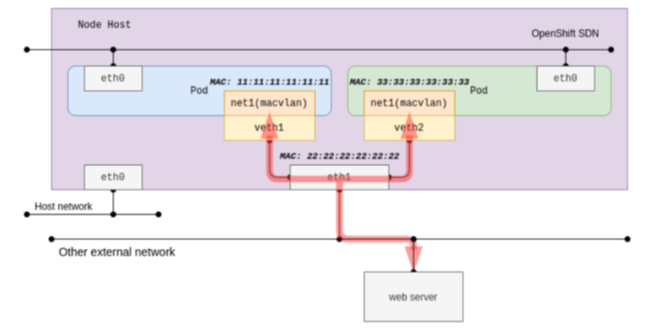
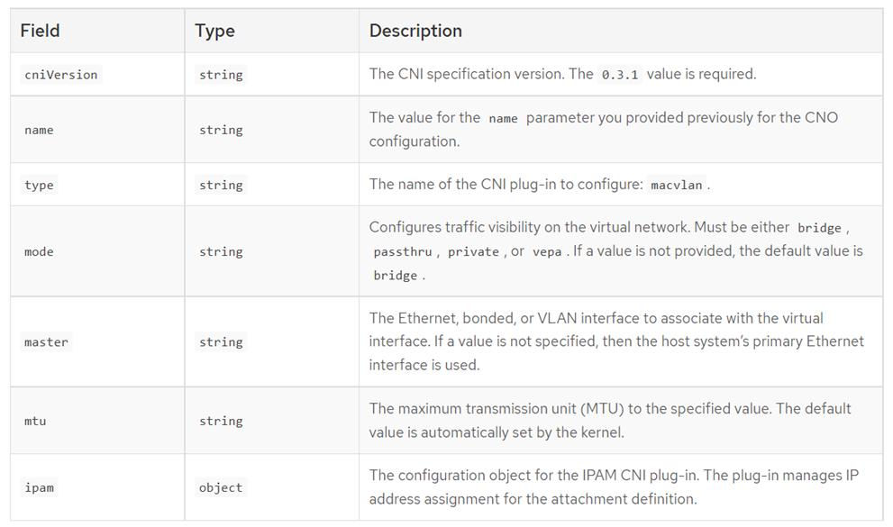

# Network Attachment Definition - MacVLAN

MACVLAN CNI plugin allows connecting container interface directly to host interface, without Linux bridge, OVS or port mapping. The parent interface on the host can be interface, sub-interface or bonded interface.

POD’s virtual interface gets auto-generated mac-address and can receive IP address via DHCP, static or host-local assignment.

## JSON Configuration 

## Operating Mode

Bridge (default) – works almost like a traditional bridge and allows direct connectivity between two macvlan interfaces without leaving the host.

VEPA (Virtual Ethernet Port Aggregator) – lower device always forwards data from macvlan towards upstream switch and expects the network device to hair-pin the traffic. Improves network visibility of the macvlan traffic. Requires NIC support.

Private – similar to VEPA with added feature that no macvlans on the same lower device can communicate <=> macvlan isolation.

Note: The physical interface to which the macvlan is attached is referred to as "lower device".

## Links

- [CRD example](./crd-macvlan.md)
- [Functional test](./pod-macvlan.md)
- [macvlan plugin](https://www.cni.dev/plugins/current/main/macvlan/)

[[Back]](./README.md)