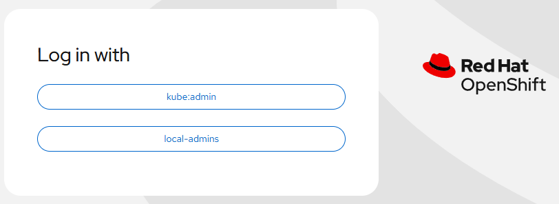

# LDAP Identity Provider - Delete provider

[[Back]](./delete.md) [[Prev]](./create_task_sync.md) [[Next]](./delete_task.md)

## Workflow

- get `OAuth` cluster configuration and check LDAP identity providers with optional --provider name
- if delete with dependencies (default and can be disabled with --no-deps option)
- delete `User`,`Identity` and `Group` objects associated with ldap provider
- Update `OAuth` configuration to remove the identity provider

## Before


```
# iserver get ocp ldap --cluster bm1 -v verbose

OpenShift Workflow - LDAP Identity Provider - Get
=================================================

OpenShift Cluster: bm1

+----+---------+----------+------------------------------------------------------------------------------------+--------------------------------------+----------+
| ID | OAuth   | Provider | LDAP                                                                               | Attribute                            | Usage    |
+----+---------+----------+------------------------------------------------------------------------------------+--------------------------------------+----------+
| 1  | cluster | ldap     | ldap://ldap-server.domain.com/ou=users,ou=se,dc=se,dc=domain,dc=com?sAMAccountName | id: sAMAccountName                   | User:  1 | 
|    |         |          | bindDN: CN=bm1,OU=Users,OU=se,DC=se,DC=domain,DC=com                               | name: cn                             | Group: 2 | 
|    |         |          | secret: ldap [exists:True]                                                         | email: mail                          |          | 
|    |         |          | mapping: claim                                                                     | preferredUsername: userPrincipalName |          |
+----+---------+----------+------------------------------------------------------------------------------------+--------------------------------------+----------+

~~~
ldap:
  attributes:
    email:
    - mail
    id:
    - sAMAccountName
    name:
    - cn
    preferredUsername:
    - userPrincipalName
  bindDN: CN=bm1,OU=Users,OU=se,DC=se,DC=domain,DC=com
  bindPassword:
    name: ldap
  insecure: true
  url: ldap://ldap-server.domain.com/ou=users,ou=se,dc=se,dc=domain,dc=com?sAMAccountName
mappingMethod: claim
name: ldap
type: LDAP

~~~

+----+----------+---------------+-----------------------------------------------------------------------+
| ID | Group    | User          | LDAP Sync                                                             |
+----+----------+---------------+-----------------------------------------------------------------------+
| 1  | NORTH    | n1@domain.com | ldap-server.domain.com                                                | 
|    |          | n2@domain.com | CN=NORTH,OU=Groups,OU=se,DC=se,DC=domain,DC=com                       | 
|    |          | n3@domain.com | 2026-03-09T17:32:20Z                                                  | 
+----+----------+---------------+-----------------------------------------------------------------------+
| 2  | SOUTH    | s1@domain.com | ldap-server.domain.com                                                | 
|    |          | s2@domain.com | CN=SOUTH,OU=Groups,OU=se,DC=se,DC=domain,DC=com                       | 
|    |          | s3@domain.com | 2026-03-09T17:32:21Z                                                  | 
+----+----------+---------------+-----------------------------------------------------------------------+

View: list (def), verbose
```

## Action

```
# iserver delete ocp ldap --cluster bm1 --no-confirm

OpenShift Workflow - LDAP Identity Provider - Delete
====================================================

OpenShift Cluster: bm1

+----+---------+----------+------------------------------------------------------------------------------------+--------------------------------------+----------+
| ID | OAuth   | Provider | LDAP                                                                               | Attribute                            | Usage    |
+----+---------+----------+------------------------------------------------------------------------------------+--------------------------------------+----------+
| 1  | cluster | ldap     | ldap://ldap-server.domain.com/ou=users,ou=se,dc=se,dc=domain,dc=com?sAMAccountName | id: sAMAccountName                   | User:  1 | 
|    |         |          | bindDN: CN=bm1,OU=Users,OU=se,DC=se,DC=domain,DC=com                               | name: cn                             | Group: 2 | 
|    |         |          | secret: ldap [exists:True]                                                         | email: mail                          |          | 
|    |         |          | mapping: claim                                                                     | preferredUsername: userPrincipalName |          |
+----+---------+----------+------------------------------------------------------------------------------------+--------------------------------------+----------+

~~~
ldap:
  attributes:
    email:
    - mail
    id:
    - sAMAccountName
    name:
    - cn
    preferredUsername:
    - userPrincipalName
  bindDN: CN=bm1,OU=Users,OU=se,DC=se,DC=domain,DC=com
  bindPassword:
    name: ldap
  insecure: true
  url: ldap://ldap-server.domain.com/ou=users,ou=se,dc=se,dc=domain,dc=com?sAMAccountName
mappingMethod: claim
name: ldap
type: LDAP

~~~

+----+----------+---------------+-----------------------------------------------------------------------+
| ID | Group    | User          | LDAP Sync                                                             |
+----+----------+---------------+-----------------------------------------------------------------------+
| 1  | NORTH    | n1@domain.com | ldap-server.domain.com                                                | 
|    |          | n2@domain.com | CN=NORTH,OU=Groups,OU=se,DC=se,DC=domain,DC=com                       | 
|    |          | n3@domain.com | 2026-03-09T17:32:20Z                                                  | 
+----+----------+---------------+-----------------------------------------------------------------------+
| 2  | SOUTH    | s1@domain.com | ldap-server.domain.com                                                | 
|    |          | s2@domain.com | CN=SOUTH,OU=Groups,OU=se,DC=se,DC=domain,DC=com                       | 
|    |          | s3@domain.com | 2026-03-09T17:32:21Z                                                  | 
+----+----------+---------------+-----------------------------------------------------------------------+

OpenShift Workflow - OAuth - Delete User
========================================

OpenShift Cluster: bm1

+----+---------------+--------------------+-------+------------------+---------------+---------------+
| ID | User          | Full Name          | Group | Identity         | Provider Name | Provider User |
+----+---------------+--------------------+-------+------------------+---------------+---------------+
| 1  | s1@domain.com | Arkadiusz Kaliwoda | SOUTH | ldap:YWthbGl3b2Q | ldap          | YWthbGl3b2Q   | 
+----+---------------+--------------------+-------+------------------+---------------+---------------+

Delete user
-----------
- user: s1@domain.com
- with identities

Delete User
-----------
- name: s1@domain.com
- deleted
- wait for no User s1@domain.com [timeout:60s]

Delete Identity
---------------
- name: ldap:YWthbGl3b2Q

Delete Identity
---------------
- name: ldap:YWthbGl3b2Q
- deleted
- wait for no Identity ldap:YWthbGl3b2Q [timeout:60s]

Completed tasks
- Selected users deleted

OpenShift Workflow - OAuth - Delete Group
=========================================

OpenShift Cluster: bm1

OpenShift Workflow - OAuth - Delete Group
=========================================

OpenShift Cluster: bm1

+----+----------+---------------+-----------------------------------------------------------------------+
| ID | Group    | User          | LDAP Sync                                                             |
+----+----------+---------------+-----------------------------------------------------------------------+
| 1  | NORTH    | n1@domain.com | ldap-server.domain.com                                                | 
|    |          | n2@domain.com | CN=NORTH,OU=Groups,OU=se,DC=se,DC=domain,DC=com                       | 
|    |          | n3@domain.com | 2026-03-09T17:32:20Z                                                  | 
+----+----------+---------------+-----------------------------------------------------------------------+

Delete Group
------------
- name: NORTH
- deleted
- wait for no Group NORTH [timeout:60s]

Completed tasks
- Selected groups deleted

OpenShift Workflow - OAuth - Delete Group
=========================================

OpenShift Cluster: bm1

+----+----------+---------------+-----------------------------------------------------------------------+
| ID | Group    | User          | LDAP Sync                                                             |
+----+----------+---------------+-----------------------------------------------------------------------+
| 1  | SOUTH    | s1@domain.com | ldap-server.domain.com                                                | 
|    |          | s2@domain.com | CN=SOUTH,OU=Groups,OU=se,DC=se,DC=domain,DC=com                       | 
|    |          | s3@domain.com | 2026-03-09T17:32:21Z                                                  | 
+----+----------+---------------+-----------------------------------------------------------------------+

Delete Group
------------
- name: SOUTH
- deleted
- wait for no Group SOUTH [timeout:60s]

Completed tasks
- Selected groups deleted

Delete identity provider from oauth
-----------------------------------
- oauth: cluster
- provider: ldap

Replace OAuth
-------------
- name: cluster

~~~
apiVersion: config.openshift.io/v1
kind: OAuth
metadata:
  annotations:
    include.release.openshift.io/ibm-cloud-managed: 'true'
    include.release.openshift.io/self-managed-high-availability: 'true'
    release.openshift.io/create-only: 'true'
  name: cluster
spec:
  identityProviders:
  - htpasswd:
      fileData:
        name: local-admins
    mappingMethod: claim
    name: local-admins
    type: HTPasswd

~~~
OAuth [cluster] replaced

Completed tasks
- LDAP Identity Provider deleted with dependencies
```

## After



```
# iserver get ocp ldap --cluster bm1

OpenShift Workflow - LDAP Identity Provider - Get
=================================================

OpenShift Cluster: bm1
Identity ldap not defined

View: list (def), verbose
```

[[Back]](./delete.md) [[Prev]](./create_task_sync.md) [[Next]](./delete_task.md)