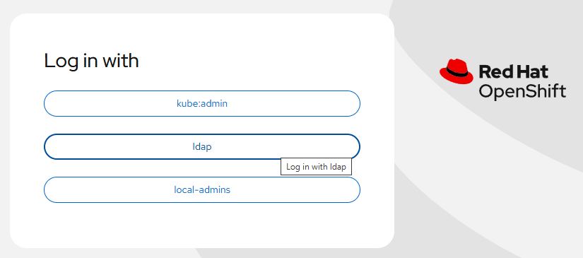
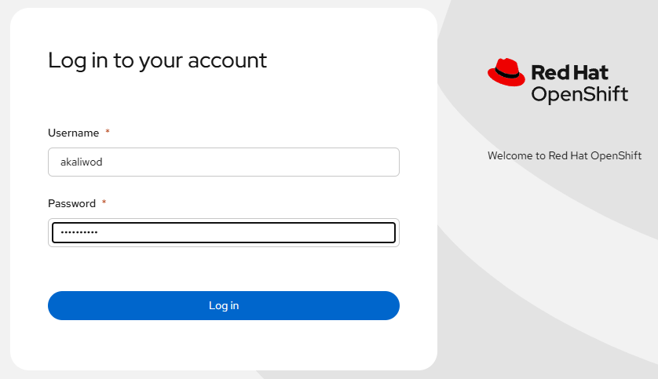
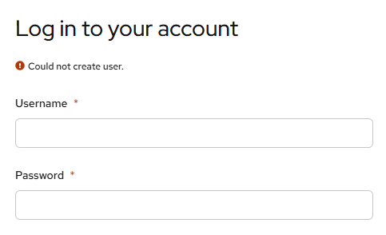

# LDAP IDP example

[[Back]](./README.md) [[Prev]](./example_job.md) [[Next]](./example_sync.md)

The goal is to allow Console UI authentication with LDAP backend. 

The configuration object is `OAauth` crd with `cluster` name that should exist and can be modified. Note: only one OAuth object is expected.

[Reference](https://docs.redhat.com/en/documentation/openshift_container_platform/4.19/html/authentication_and_authorization/configuring-identity-providers#configuring-ldap-identity-provider)

## LDAP 

- Server: ldap://ldapserver.domain.com
- BindDN (username): cn=bm1,ou=Users,ou=se,dc=se,dc=domain,dc=com
- Password: secret
- Users base dn: ou=users,ou=se,dc=se,dc=domain,dc=com

## IDP

```
# oc create secret generic ldap-secret --from-literal=bindPassword=secret -n openshift-config
```

```
apiVersion: config.openshift.io/v1
kind: OAuth
metadata:
  name: cluster
spec:
  identityProviders:
  - type: LDAP
    name: ldap
    mappingMethod: claim
    ldap:
      url: ldap://ldapserver.domain.com/ou=users,ou=se,dc=se,dc=domain,dc=com?sAMAccountName
      insecure: true
      bindDN: CN=bm1,OU=Users,OU=se,DC=se,DC=domain,DC=com
      bindPassword:
        name: ldap-secret
      attributes:
        email:
        - mail
        id:
        - sAMAccountName
        name:
        - cn
        preferredUsername:
        - userPrincipalName
```

Attributes
- name will be seen in ConsoleUI as well as is prefixed to provider user names to form an identity name
- [mappingMethod](https://docs.redhat.com/en/documentation/openshift_container_platform/4.19/html/authentication_and_authorization/understanding-identity-provider#identity-provider-parameters_understanding-identity-provider) defines how new identities are mapped to users when they log in. the value `claim` is the default one and expects that user identities are unique across all defined identity providers
- url defines the ldap server with search parameters
- bindDN defines branch of the directory where all searches should start from
- bindPassword password defined in `Secret` object in `openshift-config` namespace and referred by name
- attributes define the list of LDAP properties that will be used in OpenShift
    - id: what is expected as 'Username' in Console UI login page
    - name: what will be shown in the top-right corner of Console UI once authenticated
    - preferredUsername: what will be used as `User` object name in Kubernets once user is authenticated

## Example



<ins>LDAP User</ins>

```
objectClass: person
objectClass: user
cn: Arkadiusz Kaliwoda
distinguishedName: CN=Arkadiusz Kaliwoda,OU=Users,OU=se,DC=se,DC=domain,DC=com
displayName: Arkadiusz Kaliwoda
name: Arkadiusz Kaliwoda
sAMAccountName: akaliwod
userPrincipalName: akaliwod@domain.com
memberOf: CN=ADMINS-EMEA,OU=Groups,OU=se,DC=se,DC=domain,DC=com
```

All details with: 'curl ldap://ldapserver.domain.com/CN="Arkadiusz%20Kaliwoda",OU=Users,OU=se,DC=se,DC=domain,DC=com -u cn=bm1,ou=Users,ou=se,dc=se,dc=domain,dc=com:secret'




```
# oc get user akaliwod@domain.com -o yaml
apiVersion: user.openshift.io/v1
fullName: Arkadiusz Kaliwoda
groups: null
identities:
- ldap:XYZ
kind: User
metadata:
  creationTimestamp: "2026-03-05T16:42:42Z"
  name: akaliwod@domain.com
  resourceVersion: "666"
  uid: 123
```

```
# oc get identities.user.openshift.io ldap:XYZ -o yaml
apiVersion: user.openshift.io/v1
extra:
  name: Arkadiusz Kaliwoda
  preferred_username: akaliwod@domain.com
kind: Identity
metadata:
  creationTimestamp: "2026-03-05T16:42:42Z"
  name: ldap:XYZ
  resourceVersion: "666"
  uid: 456
providerName: ldap
providerUserName: XYZ
user:
  name: akaliwod@domain.com
  uid: 123
```

## Username collision

Suppose you have two identity providers
- ldap
- [htpasswd](../htpasswd/README.md)

Username 'akaliwod' is defined in both backends. In case where ldap idp is defined with preferredUsername:sAMAccountName, Kubernetes `User` object with 'akaliwod' name is created upon authentication. Switching between identity providers will in such case result in the following error



There are two ways to avoid that assuming that keeping different username values from functional perspective is not a good idea
- changing mappingMethod to 'add' value where the identity is mapped to the existing user, adding to any existing identity mappings for the user
- using preferredUsername attribute that will provide uniquness on the `User` 

The latter case example

```
# oc get user
NAME                       UID   FULL NAME            IDENTITIES
akaliwod                   111                        local-admins:akaliwod
akaliwod@domain.com        222   Arkadiusz Kaliwoda   ldap:XYZ
```

[[Back]](./README.md) [[Prev]](./example_job.md) [[Next]](./example_sync.md)