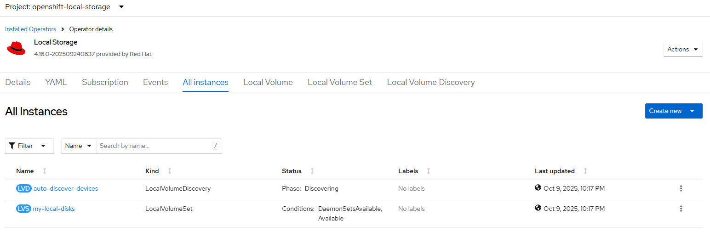
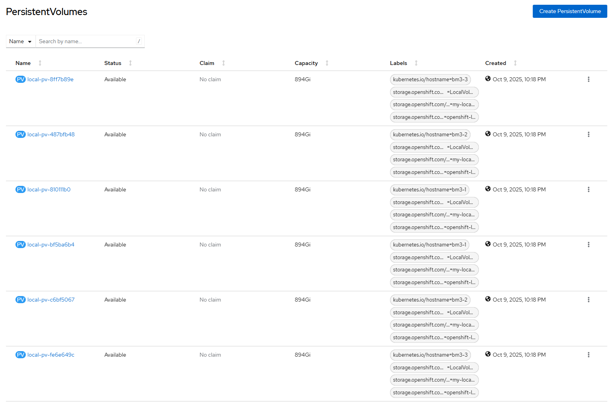

# Local Storage Operator - Create Volume

## Workflow

There are tree ways (aka mode) to configure volumes in local storage i.e.

Intent | Mode | Command  
--- | --- | ---
All-nodes with device discovery | discovery-all | iserver set ocp lso --mode volume 
Selected nodes with device discovery | discovery-node | iserver set ocp lso --mode volume --device nodeName-a
Explicit nodes and devices | explicit | iserver set ocp lso --mode volume --device nodeName-a:wwn-b 

Discovery-all and discovery-node are identical with the only difference being what cluster nodes are used to deploy volumes. In both modes LocalVolumeDiscovery and LocalVolumeSet resources are used, single instance of each object type. 

- check local volume, local volume set and local volume discovery resources (none is expected to continue)
- label all nodes with cluster.ocs.openshift.io/openshift-storage=""
- generate LocalVolumeDiscovery CRD
- optional user confirmation
- create LocalVolumeDiscovery CRD
- wait until status Available is True
- check LocalVolumeDiscoveryResult for every cluster node
- list all discovered available devices
- generate LocalVolumeSet CRD
- optional user confirmation
- create LocalVolumeSet CRD
- wait until PV created on all expected devices across all nodes

Explicit node is controlled with LocalVolume CRD that may have multiple object instances.

- check device disk identities
- check local volume set and local volume discovery resources (none is expected to continue)
- check persistent volume (expect node and device is not yet configured, warn otherwise)
- label selected nodes with cluster.ocs.openshift.io/openshift-storage=""
- generate LocalVolume per node and device
- optional user confirmation
- create LocalVolume CRD
- wait until PV created on selected devices

The mode is controlled with --device parameters that can be either skipped (discovery-all mode), define the cluster node name only (discovery-node mode) or define node and device with wwn identifier (explicit mode).

## Requirements

- local storage operator deployed
- ssh access to cluster nodes

## Configurable options

```
# iserver set ocp lso --mode volume
  --cluster TEXT                  Cluster Name
  --device TEXT                   Device for local volumes
  --sc TEXT                       Storage class name  [default: local-sc]
  --limit TEXT                    Device discovery limitations
  --volume [block|fs]             Volume mode  [default: block]
  --fs TEXT                       Filesystem type if filesystem volume [default: ext4]
  --max INTEGER                   Max discovered devices per node (default unlimited)  [default: -1]
  --no-confirm                    Confirmation mode
```

Notes:
- filesystem type (ext4 by default) only if volume type is fs
- max discovered devices per node if you do not want local volumes to be created on all discovered devices
- supported device discovery limit examples below and multiple limits can be defined.

```
--limit type:disk
--limit type:part
--limit mechanical:rotational
--limit mechanical:nonrotational
--limit minsize:10G
--limit maxsize:100G
--limit model:SAMSUNG
--limit vendor:ATA
```

## All-nodes with device discovery (mode: discovery-all)

```
# iserver set ocp lso 
    --mode volume 
    --limit type:disk 
    --max 2 
    --volume block
```

### Expected Outcome (3-node cluster)






### Example 

```
# iserver set ocp lso --mode volume --limit type:disk --max 2 --volume block
OpenShift Cluster: bm1


OpenShift Workflow - Local Storage Operator - Create Local Volume
=================================================================

Workflow Parameters
-------------------
{
    "cluster": "bm1",
    "sc": "local-sc",
    "device": [],
    "limit": [
        "type:disk"
    ],
    "volume": "block",
    "fstype": "ext4",
    "max": 2,
    "confirmation": true,
    "ssh-required": true,
    "check-verbose": true,
    "namespace": "openshift-local-storage",
    "name": "local-storage-operator",
    "operator-group-name": "local-operator-group",
    "delete-namespace": true
}


OpenShift Cluster
-----------------
- cluster: bm1 [domain:local]
- api [C:\Users\user\.itool\ocp-clusters\bm1\kubeconfig]: ok
- dns resolution: ok
- cluster node [10.10.10.10] [key:C:\Users\user\.itool\ocp-clusters\bm1\ssh.pub]: ok

Local Storage Operator
----------------------
- namespace: openshift-local-storage/local-storage-operator
- package: local-storage-operator
- csv: local-storage-operator.v4.18.0-202509240837

Collect cluster state and validate input values
-----------------------------------------------
- get kubernetes node names
- get linux level block devices for all nodes
- get local volumes
- get local volume sets
- get local volume discovery
- detected volume create mode: discovery-all
- state and values verified

Label Discovery Nodes
---------------------
- node label: cluster.ocs.openshift.io/openshift-storage=""
- node: bm1-1
- node: bm1-2
- node: bm1-3

Create Local Volume Discovery
-----------------------------
- namespace: openshift-local-storage
- name: auto-discover-devices
- nodes: bm1-1,bm1-2,bm1-3

~~~
apiVersion: local.storage.openshift.io/v1alpha1
kind: LocalVolumeDiscovery
metadata:
  name: auto-discover-devices
  namespace: openshift-local-storage
spec:
  nodeSelector:
    nodeSelectorTerms:
    - matchExpressions:
      - key: kubernetes.io/hostname
        operator: In
        values:
        - bm1-1
        - bm1-2
        - bm1-3

~~~
Continue [Y/N]? y

- Local volume discover created

- wait for LocalVolumeDiscovery crd [timeout:60]...
- wait for LocalVolumeDiscoveryResult crd [timeout:360]...
        bm1-1
        bm1-2
        bm1-3

Local Volume Discovery Result - Available Devices
-------------------------------------------------

+-------+---------+----------+------------------------+------------+---------------+------+--------+
| Node  | Summary | Path     | WWN                    | Size       | Property      | Type | FSType |
+-------+---------+----------+------------------------+------------+---------------+------+--------+
| bm1-1 | 2/6     | /dev/sdb | wwn-0x500a075118ef25c1 | 960.2 [GB] | NonRotational | disk |        |
|       |         | /dev/sdc | wwn-0x500a075118ef2777 | 960.2 [GB] | NonRotational | disk |        |
+-------+---------+----------+------------------------+------------+---------------+------+--------+
| bm1-2 | 2/6     | /dev/sdb | wwn-0x500a075118ef266c | 960.2 [GB] | NonRotational | disk |        |
|       |         | /dev/sdc | wwn-0x500a075118ef25d9 | 960.2 [GB] | NonRotational | disk |        |
+-------+---------+----------+------------------------+------------+---------------+------+--------+
| bm1-3 | 2/6     | /dev/sda | wwn-0x500a075118ef291c | 960.2 [GB] | NonRotational | disk |        |
|       |         | /dev/sdb | wwn-0x500a075118ef2616 | 960.2 [GB] | NonRotational | disk |        |
+-------+---------+----------+------------------------+------------+---------------+------+--------+

+-------+-------------------+------------------+------------------+
| Node  | Available Devices | Max Device Count | Expected Devices |
+-------+-------------------+------------------+------------------+
| bm1-1 | 2                 | 2                | 2                |
| bm1-2 | 2                 | 2                | 2                |
| bm1-3 | 2                 | 2                | 2                |
+-------+-------------------+------------------+------------------+

Total expected devices to be provisioned: 6


Create Local Volume Set
-----------------------
- namespace: openshift-local-storage
- name: my-local-disks
- nodes: bm1-1,bm1-2,bm1-3

~~~
apiVersion: local.storage.openshift.io/v1alpha1
kind: LocalVolumeSet
metadata:
  name: my-local-disks
  namespace: openshift-local-storage
spec:
  deviceInclusionSpec:
    deviceTypes:
    - disk
  maxDeviceCount: 2
  nodeSelector:
    nodeSelectorTerms:
    - matchExpressions:
      - key: kubernetes.io/hostname
        operator: In
        values:
        - bm1-1
        - bm1-2
        - bm1-3
  storageClassName: local-sc
  volumeMode: Block

~~~
Continue [Y/N]? y

- Local volume set created

- wait for LocalVolumeSet crd [timeout:60]...
- wait for LocalVolumeSet ready [timeout:360]...
- wait for all devices to be provisioned [timeout:360]...

+-------------------------+----------------+---------------+-------------+-----------+------------+---------+
| Namespace               | Name           | Storage Class | Volume Mode | Available | Disk Maker | Devices |
+-------------------------+----------------+---------------+-------------+-----------+------------+---------+
| openshift-local-storage | my-local-disks | local-sc      | Block       | ✓         | ✓          | 6       |
+-------------------------+----------------+---------------+-------------+-----------+------------+---------+

+-------------------+-----------+-------+----------+-------+---------------+----------------+----------------+--------------------------------+-----+------+
| Name              | Status    | Mode  | SC       | Size  | Access Mode   | CSI Driver     | CSI Handle     | Device                         | PVC | Age  |
+-------------------+-----------+-------+----------+-------+---------------+----------------+----------------+--------------------------------+-----+------+
| local-pv-487bfb48 | Available | Block | local-sc | 894Gi | ReadWriteOnce | LocalVolumeSet | my-local-disks | wwn-0x500a075118ef25d9 [bm1-2] | --  | 2h0m |
| local-pv-810111b0 | Available | Block | local-sc | 894Gi | ReadWriteOnce | LocalVolumeSet | my-local-disks | wwn-0x500a075118ef2777 [bm1-1] | --  | 2h0m |
| local-pv-8ff7b89e | Available | Block | local-sc | 894Gi | ReadWriteOnce | LocalVolumeSet | my-local-disks | wwn-0x500a075118ef291c [bm1-3] | --  | 2h0m |
| local-pv-bf5ba6b4 | Available | Block | local-sc | 894Gi | ReadWriteOnce | LocalVolumeSet | my-local-disks | wwn-0x500a075118ef25c1 [bm1-1] | --  | 2h0m |
| local-pv-c6bf5067 | Available | Block | local-sc | 894Gi | ReadWriteOnce | LocalVolumeSet | my-local-disks | wwn-0x500a075118ef266c [bm1-2] | --  | 2h0m |
| local-pv-fe6e649c | Available | Block | local-sc | 894Gi | ReadWriteOnce | LocalVolumeSet | my-local-disks | wwn-0x500a075118ef2616 [bm1-3] | --  | 2h0m |
+-------------------+-----------+-------+----------+-------+---------------+----------------+----------------+--------------------------------+-----+------+

Completed tasks
- Volumes created
```

## Selected nodes with device discovery (mode: discovery-node)

```
# iserver set ocp lso 
    --mode volume 
    --limit type:disk 
    --max 2 
    --volume block
    --device bm1-1 
    --device bm1-2 
```

### Expected Outcome (2-nodes out of 3-node cluster)


### Example 

```
# iserver set ocp lso --mode volume --limit type:disk --max 2 --volume block --device bm1-1 --device bm1-2
OpenShift Cluster: bm1


OpenShift Workflow - Local Storage Operator - Create Local Volume
=================================================================

Workflow Parameters
-------------------
{
    "cluster": "bm1",
    "sc": "local-sc",
    "device": [
        "bm1-1",
        "bm1-2"
    ],
    "limit": [
        "type:disk"
    ],
    "volume": "block",
    "fstype": "ext4",
    "max": 2,
    "confirmation": true,
    "ssh-required": true,
    "check-verbose": true,
    "namespace": "openshift-local-storage",
    "name": "local-storage-operator",
    "operator-group-name": "local-operator-group",
    "delete-namespace": true
}


OpenShift Cluster
-----------------
- cluster: bm1 [domain:local]
- api [C:\Users\user\.itool\ocp-clusters\bm1\kubeconfig]: ok
- dns resolution: ok
- cluster node [10.10.10.10] [key:C:\Users\user\.itool\ocp-clusters\bm1\ssh.pub]: ok

Local Storage Operator
----------------------
- namespace: openshift-local-storage/local-storage-operator
- package: local-storage-operator
- csv: local-storage-operator.v4.18.0-202509240837

Collect cluster state and validate input values
-----------------------------------------------
- get kubernetes node names
- get linux level block devices for all nodes
- get local volumes
- get local volume sets
- get local volume discovery
- detected volume create mode: discovery-node
- state and values verified

Label Discovery Nodes
---------------------
- node label: cluster.ocs.openshift.io/openshift-storage=""
- node: bm1-1
- node: bm1-2

Create Local Volume Discovery
-----------------------------
- namespace: openshift-local-storage
- name: auto-discover-devices
- nodes: bm1-1,bm1-2

~~~
apiVersion: local.storage.openshift.io/v1alpha1
kind: LocalVolumeDiscovery
metadata:
  name: auto-discover-devices
  namespace: openshift-local-storage
spec:
  nodeSelector:
    nodeSelectorTerms:
    - matchExpressions:
      - key: kubernetes.io/hostname
        operator: In
        values:
        - bm1-1
        - bm1-2

~~~
Continue [Y/N]? y

- Local volume discover created

- wait for LocalVolumeDiscovery crd [timeout:60]...
- wait for LocalVolumeDiscoveryResult crd [timeout:360]...
        bm1-1
        bm1-2

Local Volume Discovery Result - Available Devices
-------------------------------------------------

+-------+---------+----------+------------------------+------------+---------------+------+--------+
| Node  | Summary | Path     | WWN                    | Size       | Property      | Type | FSType |
+-------+---------+----------+------------------------+------------+---------------+------+--------+
| bm1-1 | 2/6     | /dev/sdb | wwn-0x500a075118ef25c1 | 960.2 [GB] | NonRotational | disk |        |
|       |         | /dev/sdc | wwn-0x500a075118ef2777 | 960.2 [GB] | NonRotational | disk |        |
+-------+---------+----------+------------------------+------------+---------------+------+--------+
| bm1-2 | 2/6     | /dev/sdb | wwn-0x500a075118ef266c | 960.2 [GB] | NonRotational | disk |        |
|       |         | /dev/sdc | wwn-0x500a075118ef25d9 | 960.2 [GB] | NonRotational | disk |        |
+-------+---------+----------+------------------------+------------+---------------+------+--------+

+-------+-------------------+------------------+------------------+
| Node  | Available Devices | Max Device Count | Expected Devices |
+-------+-------------------+------------------+------------------+
| bm1-1 | 2                 | 2                | 2                |
| bm1-2 | 2                 | 2                | 2                |
+-------+-------------------+------------------+------------------+

Total expected devices to be provisioned: 4


Create Local Volume Set
-----------------------
- namespace: openshift-local-storage
- name: my-local-disks
- nodes: bm1-1,bm1-2

~~~
apiVersion: local.storage.openshift.io/v1alpha1
kind: LocalVolumeSet
metadata:
  name: my-local-disks
  namespace: openshift-local-storage
spec:
  deviceInclusionSpec:
    deviceTypes:
    - disk
  maxDeviceCount: 2
  nodeSelector:
    nodeSelectorTerms:
    - matchExpressions:
      - key: kubernetes.io/hostname
        operator: In
        values:
        - bm1-1
        - bm1-2
  storageClassName: local-sc
  volumeMode: Block

~~~
Continue [Y/N]? y

- Local volume set created

- wait for LocalVolumeSet crd [timeout:60]...
- wait for LocalVolumeSet ready [timeout:360]...
- wait for all devices to be provisioned [timeout:360]...

+-------------------------+----------------+---------------+-------------+-----------+------------+---------+
| Namespace               | Name           | Storage Class | Volume Mode | Available | Disk Maker | Devices |
+-------------------------+----------------+---------------+-------------+-----------+------------+---------+
| openshift-local-storage | my-local-disks | local-sc      | Block       | ✓         | ✓          | 4       |
+-------------------------+----------------+---------------+-------------+-----------+------------+---------+

+-------------------+-----------+-------+----------+-------+---------------+----------------+----------------+--------------------------------+-----+------+
| Name              | Status    | Mode  | SC       | Size  | Access Mode   | CSI Driver     | CSI Handle     | Device                         | PVC | Age  |
+-------------------+-----------+-------+----------+-------+---------------+----------------+----------------+--------------------------------+-----+------+
| local-pv-487bfb48 | Available | Block | local-sc | 894Gi | ReadWriteOnce | LocalVolumeSet | my-local-disks | wwn-0x500a075118ef25d9 [bm1-2] | --  | 2h0m |
| local-pv-810111b0 | Available | Block | local-sc | 894Gi | ReadWriteOnce | LocalVolumeSet | my-local-disks | wwn-0x500a075118ef2777 [bm1-1] | --  | 2h0m |
| local-pv-bf5ba6b4 | Available | Block | local-sc | 894Gi | ReadWriteOnce | LocalVolumeSet | my-local-disks | wwn-0x500a075118ef25c1 [bm1-1] | --  | 2h0m |
| local-pv-c6bf5067 | Available | Block | local-sc | 894Gi | ReadWriteOnce | LocalVolumeSet | my-local-disks | wwn-0x500a075118ef266c [bm1-2] | --  | 2h0m |
+-------------------+-----------+-------+----------+-------+---------------+----------------+----------------+--------------------------------+-----+------+

Completed tasks
- Volumes created
```

## Explicit nodes and devices (mode: explicit)

```
# iserver set ocp lso 
    --mode volume 
    --limit type:disk 
    --max 2 
    --volume block
    --device bm1-1:wwn-0x500a075118ef25c1 
    --device bm1-2:wwn-0x500a075118ef266c
```

### Expected Outcome (1-node out of 3-node cluster with selected devices)


### Example 

```
# iserver set ocp lso --mode volume --limit type:disk --max 2 --volume block --device bm1-1:wwn-0x500a075118ef25c1 --device bm1-2:wwn-0x500a075118ef266c
OpenShift Cluster: bm1


OpenShift Workflow - Local Storage Operator - Create Local Volume
=================================================================

Workflow Parameters
-------------------
{
    "cluster": "bm1",
    "sc": "local-sc",
    "device": [
        "bm1-1:wwn-0x500a075118ef25c1",
        "bm1-2:wwn-0x500a075118ef266c"
    ],
    "limit": [
        "type:disk"
    ],
    "volume": "block",
    "fstype": "ext4",
    "max": 2,
    "confirmation": true,
    "ssh-required": true,
    "check-verbose": true,
    "namespace": "openshift-local-storage",
    "name": "local-storage-operator",
    "operator-group-name": "local-operator-group",
    "delete-namespace": true
}


OpenShift Cluster
-----------------
- cluster: bm1 [domain:local]
- api [C:\Users\user\.itool\ocp-clusters\bm1\kubeconfig]: ok
- dns resolution: ok
- cluster node [10.10.10.10] [key:C:\Users\user\.itool\ocp-clusters\bm1\ssh.pub]: ok

Local Storage Operator
----------------------
- namespace: openshift-local-storage/local-storage-operator
- package: local-storage-operator
- csv: local-storage-operator.v4.18.0-202509240837

Collect cluster state and validate input values
-----------------------------------------------
- get kubernetes node names
- get linux level block devices for all nodes
- get local volumes
- get local volume sets
- get local volume discovery
- detected volume create mode: explicit
- state and values verified

Label Nodes
-----------
- node label: cluster.ocs.openshift.io/openshift-storage=""
- node: bm1-1
- node: bm1-2

Create Local Volume
-------------------
- namespace: openshift-local-storage
- name: local-disks-f3e4a3a77a00
- nodes: bm1-1
- device paths: /dev/disk/by-id/wwn-0x500a075118ef25c1
- volume mode: block
- storage class: local-sc

~~~
apiVersion: local.storage.openshift.io/v1
kind: LocalVolume
metadata:
  name: local-disks-f3e4a3a77a00
  namespace: openshift-local-storage
spec:
  nodeSelector:
    nodeSelectorTerms:
    - matchExpressions:
      - key: kubernetes.io/hostname
        operator: In
        values:
        - bm1-1
  storageClassDevices:
  - devicePaths:
    - /dev/disk/by-id/wwn-0x500a075118ef25c1
    forceWipeDevicesAndDestroyAllData: false
    storageClassName: local-sc
    volumeMode: Block

~~~
Continue [Y/N]? y

- Local volume created

- wait for LocalVolume crd [timeout:60]...
- wait for persistent volumes [timeout:180]...

Create Local Volume
-------------------
- namespace: openshift-local-storage
- name: local-disks-5fb3cf004057
- nodes: bm1-2
- device paths: /dev/disk/by-id/wwn-0x500a075118ef266c
- volume mode: block
- storage class: local-sc

~~~
apiVersion: local.storage.openshift.io/v1
kind: LocalVolume
metadata:
  name: local-disks-5fb3cf004057
  namespace: openshift-local-storage
spec:
  nodeSelector:
    nodeSelectorTerms:
    - matchExpressions:
      - key: kubernetes.io/hostname
        operator: In
        values:
        - bm1-2
  storageClassDevices:
  - devicePaths:
    - /dev/disk/by-id/wwn-0x500a075118ef266c
    forceWipeDevicesAndDestroyAllData: false
    storageClassName: local-sc
    volumeMode: Block

~~~
Continue [Y/N]? y

- Local volume created

- wait for LocalVolume crd [timeout:60]...
- wait for persistent volumes [timeout:180]...

+-------------------+-----------+-------+----------+-------+---------------+-------------+--------------------------+--------------------------------+-----+------+
| Name              | Status    | Mode  | SC       | Size  | Access Mode   | CSI Driver  | CSI Handle               | Device                         | PVC | Age  |
+-------------------+-----------+-------+----------+-------+---------------+-------------+--------------------------+--------------------------------+-----+------+
| local-pv-bf5ba6b4 | Available | Block | local-sc | 894Gi | ReadWriteOnce | LocalVolume | local-disks-f3e4a3a77a00 | wwn-0x500a075118ef25c1 [bm1-1] | --  | 2h0m |
| local-pv-c6bf5067 | Available | Block | local-sc | 894Gi | ReadWriteOnce | LocalVolume | local-disks-5fb3cf004057 | wwn-0x500a075118ef266c [bm1-2] | --  | 2h0m |
+-------------------+-----------+-------+----------+-------+---------------+-------------+--------------------------+--------------------------------+-----+------+

Completed tasks
- Volumes created
```

[[Back]](./README.md)