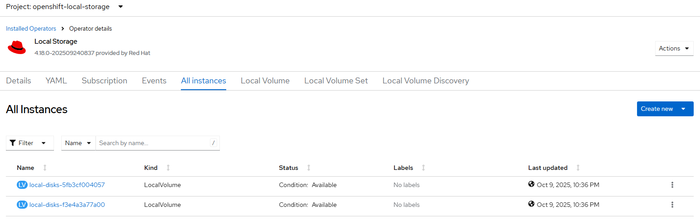
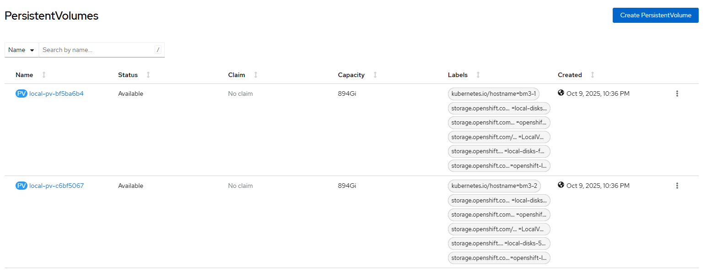

# Local Storage Operator - Create Volume in explicit mode

## Workflow

- check device disk identities
- check local volume set and local volume discovery resources (none is expected to continue)
- check persistent volume (expect node and device is not yet configured, warn otherwise)
- label selected nodes with cluster.ocs.openshift.io/openshift-storage=""
- generate LocalVolume per node and device
- create LocalVolume CRD
- wait until PV created on selected devices

Note: 
- check the local disks using [lsblk](../disk/lsblk.md) command
- disks with LVM2 or Ceph filesystem type will not be used by LSO
- consider disk clean up first using [disk zap](../disk/zap.md) or [remove stale lvm](../disk/delete_lvm.md) features

## Requirements

- local storage operator [installed](./create_operator.md)
- ssh access to all cluster nodes

## Configurable options

```
# iserver set ocp lso --mode volume
  --cluster TEXT                  Cluster Name
  --device TEXT                   Device for local volumes
  --sc TEXT                       Storage class name  [default: local-sc]
  --limit TEXT                    Device discovery limitations
  --volume [block|fs]             Volume mode  [default: block]
  --fs TEXT                       Filesystem type if filesystem volume [default: ext4]
  --max INTEGER                   Max discovered devices per node (default unlimited)  [default: -1]
  --no-confirm                    Confirmation mode
```

Notes:
- filesystem type (ext4 by default) only if volume type is fs
- max discovered devices per node if you do not want local volumes to be created on all discovered devices
- supported device discovery limit examples below and multiple limits can be defined.

```
--limit type:disk
--limit type:part
--limit mechanical:rotational
--limit mechanical:nonrotational
--limit minsize:10G
--limit maxsize:100G
--limit model:SAMSUNG
--limit vendor:ATA
```

## Expected outcome (1-node out of 3-node cluster with selected devices)

```
# iserver set ocp lso 
    --mode volume 
    --limit type:disk 
    --max 2 
    --volume block
    --device bm1-1:wwn-0x500a075118ef25c1 
    --device bm1-2:wwn-0x500a075118ef266c
```







### Example 

```
# iserver set ocp lso \
  --cluster bm1 \
  --mode volume \
  --limit type:disk \
  --max 2 \
  --volume block \
  --device bm1-1:wwn-0x55cd2e414e3ba224 \
  --device bm1-2:wwn-0x500a07511c54ae16

OpenShift Workflow - Local Storage Operator - Create Local Volume
=================================================================

OpenShift Cluster: bm1

Local Storage Operator Subscription
-----------------------------------
- subscription: openshift-local-storage/local-storage-operator
- package: local-storage-operator
- csv: local-storage-operator.v4.18.0-202602132343

Local Storage Operator Resources
--------------------------------
- deployment openshift-local-storage/local-storage-operator ready

Collect cluster state and validate input values
-----------------------------------------------
- get kubernetes node names
- get linux level block devices for all nodes
- get local volumes
- get local volume sets
- get local volume discovery
- detected volume create mode: explicit
- state and values verified

Label Nodes
-----------
- node label: cluster.ocs.openshift.io/openshift-storage=""
- node: bm1-1
- node: bm1-2

Create Local Volume
-------------------
- namespace: openshift-local-storage
- name: local-disks-93e8611f3e62
- nodes: bm1-1
- device paths: /dev/disk/by-id/wwn-0x55cd2e414e3ba224
- volume mode: block
- storage class: local-sc

~~~
apiVersion: local.storage.openshift.io/v1
kind: LocalVolume
metadata:
  name: local-disks-93e8611f3e62
  namespace: openshift-local-storage
spec:
  nodeSelector:
    nodeSelectorTerms:
    - matchExpressions:
      - key: kubernetes.io/hostname
        operator: In
        values:
        - bm1-1
  storageClassDevices:
  - devicePaths:
    - /dev/disk/by-id/wwn-0x55cd2e414e3ba224
    forceWipeDevicesAndDestroyAllData: false
    storageClassName: local-sc
    volumeMode: Block

~~~

- Local volume created

- wait for LocalVolume crd [timeout:60]...
- wait for persistent volume assiated with local volume local-disks-93e8611f3e62 [timeout:180]...

Create Local Volume
-------------------
- namespace: openshift-local-storage
- name: local-disks-73bd95395a50
- nodes: bm1-2
- device paths: /dev/disk/by-id/wwn-0x500a07511c54ae16
- volume mode: block
- storage class: local-sc

~~~
apiVersion: local.storage.openshift.io/v1
kind: LocalVolume
metadata:
  name: local-disks-73bd95395a50
  namespace: openshift-local-storage
spec:
  nodeSelector:
    nodeSelectorTerms:
    - matchExpressions:
      - key: kubernetes.io/hostname
        operator: In
        values:
        - bm1-2
  storageClassDevices:
  - devicePaths:
    - /dev/disk/by-id/wwn-0x500a07511c54ae16
    forceWipeDevicesAndDestroyAllData: false
    storageClassName: local-sc
    volumeMode: Block

~~~

- Local volume created

- wait for LocalVolume crd [timeout:60]...
- wait for persistent volume assiated with local volume local-disks-73bd95395a50 [timeout:180]...

+----+-------------------+-----------+-------+----------+-------+--------+-----+------+
| ID | Persistent Volume | Status    | Mode  | SC       | Size  | Access | PVC | Age  |
+----+-------------------+-----------+-------+----------+-------+--------+-----+------+
| 1  | local-pv-21e09790 | Available | Block | local-sc | 894Gi | RWO    | --  | 1h0m | 
| 2  | local-pv-290dd896 | Available | Block | local-sc | 894Gi | RWO    | --  | 1h0m | 
+----+-------------------+-----------+-------+----------+-------+--------+-----+------+

Completed tasks
- Volumes created
```

[[Back]](./create_volume.md)