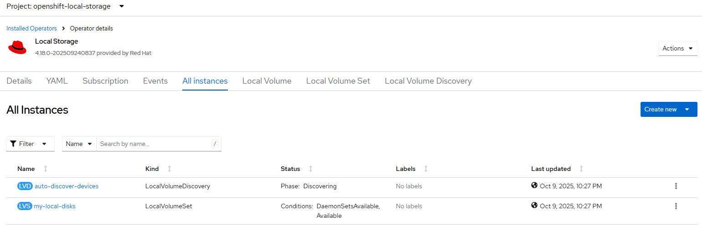
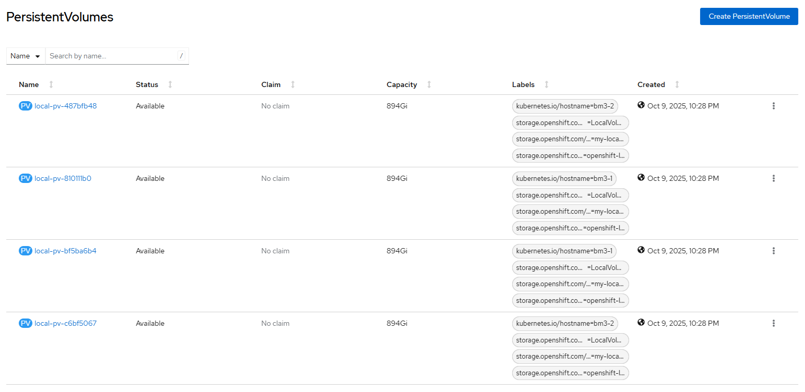

# Local Storage Operator - Create Volume in discover-node mode

## Workflow

- check local volume, local volume set and local volume discovery resources (none is expected to continue)
- selected nodes based on --device parameter with node name as value
- label selected nodes with `cluster.ocs.openshift.io/openshift-storage=''`
- create `LocalVolumeDiscovery` CRD and wait until status Available is True
- check `LocalVolumeDiscoveryResult` for selected cluster nodes
- list all discovered available devices
- create `LocalVolumeSet` CRD
- wait until PV created on all expected devices across selected nodes

Note: 
- check the local disks using [lsblk](../disk/lsblk.md) command
- disks with LVM2 or Ceph filesystem type will not be used by LSO
- consider disk clean up first using [disk zap](../disk/zap.md) or [remove stale lvm](../disk/delete_lvm.md) features

## Requirements

- local storage operator [installed](./create_operator.md)
- ssh access to cluster nodes

## Configurable options

```
# iserver set ocp lso --mode volume
  --cluster TEXT                  Cluster Name
  --device TEXT                   Device for local volumes
  --sc TEXT                       Storage class name  [default: local-sc]
  --limit TEXT                    Device discovery limitations
  --volume [block|fs]             Volume mode  [default: block]
  --fs TEXT                       Filesystem type if filesystem volume [default: ext4]
  --max INTEGER                   Max discovered devices per node (default unlimited)  [default: -1]
  --no-confirm                    Confirmation mode
```

Notes:
- filesystem type (ext4 by default) only if volume type is fs
- max discovered devices per node if you do not want local volumes to be created on all discovered devices
- supported device discovery limit examples below and multiple limits can be defined.

```
--limit type:disk
--limit type:part
--limit mechanical:rotational
--limit mechanical:nonrotational
--limit minsize:10G
--limit maxsize:100G
--limit model:SAMSUNG
--limit vendor:ATA
```

### Expected outcome (2-nodes out of 3-node cluster)






### Example 

```
# iserver set ocp lso \
  --cluster bm1 \
  --mode volume \
  --limit type:disk \
  --max 2 \
  --volume block \
  --device bm1-1 \
  --device bm1-2

OpenShift Workflow - Local Storage Operator - Create Local Volume
=================================================================

OpenShift Cluster: bm1

Local Storage Operator Subscription
-----------------------------------
- subscription: openshift-local-storage/local-storage-operator
- package: local-storage-operator
- csv: local-storage-operator.v4.18.0-202602132343

Local Storage Operator Resources
--------------------------------
- deployment openshift-local-storage/local-storage-operator ready

Collect cluster state and validate input values
-----------------------------------------------
- get kubernetes node names
- get linux level block devices for all nodes
- get local volumes
- get local volume sets
- get local volume discovery
- detected volume create mode: discovery-node
- state and values verified

Label Discovery Nodes
---------------------
- node label: cluster.ocs.openshift.io/openshift-storage=""
- node: bm1-1
- node: bm1-2

Create Local Volume Discovery
-----------------------------
- namespace: openshift-local-storage
- name: auto-discover-devices
- nodes: bm1-1,bm1-2

~~~
apiVersion: local.storage.openshift.io/v1alpha1
kind: LocalVolumeDiscovery
metadata:
  name: auto-discover-devices
  namespace: openshift-local-storage
spec:
  nodeSelector:
    nodeSelectorTerms:
    - matchExpressions:
      - key: kubernetes.io/hostname
        operator: In
        values:
        - bm1-1
        - bm1-2

~~~

- Local volume discover created

- wait for LocalVolumeDiscovery crd [timeout:60]...
- wait for LocalVolumeDiscoveryResult crd [timeout:360]...
	bm1-1
	bm1-2

+----+---------------------+-----------+----------+------------------------+------------+---------------+------+--------+
| ID | LV Discovery Result | Available | Path     | WWN                    | Size       | Property      | Type | FSType |
+----+---------------------+-----------+----------+------------------------+------------+---------------+------+--------+
| 1  | bm1-1               | 10/14     | /dev/sdb | wwn-0x55cd2e414e3ba224 | 960.2 [GB] | NonRotational | disk |        | 
|    |                     |           | /dev/sdc | wwn-0x500a07511c54a9e9 | 960.2 [GB] | NonRotational | disk |        | 
|    |                     |           | /dev/sdd | wwn-0x55cd2e414e3ba1f8 | 960.2 [GB] | NonRotational | disk |        | 
|    |                     |           | /dev/sde | wwn-0x5000c500af4a7bab | 1.2 [TB]   | Rotational    | disk |        | 
|    |                     |           | /dev/sdf | wwn-0x55cd2e414e3bc3de | 960.2 [GB] | NonRotational | disk |        | 
|    |                     |           | /dev/sdg | wwn-0x5000c500af4a79cf | 1.2 [TB]   | Rotational    | disk |        | 
|    |                     |           | /dev/sdh | wwn-0x5000c500af4a64bb | 1.2 [TB]   | Rotational    | disk |        | 
|    |                     |           | /dev/sdi | wwn-0x5000c500af4a689b | 1.2 [TB]   | Rotational    | disk |        | 
|    |                     |           | /dev/sdn | wwn-0x500a07511c5401fc | 960.2 [GB] | NonRotational | disk |        | 
|    |                     |           | /dev/sdo | wwn-0x55cd2e414e3ba1bd | 960.2 [GB] | NonRotational | disk |        | 
+----+---------------------+-----------+----------+------------------------+------------+---------------+------+--------+
| 2  | bm1-2               | 10/14     | /dev/sda | wwn-0x55cd2e414e3b9850 | 960.2 [GB] | NonRotational | disk |        | 
|    |                     |           | /dev/sdb | wwn-0x500a07511c54ae16 | 960.2 [GB] | NonRotational | disk |        | 
|    |                     |           | /dev/sdc | wwn-0x500a07511c54a905 | 960.2 [GB] | NonRotational | disk |        | 
|    |                     |           | /dev/sde | wwn-0x55cd2e414e3bc355 | 960.2 [GB] | NonRotational | disk |        | 
|    |                     |           | /dev/sdf | wwn-0x5000c500af4a7c5b | 1.2 [TB]   | Rotational    | disk |        | 
|    |                     |           | /dev/sdg | wwn-0x5000c500af4367db | 1.2 [TB]   | Rotational    | disk |        | 
|    |                     |           | /dev/sdh | wwn-0x5000c500af4a76a7 | 1.2 [TB]   | Rotational    | disk |        | 
|    |                     |           | /dev/sdi | wwn-0x5000c500af4a68ef | 1.2 [TB]   | Rotational    | disk |        | 
|    |                     |           | /dev/sdj | wwn-0x55cd2e414e3ba24a | 960.2 [GB] | NonRotational | disk |        | 
|    |                     |           | /dev/sdk | wwn-0x55cd2e414e3b9843 | 960.2 [GB] | NonRotational | disk |        | 
+----+---------------------+-----------+----------+------------------------+------------+---------------+------+--------+

+-------+-------------------+------------------+------------------+
| Node  | Available Devices | Max Device Count | Expected Devices |
+-------+-------------------+------------------+------------------+
| bm1-1 | 10                | 2                | 2                | 
| bm1-2 | 10                | 2                | 2                | 
+-------+-------------------+------------------+------------------+

Total expected devices to be provisioned: 4


Create Local Volume Set
-----------------------
- namespace: openshift-local-storage
- name: my-local-disks
- nodes: bm1-1,bm1-2

~~~
apiVersion: local.storage.openshift.io/v1alpha1
kind: LocalVolumeSet
metadata:
  name: my-local-disks
  namespace: openshift-local-storage
spec:
  deviceInclusionSpec:
    deviceTypes:
    - disk
  maxDeviceCount: 2
  nodeSelector:
    nodeSelectorTerms:
    - matchExpressions:
      - key: kubernetes.io/hostname
        operator: In
        values:
        - bm1-1
        - bm1-2
  storageClassName: local-sc
  volumeMode: Block

~~~

- Local volume set created

- wait for LocalVolumeSet crd [timeout:60]...
- wait for LocalVolumeSet ready [timeout:360]...
- wait for all devices to be provisioned [timeout:360]...

+----+-------------------------+---------------+-------------+-----------+------------+-----------+
| ID | Local Volume Set        | Storage Class | Volume Mode | Available | Disk Maker | # Devices |
+----+-------------------------+---------------+-------------+-----------+------------+-----------+
| 1  | openshift-local-storage | local-sc      | Block       | V         | V          | 4         | 
|    | my-local-disks          |               |             |           |            |           | 
+----+-------------------------+---------------+-------------+-----------+------------+-----------+

+----+-------------------+-----------+-------+----------+-------+--------+-----+------+
| ID | Persistent Volume | Status    | Mode  | SC       | Size  | Access | PVC | Age  |
+----+-------------------+-----------+-------+----------+-------+--------+-----+------+
| 1  | local-pv-1a28a040 | Available | Block | local-sc | 894Gi | RWO    | --  | 1h0m | 
| 2  | local-pv-21e09790 | Available | Block | local-sc | 894Gi | RWO    | --  | 1h0m | 
| 3  | local-pv-290dd896 | Available | Block | local-sc | 894Gi | RWO    | --  | 1h0m | 
| 4  | local-pv-8476522  | Available | Block | local-sc | 894Gi | RWO    | --  | 1h0m | 
+----+-------------------+-----------+-------+----------+-------+--------+-----+------+

Completed tasks
- Volumes created
```


[[Back]](./create_volume.md)