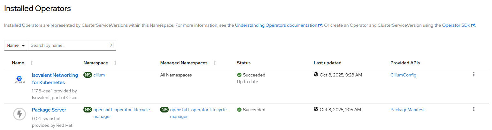
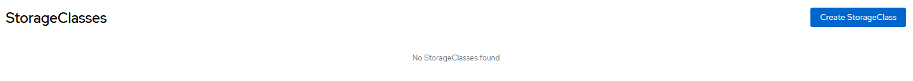
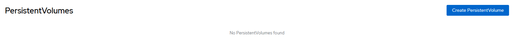
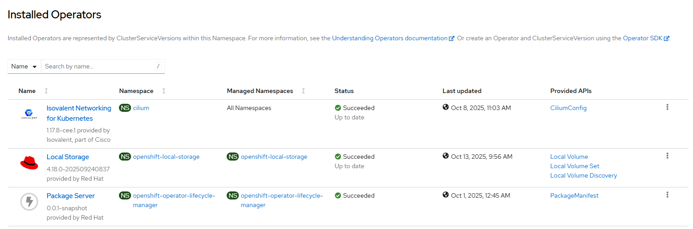
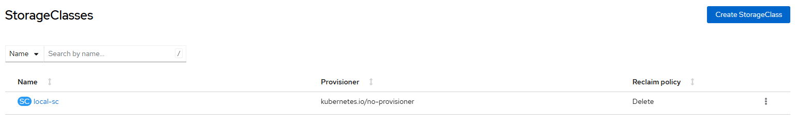
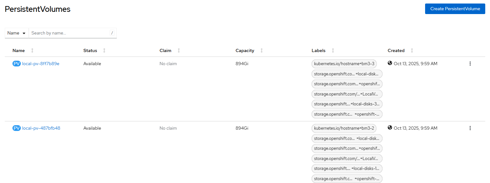

# Local Storage Operator - Example

## Step 1: Preparation

- prepare kubeconfig file
- add cluster
- define ssh access
- check k8s and ssh access

## Step 2: Check cluster state

### CLI

```
# iserver get ocp lso --cluster my-cluster

OpenShift Workflow - Local Storage Operator - Get Information
=============================================================

Workflow Parameters
-------------------
{
    "cluster": "my-cluster",
    "check-verbose": true,
    "namespace": "openshift-local-storage",
    "name": "local-storage-operator",
    "operator-group-name": "local-operator-group",
    "delete-namespace": true
}


OpenShift Cluster
-----------------
- cluster: my-cluster
- api [C:\Users\user\.itool\ocp-clusters\my-cluster\kubeconfig]: ok
- dns resolution: ok

Operator not found: local-storage-operator
```

```
# iserver get k8s sc --cluster my-cluster
Cluster: my-cluster (type: ocp)
-
Storage Class [#0]
------------------
None
```

```
# iserver get k8s pv --cluster my-cluster
Cluster: my-cluster (type: ocp)
/
PV [#0]
-------
None
```

### UI







## Step 3: Check disks

```
# iserver get linux lsblk --server ocp:my-cluster
OpenShift cluster: my-cluster
Server: ocp:my-cluster:node-1, ocp:my-cluster:node-2, ocp:my-cluster:node-3
|
Block Devices [ocp:my-cluster:node-1]
-----------------------------

+----------+-------+------+---------+--------+------------------+----------------------------------+-------+---------+--------------------------------------------------------+
| Path     | KName | Boot | Maj:Min | Size   | Model            | Serial                           | Group | FS Type | Disk ID                                                |
+----------+-------+------+---------+--------+------------------+----------------------------------+-------+---------+--------------------------------------------------------+
| /dev/sda | sda   | ✓    | 8:0     | 1.1T   | UCSC-RAID12G-2GB | 00fa361ac3d11b7729c00f7073e967c1 | disk  | ---     | /dev/disk/by-path/pci-0000:3c:00.0-scsi-0:2:0:0        | 
|          |       |      |         |        |                  |                                  |       |         | /dev/disk/by-id/wwn-0x6cc167e973700fc029771bd1c31a36fa | 
+----------+-------+------+---------+--------+------------------+----------------------------------+-------+---------+--------------------------------------------------------+
| /dev/sdb | sdb   |      | 8:16    | 894.3G | Micron_5100_MTFD | 173918EF25C1                     | disk  | ---     | /dev/disk/by-path/pci-0000:00:11.5-ata-1.0             |
|          |       |      |         |        |                  |                                  |       |         | /dev/disk/by-id/wwn-0x500a075118ef25c1                 |
+----------+-------+------+---------+--------+------------------+----------------------------------+-------+---------+--------------------------------------------------------+
| /dev/sdc | sdc   |      | 8:32    | 894.3G | Micron_5100_MTFD | 173918EF2777                     | disk  | ---     | /dev/disk/by-path/pci-0000:00:11.5-ata-3.0             |
|          |       |      |         |        |                  |                                  |       |         | /dev/disk/by-id/wwn-0x500a075118ef2777                 |
+----------+-------+------+---------+--------+------------------+----------------------------------+-------+---------+--------------------------------------------------------+

Block Devices [ocp:my-cluster:node-2]
-----------------------------

+----------+-------+------+---------+--------+------------------+----------------------------------+-------+---------+--------------------------------------------------------+
| Path     | KName | Boot | Maj:Min | Size   | Model            | Serial                           | Group | FS Type | Disk ID                                                |
+----------+-------+------+---------+--------+------------------+----------------------------------+-------+---------+--------------------------------------------------------+
| /dev/sda | sda   | ✓    | 8:0     | 1.1T   | UCSC-RAID12G-2GB | 003a3f808e6ab46829c0167073e967c1 | disk  | ---     | /dev/disk/by-path/pci-0000:3c:00.0-scsi-0:2:0:0        |
|          |       |      |         |        |                  |                                  |       |         | /dev/disk/by-id/wwn-0x6cc167e9737016c02968b46a8e803f3a |
+----------+-------+------+---------+--------+------------------+----------------------------------+-------+---------+--------------------------------------------------------+
| /dev/sdb | sdb   |      | 8:16    | 894.3G | Micron_5100_MTFD | 173918EF266C                     | disk  | ---     | /dev/disk/by-path/pci-0000:00:11.5-ata-1.0             |
|          |       |      |         |        |                  |                                  |       |         | /dev/disk/by-id/wwn-0x500a075118ef266c                 |
+----------+-------+------+---------+--------+------------------+----------------------------------+-------+---------+--------------------------------------------------------+
| /dev/sdc | sdc   |      | 8:32    | 894.3G | Micron_5100_MTFD | 173918EF25D9                     | disk  | ---     | /dev/disk/by-path/pci-0000:00:11.5-ata-3.0             |
|          |       |      |         |        |                  |                                  |       |         | /dev/disk/by-id/wwn-0x500a075118ef25d9                 |
+----------+-------+------+---------+--------+------------------+----------------------------------+-------+---------+--------------------------------------------------------+

Block Devices [ocp:my-cluster:node-3]
-----------------------------

+----------+-------+------+---------+--------+------------------+----------------------------------+-------+---------+--------------------------------------------------------+
| Path     | KName | Boot | Maj:Min | Size   | Model            | Serial                           | Group | FS Type | Disk ID                                                |
+----------+-------+------+---------+--------+------------------+----------------------------------+-------+---------+--------------------------------------------------------+
| /dev/sda | sda   |      | 8:0     | 894.3G | Micron_5100_MTFD | 173918EF291C                     | disk  | ---     | /dev/disk/by-path/pci-0000:00:11.5-ata-1.0             |
|          |       |      |         |        |                  |                                  |       |         | /dev/disk/by-id/wwn-0x500a075118ef291c                 |
+----------+-------+------+---------+--------+------------------+----------------------------------+-------+---------+--------------------------------------------------------+
| /dev/sdb | sdb   |      | 8:16    | 894.3G | Micron_5100_MTFD | 173918EF2616                     | disk  | ---     | /dev/disk/by-path/pci-0000:00:11.5-ata-3.0             |
|          |       |      |         |        |                  |                                  |       |         | /dev/disk/by-id/wwn-0x500a075118ef2616                 |
+----------+-------+------+---------+--------+------------------+----------------------------------+-------+---------+--------------------------------------------------------+
| /dev/sdc | sdc   | ✓    | 8:32    | 1.1T   | UCSC-RAID12G-2GB | 00769a6420e4e4ab27c00a7073e967c1 | disk  | ---     | /dev/disk/by-path/pci-0000:3c:00.0-scsi-0:2:0:0        |
|          |       |      |         |        |                  |                                  |       |         | /dev/disk/by-id/wwn-0x6cc167e973700ac027abe4e420649a76 |
+----------+-------+------+---------+--------+------------------+----------------------------------+-------+---------+--------------------------------------------------------+
```

## Step 4:  Add local storage operator on selected disks

```
# iserver set ocp lso --mode all --cluster my-cluster --device node-1:wwn-0x500a075118ef25c1 --device node-1:wwn-0x500a075118ef2777 --device node-2:wwn-0x500a075118ef266c --device node-2:wwn-0x500a075118ef25d9 --device node-3:wwn-0x500a075118ef2616 --device node-3:wwn-0x500a075118ef291c

OpenShift Workflow - Local Storage Operator - Create Operator
=============================================================

Workflow Parameters
-------------------
{
    "cluster": "my-cluster",
    "node-selector-override": false,
    "channel": "__default__",
    "confirmation": true,
    "check-verbose": true,
    "namespace": "openshift-local-storage",
    "name": "local-storage-operator",
    "operator-group-name": "local-operator-group",
    "delete-namespace": true
}


OpenShift Cluster
-----------------
- cluster: my-cluster
- api [C:\Users\user\.itool\ocp-clusters\my-cluster\kubeconfig]: ok
- dns resolution: ok


Create Namespace
----------------
- name: openshift-local-storage

~~~
apiVersion: v1
kind: Namespace
metadata:
  name: openshift-local-storage

~~~
Continue [Y/N]? y

Namespace created

Wait for namespace [timeout:60]...

Create Operator Group
---------------------
Operator group: openshift-local-storage/local-operator-group
Target namespaces: openshift-local-storage

~~~
apiVersion: operators.coreos.com/v1
kind: OperatorGroup
metadata:
  name: local-operator-group
  namespace: openshift-local-storage
spec:
  targetNamespaces:
  - openshift-local-storage

~~~
Continue [Y/N]? y

Operator group created

Wait for operator group [timeout:60]...

Create Subscription
-------------------
Subscription: openshift-local-storage/local-storage-operator
Source: openshift-marketplace/redhat-operators/local-storage-operator
Install plan approval: Automatic
Getting subscription and packege manifest information...
Resolving channel name...
Channel: stable
- CSV [local-storage-operator.v4.18.0-202509240837]
- CSV Display name [Local Storage]
- CVS Version [4.18.0-202509240837]
- CSV Provider [{'name': 'Red Hat'}]
- CSV Maturity [stable]

~~~
apiVersion: operators.coreos.com/v1alpha1
kind: Subscription
metadata:
  name: local-storage-operator
  namespace: openshift-local-storage
spec:
  channel: stable
  installPlanApproval: Automatic
  name: local-storage-operator
  source: redhat-operators
  sourceNamespace: openshift-marketplace

~~~
Continue [Y/N]? y

Subscription created

Wait for subscription install plan started [timeout:360]...
Install plan: install-bs78p
Wait for subscription install plan ready [timeout:600]...
Install plan succeeded
Wait for deployments ready (optional: False, allow zero replicas: False)...
- openshift-local-storage/local-storage-operator

Completed tasks
- Namespace created
- Operator Group created
- Local Storage Operator installed

OpenShift Workflow - Local Storage Operator - Create Local Volume
=================================================================

Workflow Parameters
-------------------
{
    "cluster": "my-cluster",
    "sc": "local-sc",
    "device": [
        "node-1:wwn-0x500a075118ef25c1",
        "node-1:wwn-0x500a075118ef2777",
        "node-2:wwn-0x500a075118ef266c",
        "node-2:wwn-0x500a075118ef25d9",
        "node-3:wwn-0x500a075118ef2616",
        "node-3:wwn-0x500a075118ef291c"
    ],
    "limit": [],
    "volume": "block",
    "fstype": "ext4",
    "max": -1,
    "confirmation": true,
    "ssh-required": true,
    "check-verbose": true,
    "namespace": "openshift-local-storage",
    "name": "local-storage-operator",
    "operator-group-name": "local-operator-group",
    "delete-namespace": true
}


OpenShift Cluster
-----------------
- cluster: my-cluster
- api [C:\Users\user\.itool\ocp-clusters\my-cluster\kubeconfig]: ok
- dns resolution: ok
- cluster node [10.10.10.10] [key:C:\Users\user\.itool\ocp-clusters\my-cluster\ssh.pub]: ok

Local Storage Operator
----------------------
- namespace: openshift-local-storage/local-storage-operator
- package: local-storage-operator
- csv: local-storage-operator.v4.18.0-202509240837

Collect cluster state and validate input values
-----------------------------------------------
- get kubernetes node names
- get linux level block devices for all nodes
- get local volumes
- get local volume sets
- get local volume discovery
- detected volume create mode: explicit
- state and values verified

Label Nodes
-----------
- node label: cluster.ocs.openshift.io/openshift-storage=""
- node: node-1
- node: node-2
- node: node-3

Create Local Volume
-------------------
- namespace: openshift-local-storage
- name: local-disks-08017d2040da
- nodes: node-1
- device paths: /dev/disk/by-id/wwn-0x500a075118ef25c1
- volume mode: block
- storage class: local-sc

~~~
apiVersion: local.storage.openshift.io/v1
kind: LocalVolume
metadata:
  name: local-disks-08017d2040da
  namespace: openshift-local-storage
spec:
  nodeSelector:
    nodeSelectorTerms:
    - matchExpressions:
      - key: kubernetes.io/hostname
        operator: In
        values:
        - node-1
  storageClassDevices:
  - devicePaths:
    - /dev/disk/by-id/wwn-0x500a075118ef25c1
    forceWipeDevicesAndDestroyAllData: false
    storageClassName: local-sc
    volumeMode: Block

~~~
Continue [Y/N]? y

- Local volume created

- wait for LocalVolume crd [timeout:60]...
- wait for persistent volumes [timeout:180]...

Create Local Volume
-------------------
- namespace: openshift-local-storage
- name: local-disks-e365dbd6bf05
- nodes: node-1
- device paths: /dev/disk/by-id/wwn-0x500a075118ef2777
- volume mode: block
- storage class: local-sc

~~~
apiVersion: local.storage.openshift.io/v1
kind: LocalVolume
metadata:
  name: local-disks-e365dbd6bf05
  namespace: openshift-local-storage
spec:
  nodeSelector:
    nodeSelectorTerms:
    - matchExpressions:
      - key: kubernetes.io/hostname
        operator: In
        values:
        - node-1
  storageClassDevices:
  - devicePaths:
    - /dev/disk/by-id/wwn-0x500a075118ef2777
    forceWipeDevicesAndDestroyAllData: false
    storageClassName: local-sc
    volumeMode: Block

~~~
Continue [Y/N]? y

- Local volume created

- wait for LocalVolume crd [timeout:60]...
- wait for persistent volumes [timeout:180]...

Create Local Volume
-------------------
- namespace: openshift-local-storage
- name: local-disks-e850c1b1fcc9
- nodes: node-2
- device paths: /dev/disk/by-id/wwn-0x500a075118ef266c
- volume mode: block
- storage class: local-sc

~~~
apiVersion: local.storage.openshift.io/v1
kind: LocalVolume
metadata:
  name: local-disks-e850c1b1fcc9
  namespace: openshift-local-storage
spec:
  nodeSelector:
    nodeSelectorTerms:
    - matchExpressions:
      - key: kubernetes.io/hostname
        operator: In
        values:
        - node-2
  storageClassDevices:
  - devicePaths:
    - /dev/disk/by-id/wwn-0x500a075118ef266c
    forceWipeDevicesAndDestroyAllData: false
    storageClassName: local-sc
    volumeMode: Block

~~~
Continue [Y/N]? y

- Local volume created

- wait for LocalVolume crd [timeout:60]...
- wait for persistent volumes [timeout:180]...

Create Local Volume
-------------------
- namespace: openshift-local-storage
- name: local-disks-1d7e2f8520c1
- nodes: node-2
- device paths: /dev/disk/by-id/wwn-0x500a075118ef25d9
- volume mode: block
- storage class: local-sc

~~~
apiVersion: local.storage.openshift.io/v1
kind: LocalVolume
metadata:
  name: local-disks-1d7e2f8520c1
  namespace: openshift-local-storage
spec:
  nodeSelector:
    nodeSelectorTerms:
    - matchExpressions:
      - key: kubernetes.io/hostname
        operator: In
        values:
        - node-2
  storageClassDevices:
  - devicePaths:
    - /dev/disk/by-id/wwn-0x500a075118ef25d9
    forceWipeDevicesAndDestroyAllData: false
    storageClassName: local-sc
    volumeMode: Block

~~~
Continue [Y/N]? y

- Local volume created

- wait for LocalVolume crd [timeout:60]...
- wait for persistent volumes [timeout:180]...

Create Local Volume
-------------------
- namespace: openshift-local-storage
- name: local-disks-e21187c628c8
- nodes: node-3
- device paths: /dev/disk/by-id/wwn-0x500a075118ef2616
- volume mode: block
- storage class: local-sc

~~~
apiVersion: local.storage.openshift.io/v1
kind: LocalVolume
metadata:
  name: local-disks-e21187c628c8
  namespace: openshift-local-storage
spec:
  nodeSelector:
    nodeSelectorTerms:
    - matchExpressions:
      - key: kubernetes.io/hostname
        operator: In
        values:
        - node-3
  storageClassDevices:
  - devicePaths:
    - /dev/disk/by-id/wwn-0x500a075118ef2616
    forceWipeDevicesAndDestroyAllData: false
    storageClassName: local-sc
    volumeMode: Block

~~~
Continue [Y/N]? y

- Local volume created

- wait for LocalVolume crd [timeout:60]...
- wait for persistent volumes [timeout:180]...

Create Local Volume
-------------------
- namespace: openshift-local-storage
- name: local-disks-33e88bf057ad
- nodes: node-3
- device paths: /dev/disk/by-id/wwn-0x500a075118ef291c
- volume mode: block
- storage class: local-sc

~~~
apiVersion: local.storage.openshift.io/v1
kind: LocalVolume
metadata:
  name: local-disks-33e88bf057ad
  namespace: openshift-local-storage
spec:
  nodeSelector:
    nodeSelectorTerms:
    - matchExpressions:
      - key: kubernetes.io/hostname
        operator: In
        values:
        - node-3
  storageClassDevices:
  - devicePaths:
    - /dev/disk/by-id/wwn-0x500a075118ef291c
    forceWipeDevicesAndDestroyAllData: false
    storageClassName: local-sc
    volumeMode: Block

~~~
Continue [Y/N]? y

- Local volume created

- wait for LocalVolume crd [timeout:60]...
- wait for persistent volumes [timeout:180]...

+-------------------+-----------+-------+----------+-------+---------------+-------------+--------------------------+--------------------------------+-----+------+
| Name              | Status    | Mode  | SC       | Size  | Access Mode   | CSI Driver  | CSI Handle               | Device                         | PVC | Age  |
+-------------------+-----------+-------+----------+-------+---------------+-------------+--------------------------+--------------------------------+-----+------+
| local-pv-487bfb48 | Available | Block | local-sc | 894Gi | ReadWriteOnce | LocalVolume | local-disks-1d7e2f8520c1 | wwn-0x500a075118ef25d9 [node-2] | --  | 2h0m |
| local-pv-810111b0 | Available | Block | local-sc | 894Gi | ReadWriteOnce | LocalVolume | local-disks-e365dbd6bf05 | wwn-0x500a075118ef2777 [node-1] | --  | 2h0m |
| local-pv-8ff7b89e | Available | Block | local-sc | 894Gi | ReadWriteOnce | LocalVolume | local-disks-33e88bf057ad | wwn-0x500a075118ef291c [node-3] | --  | 2h0m |
| local-pv-bf5ba6b4 | Available | Block | local-sc | 894Gi | ReadWriteOnce | LocalVolume | local-disks-08017d2040da | wwn-0x500a075118ef25c1 [node-1] | --  | 2h1m |
| local-pv-c6bf5067 | Available | Block | local-sc | 894Gi | ReadWriteOnce | LocalVolume | local-disks-e850c1b1fcc9 | wwn-0x500a075118ef266c [node-2] | --  | 2h0m |
| local-pv-fe6e649c | Available | Block | local-sc | 894Gi | ReadWriteOnce | LocalVolume | local-disks-e21187c628c8 | wwn-0x500a075118ef2616 [node-3] | --  | 2h0m |
+-------------------+-----------+-------+----------+-------+---------------+-------------+--------------------------+--------------------------------+-----+------+

Completed tasks
- Volumes created
```

## Step 5: Verify

### CLI

```
# iserver get ocp lso

OpenShift Workflow - Local Storage Operator - Get Information
=============================================================

Workflow Parameters
-------------------
{
    "cluster": "my-cluster",
    "check-verbose": true,
    "namespace": "openshift-local-storage",
    "name": "local-storage-operator",
    "operator-group-name": "local-operator-group",
    "delete-namespace": true
}


OpenShift Cluster
-----------------
- cluster: my-cluster
- api [C:\Users\user\.itool\ocp-clusters\my-cluster\kubeconfig]: ok
- dns resolution: ok

Operator
--------
- subscription: openshift-local-storage/local-storage-operator
- channel: stable
- csv: local-storage-operator.v4.18.0-202509240837

Operator functional readiness
-----------------------------
ready

Local Volume Discovery [#0]
---------------------------
None

Local Volume Discovery Result - Available Devices
-------------------------------------------------
None

LocalVolumeSet [#0]
-------------------
None

Local Volume [#6]
-----------------

+-------------------------+--------------------------+-------+------------------------+---------------+-------+
| Namespace               | Name                     | Node  | Device                 | Storage Class | Mode  |
+-------------------------+--------------------------+-------+------------------------+---------------+-------+
| openshift-local-storage | local-disks-08017d2040da | node-1 | wwn-0x500a075118ef25c1 | local-sc      | Block |
| openshift-local-storage | local-disks-1d7e2f8520c1 | node-2 | wwn-0x500a075118ef25d9 | local-sc      | Block |
| openshift-local-storage | local-disks-33e88bf057ad | node-3 | wwn-0x500a075118ef291c | local-sc      | Block |
| openshift-local-storage | local-disks-e21187c628c8 | node-3 | wwn-0x500a075118ef2616 | local-sc      | Block |
| openshift-local-storage | local-disks-e365dbd6bf05 | node-1 | wwn-0x500a075118ef2777 | local-sc      | Block |
| openshift-local-storage | local-disks-e850c1b1fcc9 | node-2 | wwn-0x500a075118ef266c | local-sc      | Block |
+-------------------------+--------------------------+-------+------------------------+---------------+-------+

Storage Class [#1]
------------------

+----------+---------+------------------------------+----------------+----------------------+------------------------+----+
| Name     | Default | Provisioner                  | Reclaim Policy | Volume Binding Mode  | Allow Volume Expansion | PV |
+----------+---------+------------------------------+----------------+----------------------+------------------------+----+
| local-sc |         | kubernetes.io/no-provisioner | Delete         | WaitForFirstConsumer | None                   | 6  |
+----------+---------+------------------------------+----------------+----------------------+------------------------+----+

PV [#6]
-------

+-------------------+-----------+-------+----------+-------+---------------+-------------+--------------------------+--------------------------------+-----+------+
| Name              | Status    | Mode  | SC       | Size  | Access Mode   | CSI Driver  | CSI Handle               | Device                         | PVC | Age  |
+-------------------+-----------+-------+----------+-------+---------------+-------------+--------------------------+--------------------------------+-----+------+
| local-pv-487bfb48 | Available | Block | local-sc | 894Gi | ReadWriteOnce | LocalVolume | local-disks-1d7e2f8520c1 | wwn-0x500a075118ef25d9 [node-2] | --  | 2h3m |
| local-pv-810111b0 | Available | Block | local-sc | 894Gi | ReadWriteOnce | LocalVolume | local-disks-e365dbd6bf05 | wwn-0x500a075118ef2777 [node-1] | --  | 2h3m |
| local-pv-8ff7b89e | Available | Block | local-sc | 894Gi | ReadWriteOnce | LocalVolume | local-disks-33e88bf057ad | wwn-0x500a075118ef291c [node-3] | --  | 2h3m |
| local-pv-bf5ba6b4 | Available | Block | local-sc | 894Gi | ReadWriteOnce | LocalVolume | local-disks-08017d2040da | wwn-0x500a075118ef25c1 [node-1] | --  | 2h4m |
| local-pv-c6bf5067 | Available | Block | local-sc | 894Gi | ReadWriteOnce | LocalVolume | local-disks-e850c1b1fcc9 | wwn-0x500a075118ef266c [node-2] | --  | 2h3m |
| local-pv-fe6e649c | Available | Block | local-sc | 894Gi | ReadWriteOnce | LocalVolume | local-disks-e21187c628c8 | wwn-0x500a075118ef2616 [node-3] | --  | 2h3m |
+-------------------+-----------+-------+----------+-------+---------------+-------------+--------------------------+--------------------------------+-----+------+
```

### UI







[[Back]](./README.md)