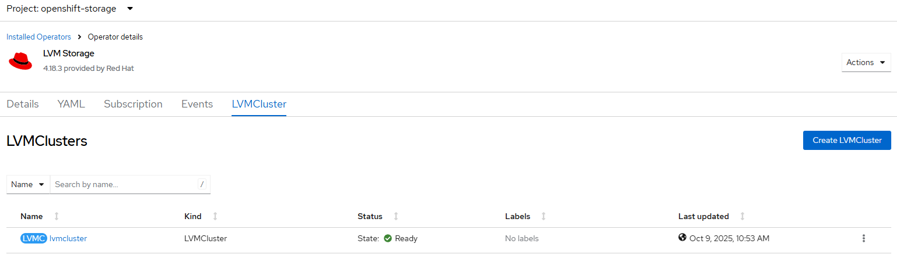

# LVM Storage Operator - Create cluster instance

## Workflow

The desired state of LVM subsystem is controlled with single LVMCluster CRD
- Create LVM volume groups that you can use to provision persistent volume claims (PVCs).
- Configure a list of devices that you want to add to the LVM volume groups.
- Configure the requirements to select the nodes on which you want to create an LVM volume group, and the thin pool configuration for the volume group.
- Force wipe the selected devices

Create LVMCluster based on 
- filename defined with --filename option with expected LVMCluster CRD in yaml format
- generate LVMCluster CRD based on user input (--device)

## Requirements

- LVM storage operator must be installed and ready
- LVM cluster instance must not be defined
- Storage class for LVM storage must not be defined
- if LVMCluster is generated based on --device input, ssh access to cluster is required

## Configurable options

```
# iserver set ocp lvm --mode cluster
  --cluster TEXT                  Cluster Name
  --filename TEXT                 LVM Cluster
  --device TEXT                   Device names for lvm storage
  --no-confirm                    Confirmation mode
```

## Expected Outcome



## Example with default generated LVMCluster CRD

```
apiVersion: lvm.topolvm.io/v1alpha1
kind: LVMCluster
metadata:
  name: my-lvmcluster
  namespace: openshift-storage
spec:
  storage:
    deviceClasses:
    - default: false
      fstype: xfs
      name: vg1
      thinPoolConfig:
        chunkSizeCalculationPolicy: Static
        metadataSizeCalculationPolicy: Host
        name: thin-pool-1
        overprovisionRatio: 10
        sizePercent: 90
```

```
# iserver set ocp lvm --mode cluster

OpenShift Workflow - LVM Operator - Create Cluster
==================================================

Workflow Parameters
-------------------
{
    "cluster": "bm1",
    "device": [],
    "confirmation": true,
    "ssh-check": true,
    "check-verbose": true,
    "instance": null,
    "ssh-required": false,
    "namespace": "openshift-storage",
    "name": "lvms-operator",
    "operator-group-name": "lvm-operator-group",
    "delete-namespace": true
}


OpenShift Cluster
-----------------
- cluster: bm1 [domain:local]
- api [C:\Users\user\.itool\ocp-clusters\bm1\kubeconfig]: ok
- dns resolution: ok
- cluster node [10.10.10.10] [key:C:\Users\user\.itool\ocp-clusters\bm1\ssh.pub]: ok


LVM Operator
------------
LVM Operator [openshift-storage/lvms] with csv [lvms-operator.v4.18.3]
LVM Subscription resources deployed
LVM Cluster instance not found
Devices not defined

Create LVM Cluster
------------------
- namespace: openshift-storage
- name: lvmcluster

~~~
apiVersion: lvm.topolvm.io/v1alpha1
kind: LVMCluster
metadata:
  name: lvmcluster
  namespace: openshift-storage
spec:
  storage:
    deviceClasses:
    - default: false
      fstype: xfs
      name: vg1
      thinPoolConfig:
        chunkSizeCalculationPolicy: Static
        metadataSizeCalculationPolicy: Host
        name: thin-pool-1
        overprovisionRatio: 10
        sizePercent: 90

~~~
Wait until ready or degraded [timeout:180s]...
Wait for lvm storage class [timeout:180s]...


LVMCluster
----------
- Namespace : openshift-storage
- Name      : lvmcluster
- State     : Ready
- Ready     : ✓
- Resources : ✓
- VGs       : ✓


Device Class
------------
- Name            : vg1
- Filesystem Type : xfs
- Default         : ✗
- Nodes Ready     : 1/1


+---------+------------------+--------+----------+-----------+-------------------------------------------------------------------------+
| Node    | Discovery Policy | Status | Devices  | Excluded  | Reason                                                                  |
+---------+------------------+--------+----------+-----------+-------------------------------------------------------------------------+
| ocp-bm1 | RuntimeDynamic   | Ready  | /dev/sda | /dev/sdc  | /dev/sdc has children block devices and could not be considered         | 
|         |                  |        | /dev/sdb | /dev/sdc1 | /dev/sdc1 has an invalid partition label "BIOS-BOOT"                    | 
|         |                  |        | /dev/sdd | /dev/sdc2 | /dev/sdc2 has an invalid filesystem signature (vfat) and cannot be used | 
|         |                  |        |          | /dev/sdc3 | /dev/sdc3 has an invalid filesystem signature (ext4) and cannot be used | 
|         |                  |        |          | /dev/sdc4 | /dev/sdc3 has an invalid partition label "boot"                         | 
|         |                  |        |          |           | /dev/sdc4 has an invalid filesystem signature (xfs) and cannot be used  | 
+---------+------------------+--------+----------+-----------+-------------------------------------------------------------------------+


+----------+---------+-------------+----------------+----------------------+------------------------+
| Name     | Default | Provisioner | Reclaim Policy | Volume Binding Mode  | Allow Volume Expansion |
+----------+---------+-------------+----------------+----------------------+------------------------+
| lvms-vg1 |         | topolvm.io  | Delete         | WaitForFirstConsumer | True                   | 
+----------+---------+-------------+----------------+----------------------+------------------------+

Collect linux level lvm state...
- ocp-bm1: collected [blks, lvs, vgs, pvs]

Block Devices [ocp-bm1]
-----------------------

+----------+-------+------+---------+--------+------------------+----------------------------------+-------+---------+
| Path     | KName | Boot | Maj:Min | Size   | Model            | Serial                           | Group | FS Type |
+----------+-------+------+---------+--------+------------------+----------------------------------+-------+---------+
| /dev/sda | sda   |      | 8:0     | 894.3G | Micron_5100_MTFD | xxxxxxxxxxx                      | disk  | LVM2    | 
+----------+-------+------+---------+--------+------------------+----------------------------------+-------+---------+
| /dev/sdb | sdb   |      | 8:16    | 894.3G | Micron_5100_MTFD | xxxxxxxxxxx                      | disk  | LVM2    | 
+----------+-------+------+---------+--------+------------------+----------------------------------+-------+---------+
| /dev/sdc | sdc   | ✓    | 8:32    | 1.1T   | UCSC-RAID12G-2GB | xxxxxxxxxxxxxxxxxxxxxxxxxxxxxxxx | disk  | ---     | 
+----------+-------+------+---------+--------+------------------+----------------------------------+-------+---------+
| /dev/sdd | sdd   |      | 8:48    | 1.1T   | UCSC-RAID12G-2GB | xxxxxxxxxxxxxxxxxxxxxxxxxxxxxxxx | disk  | LVM2    | 
+----------+-------+------+---------+--------+------------------+----------------------------------+-------+---------+

Physical Volume (LVM) [ocp-bm1]
-------------------------------

+----------+-----+------+------+---------+----------+
| PV       | VG  | Fmt  | Attr | PSize   | PFree    |
+----------+-----+------+------+---------+----------+
| /dev/sda | vg1 | lvm2 | a--  | 894.25g | 0        | 
| /dev/sdb | vg1 | lvm2 | a--  | 894.25g | <290.52g | 
| /dev/sdd | vg1 | lvm2 | a--  | 1.09t   | 0        | 
+----------+-----+------+------+---------+----------+

Volume Groups (LVM) [ocp-bm1]
-----------------------------

+-----+-----+-----+--------+--------+----------+
| VG  | #PV | #LV | Attr   | VSize  | VFree    |
+-----+-----+-----+--------+--------+----------+
| vg1 | 3   | 1   | wz--n- | <2.84t | <290.52g | 
+-----+-----+-----+--------+--------+----------+

Logical Volumes (LVM) [ocp-bm1]
-------------------------------

+-------------+-----+---------+-------+---------+-------+--------+---------+------+-----------+
| LV Name     | VG  | LV Pool | Dev   | LV Size | MSize | Layout | Role    | Snap | K8s Usage |
+-------------+-----+---------+-------+---------+-------+--------+---------+------+-----------+
| thin-pool-1 | vg1 |         | 253:2 | 2.55t   | 0.00% | thin   | private | --   | N/A       | 
|             |     |         |       |         |       | pool   |         |      |           | 
+-------------+-----+---------+-------+---------+-------+--------+---------+------+-----------+

Completed tasks
- LVM Cluster instance created and ready
- Storage class ready
```

## Example with device-based generated LVMCluster CRD

```
# iserver set ocp lvm --cluster bm1 --mode cluster --device sda --device sdc
```

```
# iserver set ocp lvm --cluster bm1 --mode cluster --device pci-0000:3c:00.0-scsi-0:2:1:0 --device pci-0000:00:11.5-ata-1.0
```

Hint: 
- use 'iserver get linux lsblk' to find device names to path binding

```
apiVersion: lvm.topolvm.io/v1alpha1
kind: LVMCluster
metadata:
  name: my-lvmcluster
  namespace: openshift-storage
spec:
  storage:
    deviceClasses:
    - default: false
      deviceSelector:
        paths:
        - /dev/disk/by-path/pci-0000:3c:00.0-scsi-0:2:1:0
        - /dev/disk/by-path/pci-0000:00:11.5-ata-1.0
      fstype: xfs
      name: vg1
      thinPoolConfig:
        chunkSizeCalculationPolicy: Static
        metadataSizeCalculationPolicy: Host
        name: thin-pool-1
        overprovisionRatio: 10
        sizePercent: 90
```

```
# iserver set ocp lvm --mode cluster --cluster bm1 --device sda --device sdb

OpenShift Workflow - LVM Operator - Create Cluster
==================================================

Workflow Parameters
-------------------
{
    "cluster": "bm1",
    "device": [
        "sda",
        "sdb"
    ],
    "confirmation": true,
    "ssh-check": true,
    "check-verbose": true,
    "instance": null,
    "ssh-required": true,
    "namespace": "openshift-storage",
    "name": "lvms-operator",
    "operator-group-name": "lvm-operator-group",
    "delete-namespace": true
}


OpenShift Cluster
-----------------
- cluster: bm1 [domain:local]
- api [C:\Users\user\.itool\ocp-clusters\bm1\kubeconfig]: ok
- dns resolution: ok
- cluster node [10.10.10.10] [key:C:\Users\user\.itool\ocp-clusters\bm1\ssh.pub]: ok


LVM Operator
------------
LVM Operator [openshift-storage/lvms] with csv [lvms-operator.v4.18.3]
LVM Subscription resources deployed
LVM Cluster instance not found
Target block devices
- /dev/sda
- /dev/sdb


Collect linux level lsblk per node...

Block Devices [ocp-bm1]
-----------------------

+----------+-------+------+---------+--------+------------------+-------------+-------+---------+--------------------------------------------+
| Path     | KName | Boot | Maj:Min | Size   | Model            | Serial      | Group | FS Type | Disk ID                                    |
+----------+-------+------+---------+--------+------------------+-------------+-------+---------+--------------------------------------------+
| /dev/sda | sda   |      | 8:0     | 894.3G | Micron_5100_MTFD | xxxxxxxxxxx | disk  | ---     | /dev/disk/by-path/pci-0000:00:11.5-ata-1.0 |
|          |       |      |         |        |                  |             |       |         | /dev/disk/by-id/wwn-0x500a07511c556087     |
+----------+-------+------+---------+--------+------------------+-------------+-------+---------+--------------------------------------------+
| /dev/sdb | sdb   |      | 8:16    | 894.3G | Micron_5100_MTFD | xxxxxxxxxxx | disk  | ---     | /dev/disk/by-path/pci-0000:00:11.5-ata-3.0 |
|          |       |      |         |        |                  |             |       |         | /dev/disk/by-id/wwn-0x500a07511c5560db     |
+----------+-------+------+---------+--------+------------------+-------------+-------+---------+--------------------------------------------+

Create LVM Cluster
------------------
- namespace: openshift-storage
- name: lvmcluster

~~~
apiVersion: lvm.topolvm.io/v1alpha1
kind: LVMCluster
metadata:
  name: lvmcluster
  namespace: openshift-storage
spec:
  storage:
    deviceClasses:
    - default: false
      deviceSelector:
        paths:
        - /dev/disk/by-path/pci-0000:00:11.5-ata-1.0
        - /dev/disk/by-path/pci-0000:00:11.5-ata-3.0
      fstype: xfs
      name: vg1
      thinPoolConfig:
        chunkSizeCalculationPolicy: Static
        metadataSizeCalculationPolicy: Host
        name: thin-pool-1
        overprovisionRatio: 10
        sizePercent: 90

~~~
Continue [Y/N]? y
Wait until ready or degraded [timeout:180s]...
Wait for lvm storage class [timeout:180s]...


LVMCluster
----------
- Namespace : openshift-storage
- Name      : lvmcluster
- State     : Ready
- Ready     : ✓
- Resources : ✓
- VGs       : ✓


Device Class
------------
- Name            : vg1
- Filesystem Type : xfs
- Default         : ✗
- Nodes Ready     : 1/1


+---------+------------------+--------+----------+-----------+----------------------------------------------------------------------------------------------+
| Node    | Discovery Policy | Status | Devices  | Excluded  | Reason                                                                                       |
+---------+------------------+--------+----------+-----------+----------------------------------------------------------------------------------------------+
| ocp-bm1 | Preconfigured    | Ready  | /dev/sda | /dev/sdc  | /dev/sdc has children block devices and could not be considered                              |
|         |                  |        | /dev/sdb | /dev/sdc1 | /dev/sdc is not part of the device selector or could not be resolved via symlink resolution  | 
|         |                  |        |          | /dev/sdc2 | /dev/sdc1 has an invalid partition label "BIOS-BOOT"                                         |
|         |                  |        |          | /dev/sdc3 | /dev/sdc1 is not part of the device selector or could not be resolved via symlink resolution |
|         |                  |        |          | /dev/sdc4 | /dev/sdc2 has an invalid filesystem signature (vfat) and cannot be used                      |
|         |                  |        |          | /dev/sdd  | /dev/sdc2 is not part of the device selector or could not be resolved via symlink resolution |
|         |                  |        |          |           | /dev/sdc3 has an invalid filesystem signature (ext4) and cannot be used                      |
|         |                  |        |          |           | /dev/sdc3 has an invalid partition label "boot"                                              |
|         |                  |        |          |           | /dev/sdc3 is not part of the device selector or could not be resolved via symlink resolution | 
|         |                  |        |          |           | /dev/sdc4 has an invalid filesystem signature (xfs) and cannot be used                       |
|         |                  |        |          |           | /dev/sdc4 is not part of the device selector or could not be resolved via symlink resolution |
|         |                  |        |          |           | /dev/sdd is not part of the device selector or could not be resolved via symlink resolution  |
+---------+------------------+--------+----------+-----------+----------------------------------------------------------------------------------------------+


+----------+---------+-------------+----------------+----------------------+------------------------+
| Name     | Default | Provisioner | Reclaim Policy | Volume Binding Mode  | Allow Volume Expansion |
+----------+---------+-------------+----------------+----------------------+------------------------+
| lvms-vg1 |         | topolvm.io  | Delete         | WaitForFirstConsumer | True                   |
+----------+---------+-------------+----------------+----------------------+------------------------+

Collect linux level lvm state...
- ocp-bm1: collected [blks, lvs, vgs, pvs]

Block Devices [ocp-bm1]
-----------------------

+----------+-------+------+---------+--------+------------------+----------------------------------+-------+---------+
| Path     | KName | Boot | Maj:Min | Size   | Model            | Serial                           | Group | FS Type |
+----------+-------+------+---------+--------+------------------+----------------------------------+-------+---------+
| /dev/sda | sda   |      | 8:0     | 894.3G | Micron_5100_MTFD | xxxxxxxxxxx                      | disk  | LVM2    |
+----------+-------+------+---------+--------+------------------+----------------------------------+-------+---------+
| /dev/sdb | sdb   |      | 8:16    | 894.3G | Micron_5100_MTFD | xxxxxxxxxxx                      | disk  | LVM2    |
+----------+-------+------+---------+--------+------------------+----------------------------------+-------+---------+
| /dev/sdc | sdc   | ✓    | 8:32    | 1.1T   | UCSC-RAID12G-2GB | xxxxxxxxxxxxxxxxxxxxxxxxxxxxxxxx | disk  | ---     |
+----------+-------+------+---------+--------+------------------+----------------------------------+-------+---------+
| /dev/sdd | sdd   |      | 8:48    | 1.1T   | UCSC-RAID12G-2GB | xxxxxxxxxxxxxxxxxxxxxxxxxxxxxxxx | disk  | ---     |
+----------+-------+------+---------+--------+------------------+----------------------------------+-------+---------+

Physical Volume (LVM) [ocp-bm1]
-------------------------------

+----------+-----+------+------+---------+---------+
| PV       | VG  | Fmt  | Attr | PSize   | PFree   |
+----------+-----+------+------+---------+---------+
| /dev/sda | vg1 | lvm2 | a--  | 894.25g | 178.85g |
| /dev/sdb | vg1 | lvm2 | a--  | 894.25g | 0       |
+----------+-----+------+------+---------+---------+

Volume Groups (LVM) [ocp-bm1]
-----------------------------

+-----+-----+-----+--------+--------+---------+
| VG  | #PV | #LV | Attr   | VSize  | VFree   |
+-----+-----+-----+--------+--------+---------+
| vg1 | 2   | 1   | wz--n- | <1.75t | 178.85g |
+-----+-----+-----+--------+--------+---------+

Logical Volumes (LVM) [ocp-bm1]
-------------------------------

+-------------+-----+---------+-------+---------+-------+--------+---------+------+-----------+
| LV Name     | VG  | LV Pool | Dev   | LV Size | MSize | Layout | Role    | Snap | K8s Usage |
+-------------+-----+---------+-------+---------+-------+--------+---------+------+-----------+
| thin-pool-1 | vg1 |         | 253:2 | 1.57t   | 0.00% | thin   | private | --   | N/A       |
|             |     |         |       |         |       | pool   |         |      |           |
+-------------+-----+---------+-------+---------+-------+--------+---------+------+-----------+

Completed tasks
- LVM Cluster instance created and ready
- Storage class ready
```

## Example with custom LVMCluster CRD

```
# iserver set ocp lvm --mode cluster --cluster bm1 --filename C:\tmp\lvmcluster.yaml

OpenShift Workflow - LVM Operator - Create Cluster
==================================================

C:\tmp\lvmcluster.yaml
Workflow Parameters
-------------------
{
    "cluster": "bm1",
    "device": [],
    "confirmation": true,
    "ssh-check": true,
    "check-verbose": true,
    "instance": "user-defined",
    "ssh-required": false,
    "namespace": "openshift-storage",
    "name": "lvms-operator",
    "operator-group-name": "lvm-operator-group",
    "delete-namespace": true
}


OpenShift Cluster
-----------------
- cluster: bm1 [domain:local]
- api [C:\Users\user\.itool\ocp-clusters\bm1\kubeconfig]: ok
- dns resolution: ok
- cluster node [10.10.10.10] [key:C:\Users\user\.itool\ocp-clusters\bm1\ssh.pub]: ok


LVM Operator
------------
LVM Operator [openshift-storage/lvms] with csv [lvms-operator.v4.18.3]
LVM Subscription resources deployed
LVM Cluster instance not found
Devices not defined

Create LVM Cluster
------------------
- namespace: openshift-storage
- name: my-lvmcluster

~~~
apiVersion: lvm.topolvm.io/v1alpha1
kind: LVMCluster
metadata:
  name: my-lvmcluster
  namespace: openshift-storage
spec:
  storage:
    deviceClasses:
    - default: false
      fstype: xfs
      name: vg1
      thinPoolConfig:
        chunkSizeCalculationPolicy: Static
        metadataSizeCalculationPolicy: Host
        name: thin-pool-1
        overprovisionRatio: 10
        sizePercent: 90

~~~
Continue [Y/N]? y
Wait until ready or degraded [timeout:180s]...
Wait for lvm storage class [timeout:180s]...


LVMCluster
----------
- Namespace : openshift-storage
- Name      : my-lvmcluster
- State     : Ready
- Ready     : ✓
- Resources : ✓
- VGs       : ✓


Device Class
------------
- Name            : vg1
- Filesystem Type : xfs
- Default         : ✗
- Nodes Ready     : 1/1


+---------+------------------+--------+----------+-----------+-------------------------------------------------------------------------+
| Node    | Discovery Policy | Status | Devices  | Excluded  | Reason                                                                  |
+---------+------------------+--------+----------+-----------+-------------------------------------------------------------------------+
| ocp-bm1 | RuntimeDynamic   | Ready  | /dev/sda | /dev/sdc  | /dev/sdc has children block devices and could not be considered         |
|         |                  |        | /dev/sdb | /dev/sdc1 | /dev/sdc1 has an invalid partition label "BIOS-BOOT"                    |
|         |                  |        | /dev/sdd | /dev/sdc2 | /dev/sdc2 has an invalid filesystem signature (vfat) and cannot be used |
|         |                  |        |          | /dev/sdc3 | /dev/sdc3 has an invalid filesystem signature (ext4) and cannot be used |
|         |                  |        |          | /dev/sdc4 | /dev/sdc3 has an invalid partition label "boot"                         |
|         |                  |        |          |           | /dev/sdc4 has an invalid filesystem signature (xfs) and cannot be used  |
+---------+------------------+--------+----------+-----------+-------------------------------------------------------------------------+


+----------+---------+-------------+----------------+----------------------+------------------------+
| Name     | Default | Provisioner | Reclaim Policy | Volume Binding Mode  | Allow Volume Expansion |
+----------+---------+-------------+----------------+----------------------+------------------------+
| lvms-vg1 |         | topolvm.io  | Delete         | WaitForFirstConsumer | True                   |
+----------+---------+-------------+----------------+----------------------+------------------------+

Collect linux level lvm state...
- ocp-bm1: collected [blks, lvs, vgs, pvs]

Block Devices [ocp-bm1]
-----------------------

+----------+-------+------+---------+--------+------------------+----------------------------------+-------+---------+
| Path     | KName | Boot | Maj:Min | Size   | Model            | Serial                           | Group | FS Type |
+----------+-------+------+---------+--------+------------------+----------------------------------+-------+---------+
| /dev/sda | sda   |      | 8:0     | 894.3G | Micron_5100_MTFD | xxxxxxxxxxx                      | disk  | LVM2    |
+----------+-------+------+---------+--------+------------------+----------------------------------+-------+---------+
| /dev/sdb | sdb   |      | 8:16    | 894.3G | Micron_5100_MTFD | xxxxxxxxxxx                      | disk  | LVM2    |
+----------+-------+------+---------+--------+------------------+----------------------------------+-------+---------+
| /dev/sdc | sdc   | ✓    | 8:32    | 1.1T   | UCSC-RAID12G-2GB | xxxxxxxxxxxxxxxxxxxxxxxxxxxxxxxx | disk  | ---     |
+----------+-------+------+---------+--------+------------------+----------------------------------+-------+---------+
| /dev/sdd | sdd   |      | 8:48    | 1.1T   | UCSC-RAID12G-2GB | xxxxxxxxxxxxxxxxxxxxxxxxxxxxxxxx | disk  | LVM2    |
+----------+-------+------+---------+--------+------------------+----------------------------------+-------+---------+

Physical Volume (LVM) [ocp-bm1]
-------------------------------

+----------+-----+------+------+---------+----------+
| PV       | VG  | Fmt  | Attr | PSize   | PFree    |
+----------+-----+------+------+---------+----------+
| /dev/sda | vg1 | lvm2 | a--  | 894.25g | <290.52g |
| /dev/sdb | vg1 | lvm2 | a--  | 894.25g | 0        |
| /dev/sdd | vg1 | lvm2 | a--  | 1.09t   | 0        |
+----------+-----+------+------+---------+----------+

Volume Groups (LVM) [ocp-bm1]
-----------------------------

+-----+-----+-----+--------+--------+----------+
| VG  | #PV | #LV | Attr   | VSize  | VFree    |
+-----+-----+-----+--------+--------+----------+
| vg1 | 3   | 1   | wz--n- | <2.84t | <290.52g |
+-----+-----+-----+--------+--------+----------+

Logical Volumes (LVM) [ocp-bm1]
-------------------------------

+-------------+-----+---------+-------+---------+-------+--------+---------+------+-----------+
| LV Name     | VG  | LV Pool | Dev   | LV Size | MSize | Layout | Role    | Snap | K8s Usage |
+-------------+-----+---------+-------+---------+-------+--------+---------+------+-----------+
| thin-pool-1 | vg1 |         | 253:2 | 2.55t   | 0.00% | thin   | private | --   | N/A       |
|             |     |         |       |         |       | pool   |         |      |           |
+-------------+-----+---------+-------+---------+-------+--------+---------+------+-----------+

Completed tasks
- LVM Cluster instance created and ready
- Storage class ready
```

[[Back]](./README.md)