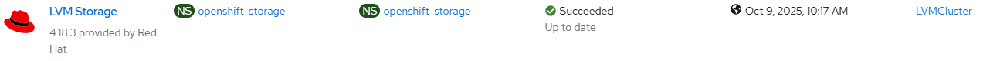

# LVM Storage Operator - Install and configure

## Workflow

- create openshift-storage namespace with extra labels
- create operator group
- create subscription with user controlled channel or defaultChannelName

```
    labels['openshift.io/cluster-monitoring'] = 'true'
    labels['pod-security.kubernetes.io/enforce'] = 'privileged'
    labels['pod-security.kubernetes.io/audit'] = 'privileged'
    labels['pod-security.kubernetes.io/warn'] = 'privileged'
```

## Requirements

None

## Configurable options

```
# iserver set ocp lvm --mode operator
  --cluster TEXT                  Cluster Name
  --channel TEXT                  Operator channel  [default: __default__]
  --no-confirm                    Confirmation mode
```

## Expected Outcome



## Example

```
# iserver set ocp lvm --mode operator --cluster bm1

OpenShift Workflow - LVM Operator - Create Operator
===================================================

Workflow Parameters
-------------------
{
    "cluster": "bm1",
    "channel": "__default__",
    "confirmation": true,
    "check-verbose": true,
    "namespace": "openshift-storage",
    "name": "lvms-operator",
    "operator-group-name": "lvm-operator-group",
    "delete-namespace": true
}


OpenShift Cluster
-----------------
- cluster: bm1 [domain:local]
- api [C:\Users\user\.itool\ocp-clusters\bm1\kubeconfig]: ok
- dns resolution: ok


Create Namespace
----------------
- name: openshift-storage
- labels
        openshift.io/cluster-monitoring:true
        pod-security.kubernetes.io/enforce:privileged
        pod-security.kubernetes.io/audit:privileged
        pod-security.kubernetes.io/warn:privileged

~~~
apiVersion: v1
kind: Namespace
metadata:
  labels:
    openshift.io/cluster-monitoring: 'true'
    pod-security.kubernetes.io/audit: privileged
    pod-security.kubernetes.io/enforce: privileged
    pod-security.kubernetes.io/warn: privileged
  name: openshift-storage

~~~
Continue [Y/N]? y

Namespace created

Wait for namespace [timeout:60]...

Check labels
- openshift.io/cluster-monitoring:true
- pod-security.kubernetes.io/enforce:privileged
- pod-security.kubernetes.io/audit:privileged
- pod-security.kubernetes.io/warn:privileged

Create Operator Group
---------------------
Operator group: openshift-storage/openshift-storage-operatorgroup
Target namespaces: openshift-storage

~~~
apiVersion: operators.coreos.com/v1
kind: OperatorGroup
metadata:
  name: openshift-storage-operatorgroup
  namespace: openshift-storage
spec:
  targetNamespaces:
  - openshift-storage

~~~
Continue [Y/N]? y

Operator group created

Wait for operator group [timeout:60]...

Create Subscription
-------------------
Subscription: openshift-storage/lvms
Source: openshift-marketplace/redhat-operators/lvms-operator
Install plan approval: Automatic
Getting subscription and packege manifest information...
Resolving channel name...
Channel: stable-4.18
- CSV [lvms-operator.v4.18.3]
- CSV Display name [LVM Storage]
- CVS Version [4.18.3]
- CSV Provider [{'name': 'Red Hat'}]
- CSV Maturity [alpha]

~~~
apiVersion: operators.coreos.com/v1alpha1
kind: Subscription
metadata:
  name: lvms
  namespace: openshift-storage
spec:
  channel: stable-4.18
  installPlanApproval: Automatic
  name: lvms-operator
  source: redhat-operators
  sourceNamespace: openshift-marketplace

~~~
Continue [Y/N]? y

Subscription created

Wait for subscription install plan started [timeout:360]...
Install plan: install-sqgq7
Wait for subscription install plan ready [timeout:600]...
Install plan succeeded
Wait for deployments ready (optional: False, allow zero replicas: False)...
- openshift-storage/lvms-operator

Completed tasks
- LVM storage operator installed
```

[[Back]](./README.md)