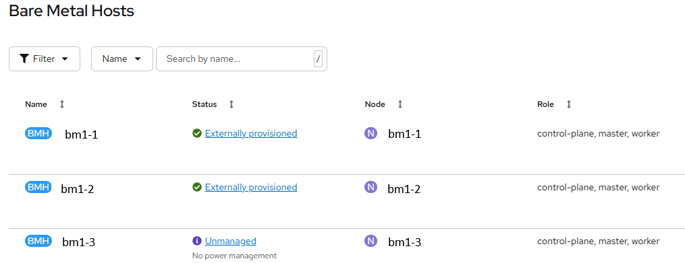

# Metal Kubed - Externally provisioned host

[[Back]](../README.md)

BareMetal Operator allows enrolling hosts that have been not been provisioned by Metal Kubed e.g., OpenShift cluster installed using Assisted Installer method. Hosts are enrolled with `spec.externallyProvisioned` field to `true`.

Once the bmc details are [defined](./bmc_define.md) and the server is successfully registered, its status changes from initial 'unmanaged' to 'externally provisioned' that enables cluster's Metal3/Ironic components for identity and power management **only**.

Limited set of actions is possible on externally provisioned hosts:
- Powering on and off using the online field.
- Rebooting using the reboot annotation.
- Live updates (servicing).
- Deletion without cleaning (the host is only powered off)

Refer to details in [official documentation](https://book.metal3.io/bmo/externally_provisioned.html).



## CRD

> [!NOTE]
> externallyProvisioned property cannot be changed

```
apiVersion: metal3.io/v1alpha1
kind: BareMetalHost
metadata:
  name: bm1-1
  namespace: openshift-machine-api
spec:
  externallyProvisioned: true
```

[[Back]](../README.md)