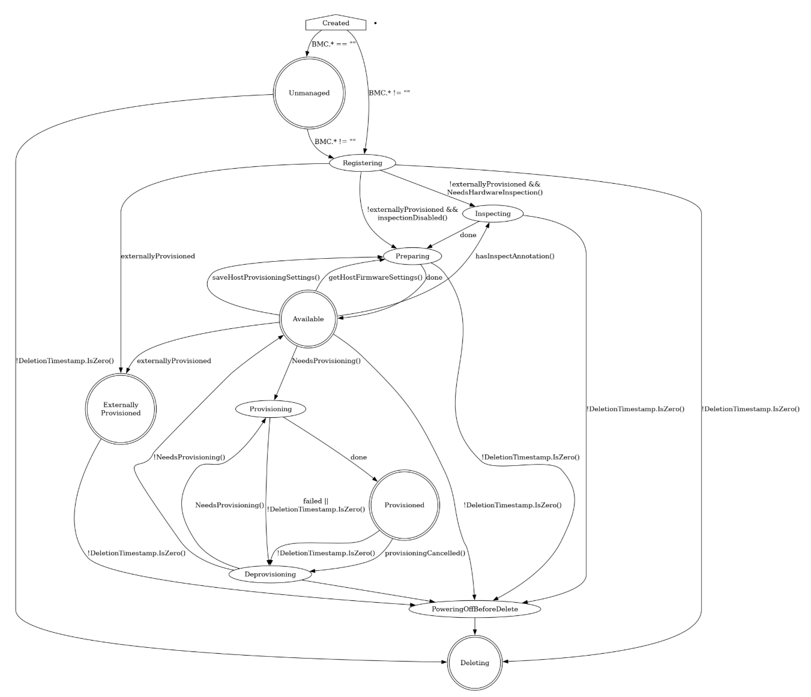

# Metal Kubed - Server provisioning state

[[Back]](../README.md)

`BareMetalHost` resource shows the current phase of the provisioning process in `status.provisioning.state` property. 

> [!NOTE]
> possible states depend on cluster provisioning method

State | Details
--- | ---
creating | wewly created hosts get an empty provisioning state briefly before moving either to unmanaged or registering
[unmanaged](./unmanaged.md) | missing both the BMC address and credentials secret name, and does not have any information to access the BMC for registration
[externally provisioned](./externally_provisioned.md) | deployed using another tool, only monitoring and power status management possible
[registering](./register.md) | when BMC access details are being validated
[inspecting](./inspect.md) | ironic agent collects information about the available hardware components and sends it back to Metal3
preparing | when setting up RAID or changing firmware settings
available | ready to be provisioned
provisioning | while image is being copied to the host
provisioned | after an image is copied to the host and the host is running the image
deprovisioning | when the previously provisioned image is being removed from the host
powering off before delete | when managed host is marked to be deleted
deleting | when managed host is marked to be deleted and has been powered off

Refer to details in [official documentation](https://book.metal3.io/bmo/state_machine.html).

[[Back]](../README.md)