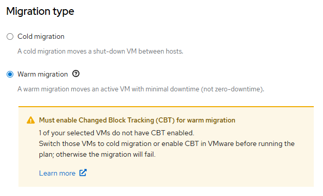
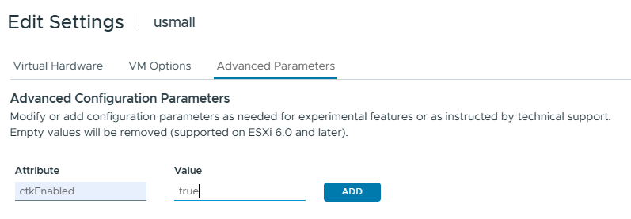

# Changed Block Tracking (CBT)

Changed Block Tracking is VMkernel feature that keeps track of the storage blocks of virtual machines as they change over time. The primary use case for CBT is backup optimization as blocks of changed data can be more efficiently backed up incrementally. 

In the context of [VM migration](./README.md), CBT must be enabled for virtual machine in case of warm backups, otherwise you will get an error like below

CBT needs to be enabled per virtual machine as by default it is turned off. 

## Enable Procedure

- power off virtual machine
- edit settings
- select advanced parameters
- add 'ctkEnabled' attribute with 'true' value

- power on virtual machine
 
## Links

- [Broadcom's KB](https://knowledge.broadcom.com/external/article?legacyId=1020128)

[[Back]](./README.md)