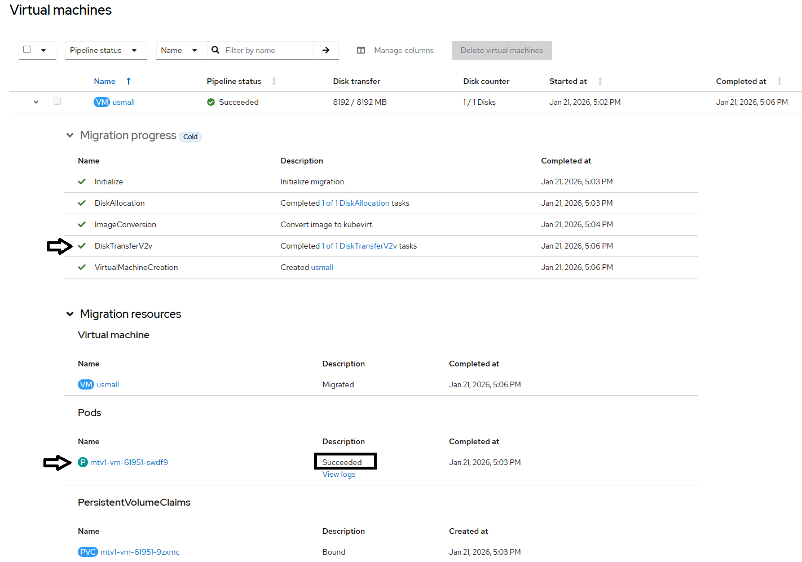

# Conversion POD

DiskTransfer V2V step of migration workflow is performed by conversion pod that is created by forklift controller
- mounts as block device the PVC that contains the original vmdk disk copied over the network from VMware cluster
- runs [v2v](./v2v.md) that performs the actual filesystem migration or adaptation from vmware hypervisor to kvm
- completes once done
- the work made by conversion pod is on the pvc that was mounted so it can be used by virtual machine created in the next step of migration workflow



## Closer look at vddk init container

Conversion POD runs vddk init container from image defined as vddkInit image in forklift controller

```
  initContainers:
  - image: image-registry.openshift-image-registry.svc:5000/openshift/vddk:latest
    imagePullPolicy: IfNotPresent
    name: vddk-side-car
    volumeMounts:
    - mountPath: /opt
      name: vddk-vol-mount 
```

The same volume is later used by [v2v](./v2v.md) container along side with pvc

```
    volumeDevices:
    - devicePath: /dev/block0
      name: mtv1-vm-61951-v9pvx
    volumeMounts:
    - mountPath: /opt
      name: vddk-vol-mount
```

v2v library is started with [vddk](./vddk.md)

```
-it vddk -io vddk-libdir=/opt/vmware-vix-disklib-distrib
```

and the libdir is used in vddk image dockerfile

```
# cat Dockerfile
FROM registry.access.redhat.com/ubi8/ubi-minimal
COPY vmware-vix-disklib-distrib /vmware-vix-disklib-distrib
RUN mkdir -p /opt
ENTRYPOINT ["cp", "-r", "/vmware-vix-disklib-distrib", "/opt"]
```

This connects all the dots for vddk and v2v.

## Closer look at pvc

Note: outputs below taken once migration workflow completed

```
$ oc get pvc
NAME                          STATUS   VOLUME                                     CAPACITY   ACCESS MODES   STORAGECLASS
mtv1-vm-61951-9zxmc           Bound    pvc-a6bb3118-736a-4325-a95a-149f248aadeb   8Gi        RWO            lvms-vg1    
```

PVC is used by migrated virtual machine

```
apiVersion: kubevirt.io/v1
kind: VirtualMachine
metadata:
  name: usmall
  namespace: default
spec:
  template:
    spec:
      volumes:
      - name: vol-0
        persistentVolumeClaim:
          claimName: mtv1-vm-61951-9zxmc    
```

```
apiVersion: kubevirt.io/v1
kind: VirtualMachineInstance
metadata:
  name: usmall
  namespace: default
status:
  volumeStatus:
  - name: vol-0
    persistentVolumeClaimInfo:
      accessModes:
      - ReadWriteOnce
      capacity:
        storage: 8Gi
      claimName: mtv1-vm-61951-9zxmc
      filesystemOverhead: "0"
      requests:
        storage: "8589934592"
      volumeMode: Block
    target: vda   
```

This pvc has been used by conversion pod

```
$ oc get pod
NAME                                              READY   STATUS      RESTARTS        AGE
mtv1-vm-61951-swdf9                               0/1     Completed   0               19m
```

```
apiVersion: v1
kind: Pod
metadata:
  name: mtv1-vm-61951-swdf9
  namespace: default
spec:
  containers:
  - name: virt-v2v
    volumeDevices:
    - devicePath: /dev/block0
      name: mtv1-vm-61951-9zxmc
  volumes:
  - name: mtv1-vm-61951-9zxmc
    persistentVolumeClaim:
      claimName: mtv1-vm-61951-9zxmc
```

[[Back]](./README.md)