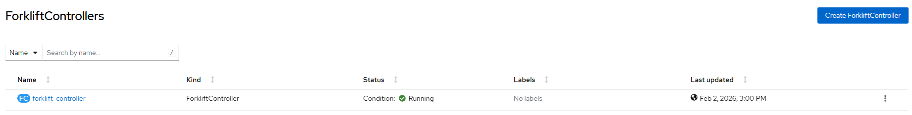

# Migration Toolkit for Virtualization - Create Forkflift Controller Instance

## Workflow

- create forklift controller instance based on package reference or user-provided CRD
- wait for resources ready

## Requirements

- mtv operator must be [created](./create_operator.md)

## Expected outcome



## Configurable options

```
# iserver set ocp mtv --mode instance
  --cluster TEXT                  Cluster Name
  --filename TEXT                 HyperConverged CRD
  --no-confirm                    Confirmation mode
```

## Example

```
# iserver set ocp mtv --mode instance --cluster bm1 --no-confirm


OpenShift Workflow - Migration Toolkit for Virtualization Operator - Create Forklift Controller Instance
========================================================================================================

OpenShift Cluster: bm1

Mtv Operator
- subscription: openshift-mtv/mtv-operator
- channel: release-v2.10
- csv: mtv-operator.v2.10.3
- ready

Mtv Forklift Controller
- no instance found

Create Forklift Controller
--------------------------
- namespace: openshift-mtv
- name: forklift-controller

~~~
apiVersion: forklift.konveyor.io/v1beta1
kind: ForkliftController
metadata:
  name: forklift-controller
  namespace: openshift-mtv
spec:
  feature_ui_plugin: 'true'
  feature_validation: 'true'
  feature_volume_populator: 'true'

~~~

Forklift controller instance created

Wait for forklift controller instance...
Wait for forklift controller instance resources...
Wait for deployments ready (optional: True, allow zero replicas: False)...
- openshift-mtv/forklift-api
- openshift-mtv/forklift-cli-download
- openshift-mtv/forklift-controller
- openshift-mtv/forklift-ova-proxy
- openshift-mtv/forklift-ui-plugin
- openshift-mtv/forklift-validation
- openshift-mtv/forklift-volume-populator-controller
Wait for forklift controller instance ready state...

Completed tasks
- forklift controller instance created and ready
```

[[Back]](./README.md)