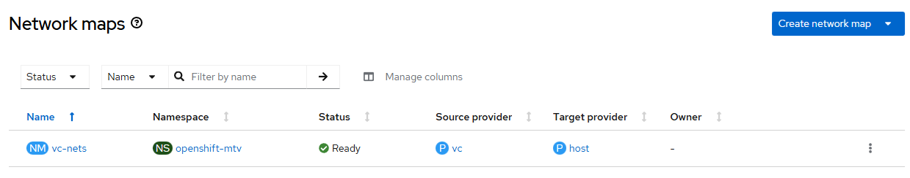

# Migration Toolkit for Virtualization - Create Network Map

## Workflow

- create network map based on user-provider parameters
- wait for network map ready

Notes:
- network map source controlled with --provider and destination fixed to 'host' value
- network map update not supported

## Requirements

- mtv operator must be [created](./create_operator.md)
- forklift controller instance must be [created](./create_instance.md)

## Expected outcome



## Configurable options

```
# iserver set ocp mtv --mode provider
  --cluster TEXT                  Cluster Name
  --provider TEXT                 Provider name
  --nmap TEXT                     Network map name
  --source TEXT                   Map source
  --destination TEXT              Map destination
  --no-confirm                    Confirmation mode
```

Notes:
- map source not checked by iserver, if does not exist at source provider, then it will be marked as SourceNetworkNotValid
- destination must be pod or multus

## Example

```
# iserver set ocp mtv \
    --mode nmap \
    --cluster bm1 \
    --nmap vc-nets \
    --provider vc \
    --source my-dvs1 \
    --destination pod \
    --no-confirm


OpenShift Workflow - Migration Toolkit for Virtualization Operator - Create Network Map
=======================================================================================

OpenShift Cluster: bm3

Mtv Operator
- subscription: openshift-mtv/mtv-operator
- channel: release-v2.10
- csv: mtv-operator.v2.10.3
- ready

Create Network Map
------------------
- namespace: openshift-mtv
- name: vc-nets

~~~
apiVersion: forklift.konveyor.io/v1beta1
kind: NetworkMap
metadata:
  name: vc-nets
  namespace: openshift-mtv
spec:
  map:
  - destination:
      type: pod
    source:
      name: my-dvs1
  provider:
    destination:
      apiVersion: forklift.konveyor.io/v1beta1
      kind: Provider
      name: host
      namespace: openshift-mtv
    source:
      apiVersion: forklift.konveyor.io/v1beta1
      kind: Provider
      name: vc
      namespace: openshift-mtv

~~~

Network map created

Wait for network map...
Wait for network map ready state...

Completed tasks
- network map created and ready
```

[[Back]](./README.md)