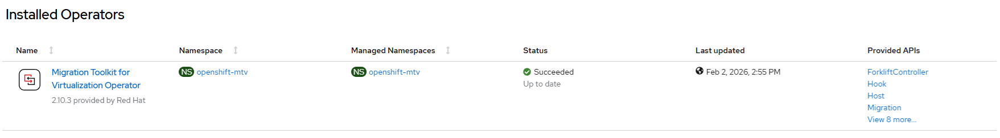

# Migration Toolkit for Virtualization - Create Operator

## Workflow

- create openshift-mtv namespace
- create operator group
- create subscription with user controlled channel or defaultChannelName
- wait for resources ready

## Requirements

None

## Configurable options

```
# iserver create ocp mtv --mode operator
  --cluster TEXT                  Cluster Name
  --channel TEXT                  Operator channel  [default: __default__]
  --no-confirm                    Confirmation mode
```

## Expected outcome



## Example

```
# iserver create ocp mtv --cluster bm1 --mode operator

OpenShift Workflow - Migration Toolkit for Virtualization Operator - Create Operator
====================================================================================

OpenShift Cluster: bm1

Create Namespace
----------------
- name: openshift-mtv

~~~
apiVersion: v1
kind: Namespace
metadata:
  name: openshift-mtv

~~~

Namespace created

Wait for namespace [timeout:60]...

Create Operator Group
---------------------
Operator group: openshift-mtv/mtv-operator-group

~~~
apiVersion: operators.coreos.com/v1
kind: OperatorGroup
metadata:
  name: mtv-operator-group
  namespace: openshift-mtv
spec:
  targetNamespaces:
  - openshift-mtv
  upgradeStrategy: Default

~~~

Operator group created

Wait for operator group [timeout:60]...

Create Subscription
-------------------
Subscription: openshift-mtv/mtv-operator
Source: openshift-marketplace/redhat-operators/mtv-operator
Install plan approval: Automatic
Getting subscription and packege manifest information...
Resolving channel name...
Channel: release-v2.10
- CSV [mtv-operator.v2.10.3]
- CSV Display name [Migration Toolkit for Virtualization Operator]
- CVS Version [2.10.3]
- CSV Provider [{'name': 'Red Hat'}]
- CSV Maturity [stable]

~~~
apiVersion: operators.coreos.com/v1alpha1
kind: Subscription
metadata:
  name: mtv-operator
  namespace: openshift-mtv
spec:
  channel: release-v2.10
  installPlanApproval: Automatic
  name: mtv-operator
  source: redhat-operators
  sourceNamespace: openshift-marketplace

~~~

Subscription created

Wait for subscription install plan started [timeout:360]...
Install plan: install-gc985
Wait for subscription install plan ready [timeout:600]...
Install plan succeeded
Wait for deployments ready (optional: True, allow zero replicas: False)...
- openshift-mtv/forklift-operator

Completed tasks
- Namespace created
- Operator Group created
- Mtv Operator installed
```

[[Back]](./README.md)