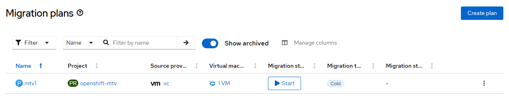

# Migration Toolkit for Virtualization - Create Migration Plan

## Workflow

- validate user inputs e.g.,

~~~
Validation checks
- provider vc found
- provider host found
- network map vc-nets found
- storage map vc-ds found
- target namespace default found
~~~

- create migration plan based on user-provider parameters
- wait for migration plan ready
- virtual machine names are validated once migration plan is created

Example output in case of invalid source virtual machines

~~~
Wait for plan ready state...
[ERROR] invalid source vms

+----+----------------+--------------+------+-----+------+---------------+---------------+-----------+---------+
| ID | Migration Plan | State        | Type | Src | Dest | Network       | Storage       | Source VM | Phase   |
+----+----------------+--------------+------+-----+------+---------------+---------------+-----------+---------+
| 1  | openshift-mtv  | Invalid VM   | cold | vc  | host | openshift-mtv | openshift-mtv | usmalls   | Pending |
|    | mtv1           | Cannot start |      |     |      | vc-nets       | vc-ds         |           |         |
+----+----------------+--------------+------+-----+------+---------------+---------------+-----------+---------+
~~~

## Requirements

- mtv operator must be [created](./create_operator.md)
- forklift controller instance must be [created](./create_instance.md)

## Expected outcome



## Configurable options

```
# iserver set ocp mtv --mode plan
  --cluster TEXT                  Cluster Name
  --plan TEXT                     Plan name
  --provider TEXT                 Provider name
  --nmap TEXT                     Network map name
  --smap TEXT                     Storage map name
  --vm TEXT                       Virtual machine name
  --type [cold|warm]              Migration type  [default: cold]
  --target TEXT                   Target namespace [default: default]
  --no-confirm                    Confirmation mode
```

## Example

```
# iserver set ocp mtv \
    --mode plan \
    --cluster bm1 \
    --plan mtv1 \
    --provider vc \
    --nmap vc-nets \
    --smap vc-ds \
    --vm usmall \
    --type cold \
    --target default \
    --no-confirm

OpenShift Workflow - Migration Toolkit for Virtualization Operator - Create Migration Plan
==========================================================================================

OpenShift Cluster: bm3

Mtv Operator
- subscription: openshift-mtv/mtv-operator
- channel: release-v2.10
- csv: mtv-operator.v2.10.3
- ready

Validation checks
- provider vc found
- provider host found
- network map vc-nets found
- storage map vc-ds found

Create Migration Plan
---------------------
- namespace: openshift-mtv
- name: mtv1

~~~
apiVersion: forklift.konveyor.io/v1beta1
kind: Plan
metadata:
  name: mtv1
  namespace: openshift-mtv
spec:
  map:
    network:
      name: vc-nets
      namespace: openshift-mtv
    storage:
      name: vc-ds
      namespace: openshift-mtv
  provider:
    destination:
      name: host
      namespace: openshift-mtv
    source:
      name: vc
      namespace: openshift-mtv
  targetNamespace: default
  type: cold
  vms:
  - name: usmall

~~~

Plan created

Wait for plan...
Wait for plan ready state...

+----+----------------+-------+------+-----+------+---------------+---------------+-----------+---------+
| ID | Migration Plan | State | Type | Src | Dest | Network       | Storage       | Source VM | Phase   |
+----+----------------+-------+------+-----+------+---------------+---------------+-----------+---------+
| 1  | openshift-mtv  | Ready | cold | vc  | host | openshift-mtv | openshift-mtv | usmall    | Pending | 
|    | mtv1           |       |      |     |      | vc-nets       | vc-ds         |           |         | 
+----+----------------+-------+------+-----+------+---------------+---------------+-----------+---------+

Completed tasks
- migration plan created and ready to run
```

[[Back]](./README.md)