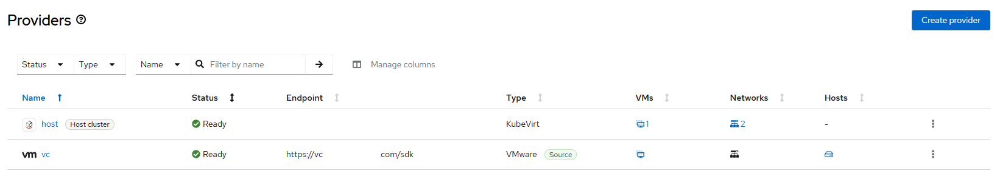

# Migration Toolkit for Virtualization - Create Provider

## Workflow

vCenter
- create provider based on user-provider parameters
- [vddk](./vddk.md) is mandatory in practice
- wait for provider ready

Note: provider definition change not supported

## Requirements

- mtv operator must be [created](./create_operator.md)
- forklift controller instance must be [created](./create_instance.md)

## Expected outcome



## Configurable options

```
# iserver set ocp mtv --mode provider
  --cluster TEXT                  Cluster Name
  --provider TEXT                 Provider name
  --vc-url TEXT                   vCenter URL
  --vc-user TEXT                  vCenter username
  --vc-pass TEXT                  vCenter password
  --vc-ssl                        vCenter SSL verify
  --vddk TEXT                     vddk init image url
  --no-confirm                    Confirmation mode
```

## Example

```
# iserver set ocp mtv \
    --mode provider \
    --cluster bm1 \
    --provider vc \
    --vc-url https://vc.domain.com/sdk \
    --vc-user Administrator \
    --vc-pass password
    --vddk image-registry.openshift-image-registry.svc:5000/openshift/vddk:latest \
    --no-confirm

OpenShift Workflow - Migration Toolkit for Virtualization Operator - Create Provider
====================================================================================

OpenShift Cluster: bm3

Mtv Operator
- subscription: openshift-mtv/mtv-operator
- channel: release-v2.10
- csv: mtv-operator.v2.10.3
- ready

Mtv Forklift Controller
- namespace: openshift-mtv
- name: forklift-controller
- ready

Create vCenter Provider
-----------------------
- namespace: openshift-mtv
- name: vc
- vCenter: https://vc.domain.com/sdk (Administrator, password), ssl[False]
- vddk: image-registry.openshift-image-registry.svc:5000/openshift/vddk:latest

~~~
apiVersion: v1
data:
  insecureSkipVerify: ...
  password: ...
  url: ...
  user: ...
kind: Secret
metadata:
  name: vc
  namespace: openshift-mtv
type: Opaque

---
apiVersion: forklift.konveyor.io/v1beta1
kind: Provider
metadata:
  name: vc
  namespace: openshift-mtv
spec:
  secret:
    name: vc
    namespace: openshift-mtv
  settings:
    sdkEndpoint: vcenter
    vddkInitImage: image-registry.openshift-image-registry.svc:5000/openshift/vddk:latest
  type: vsphere
  url: https://vc.domain.com/sdk

~~~

Secret and provider created

Wait for provider...
Wait for provider ready state...

Completed tasks
- provider created and ready
```

[[Back]](./README.md)