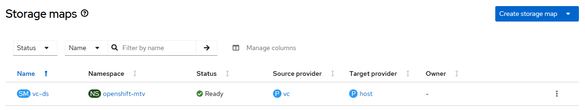

# Migration Toolkit for Virtualization - Create Storage Map

## Workflow

- create storage map based on user-provider parameters
- wait for storage map ready

Notes:
- storage map source controlled with --provider and destination fixed to 'host' value
- storage map update not supported

## Requirements

- mtv operator must be [created](./create_operator.md)
- forklift controller instance must be [created](./create_instance.md)

## Expected outcome



## Configurable options

```
# iserver set ocp mtv --mode provider
  --cluster TEXT                  Cluster Name
  --provider TEXT                 Provider name
  --smap TEXT                     Storage map name
  --source TEXT                   Map source
  --destination TEXT              Map destination
  --no-confirm                    Confirmation mode
```

Notes:
- map source not checked by iserver, if does not exist at source provider, then it will be in SourceStorageNotValid condition
- destination must be valid storage class or map will be in DestinationStorageNotValid condition

## Example

```
# iserver set ocp mtv \
    --mode smap \
    --cluster bm1 \
    --smap vc-ds \
    --provider vc \
    --source My-NAS \
    --destination lvms-vg1 \
    --no-confirm

OpenShift Workflow - Migration Toolkit for Virtualization Operator - Create Storage Map
=======================================================================================

OpenShift Cluster: bm1

Mtv Operator
- subscription: openshift-mtv/mtv-operator
- channel: release-v2.10
- csv: mtv-operator.v2.10.3
- ready

Create Storage Map
------------------
- namespace: openshift-mtv
- name: vc-ds

~~~
apiVersion: forklift.konveyor.io/v1beta1
kind: StorageMap
metadata:
  name: vc-ds
  namespace: openshift-mtv
spec:
  map:
  - destination:
      storageClass: lvms-vg1
    source:
      name: My-NAS
  provider:
    destination:
      apiVersion: forklift.konveyor.io/v1beta1
      kind: Provider
      name: host
      namespace: openshift-mtv
    source:
      apiVersion: forklift.konveyor.io/v1beta1
      kind: Provider
      name: vc
      namespace: openshift-mtv

~~~

Storage map created

Wait for storage map...
Wait for storage map ready state...

Completed tasks
- storage map created and ready
```

[[Back]](./README.md)