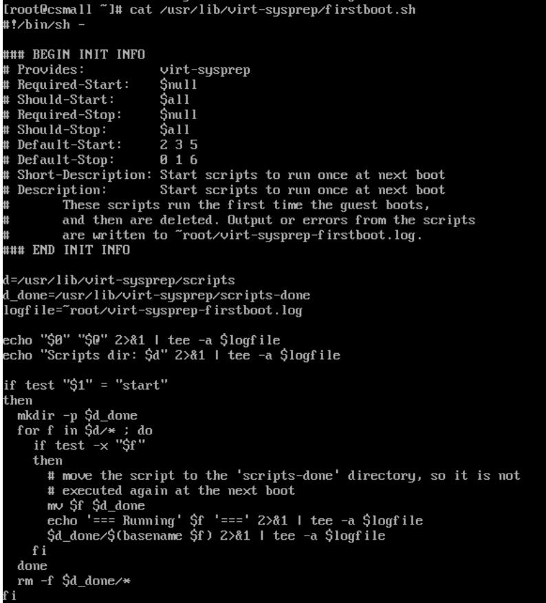
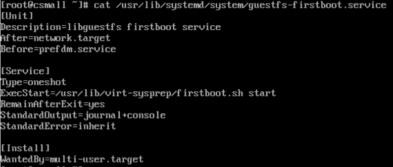

# Virtual machine first boot system preparation

[v2v](./v2v.md) mounts the migrated virtual machine filesystem and creates bunch of scripts and configurations that will run upon the first boot.

Note: some edits were made to make the output easier to read

```
libguestfs: trace: v2v: mkdir_p "/usr/lib/virt-sysprep"
libguestfs: trace: v2v: mkdir_p "/usr/lib/virt-sysprep/scripts"
libguestfs: trace: v2v: write "/usr/lib/virt-sysprep/firstboot.sh" 
libguestfs: trace: v2v: chmod 493 "/usr/lib/virt-sysprep/firstboot.sh"
libguestfs: trace: v2v: mkdir_p "/usr/lib/systemd/system"
libguestfs: trace: v2v: write "/usr/lib/systemd/system/guestfs-firstboot.service" 
libguestfs: trace: v2v: mkdir_p "/etc/systemd/system/multi-user.target.wants"
libguestfs: trace: v2v: ln_sf "/usr/lib/systemd/system/guestfs-firstboot.service" "/etc/systemd/system/multi-user.target.wants"
commandrvf: ln -sf -- /usr/lib/systemd/system/guestfs-firstboot.service /sysroot/etc/systemd/system/multi-user.target.wants
libguestfs: trace: v2v: ln_sf "/usr/lib/virt-sysprep/firstboot.sh" "/etc/rc.d/rc2.d/S99guestfs-firstboot"
libguestfs: trace: v2v: ln_sf "/usr/lib/virt-sysprep/firstboot.sh" "/etc/rc.d/rc3.d/S99guestfs-firstboot"
libguestfs: trace: v2v: ln_sf "/usr/lib/virt-sysprep/firstboot.sh" "/etc/rc.d/rc5.d/S99guestfs-firstboot"
```





As you see in the firstboot.sh above, once the scripts run, they are moved to done and then removed. So there is no trace left on the filesystem from the actual scripts that were prepared by v2v. 

[Conversion pod](./conversion-pod.md) log analysis gives some information however the logs do not have the full content of the file

```
libguestfs: trace: v2v: write "/usr/lib/virt-sysprep/scripts/5000-0001-wait-online" 
    "#!/bin/sh\x0aif conn=$(nmcli networking connectivity); "<truncated, original size 341 bytes>
```

```
libguestfs: trace: v2v: write "/usr/lib/virt-sysprep/scripts/5000-0002-setenforce-0" 
   "#!/bin/sh\x0arm -f /root/virt-v2v-fb-selinux-enforcing\x0aif 
   command -v getenforce >/dev/null &&\x0a 
   test Enforcing = "$(getenforce)"\x0athen\x0a
     touch /root/virt-v2v-fb-selinux-enforcing\x0a
     setenforce 0\x0afi\x0a"
```

```
libguestfs: trace: v2v: write "/usr/lib/virt-sysprep/scripts/5000-0003-install-qga" "dnf -y install 'qemu-guest-agent'"
```

```
libguestfs: trace: v2v: write "/usr/lib/virt-sysprep/scripts/5000-0004-setenforce-restore" 
    "#!/bin/sh\x0aif test -f /root/virt-v2v-fb-selinux-enforcing; then\x0a
      setenforce 1\x0a
      rm -f /root/virt-v2v-fb-selinux-enforcing\x0afi\x0a"
```

```
libguestfs: trace: v2v: write "/usr/lib/virt-sysprep/scripts/5000-0005-start-qga" 
    "#!/bin/sh\x0asystemctl start qemu-guest-agent\x0a"
```

## Scenario: system preparation successful

If the migrated virtual machine IP connectivity is working fine during the first boot (as per summary table [here](./static-ip.md)) then script that installs qemu agent should work e.g.,


## Scenario: some scripts fail 

Due to the fact that after the first boot virtual machine was still configured with static IP address while it has connected to POD default network, IP connectivity was not working. 

As the result, agent installation that depends on netork connectivity has failed

The trace of startup script execution is found in log file as per firstboot.sh content


[[Back]](./README.md)