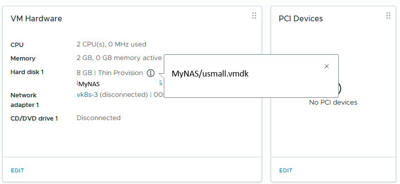

# nbdkit

Initialize nbdkit that exports over the network the storage location for the source vm disk. nbdkit uses [vddk](./vddk.md) libraries.



```
running nbdkit:
 LANG=C 'nbdkit' 
 '--exit-with-parent' 
 '--foreground' 
 '--pidfile' '/tmp/v2vnbdkit.A4CQXv/nbdkit1.pid' 
 '--unix' '/tmp/v2v.GCTRp8/in0' 
 '--threads' '16' 
 '-D' 'nbdkit.backend.datapath=0' 
 '-D' 'vddk.stats=1' 
 '-D' 'vddk.datapath=0' 
 '--verbose' 
 '--filter' 'multi-conn' 
 '--filter' 'cow' 
 '--filter' 'blocksize' 
 '--filter' 'count' 
 '--filter' 'retry' 
 'vddk' 
     'server=vc.domain.com' 
     'vm=moref=vm-61951' 
     'user=username' 
     'password=+/etc/secret/secretKey' 
     'libdir=/opt/vmware-vix-disklib-distrib' 
     'thumbprint=AA:BB:CC' 
     'minblock=512' 
     'maxdata=2M' 
     'multi-conn-mode=disable' 
     'cow-block-size=4096' 
     'cow-on-read=/tmp/v2v.GCTRp8/convert' 
     'export=\[MyNAS\] usmall.vmdk'
```

the disk (MyNAS usmall.vmdk) exposed with unix socket (/tmp/v2v.GCTRp8) is later added as libguestfs handle so v2v can do modification and conversion

```
libguestfs: trace: v2v: 
    add_drive 
        "MyNAS/usmall.vmdk" 
        "format:raw" 
        "protocol:nbd" 
        "server:unix:/tmp/v2v.GCTRp8/in0" 
        "cachemode:unsafe" 
        "discard:besteffort"
```

[[Back]](./README.md)