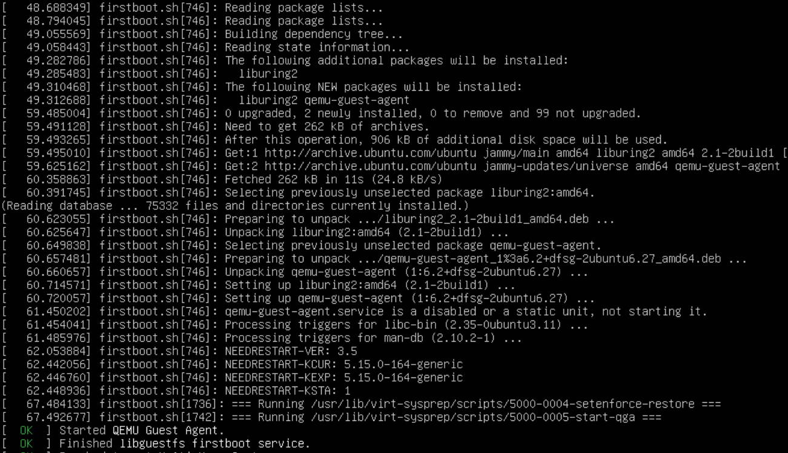
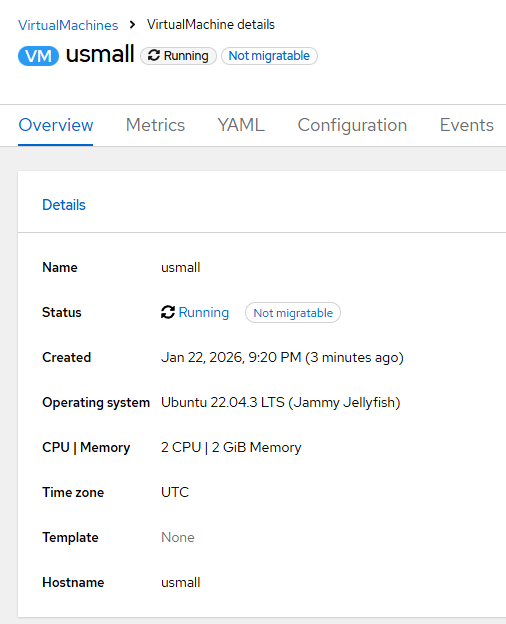
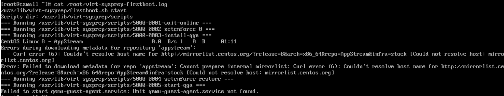
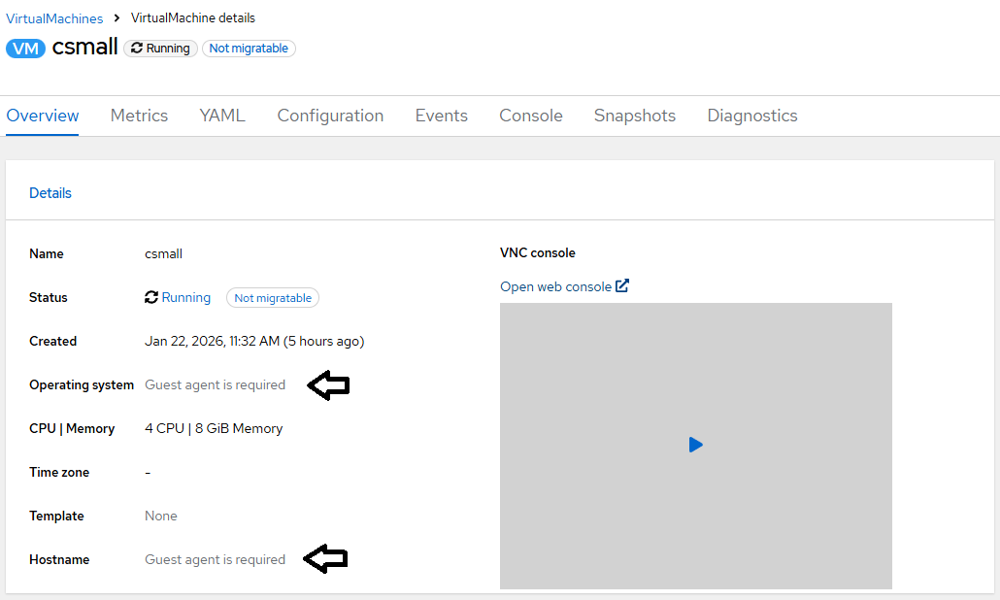

# QEMU Guest Agent - Automatic Installation

When source virtual machine runs in non-kvm environemnt such as VMware, it may likely have VMware tools package installed to improve the integration of guest OS with the hypervisor/virtualization platform.

Once virtual machine is migrated to OpenShift, VMware tools are not needed anymore. QEMU Guest Agent is needed for exactly the same reason ie. improve the integration with KVM hypervisor.

[v2v](./v2v.md) migration engine uses Linux [first boot system preparation](./first-boot.md) feature to automate qemu-guest-agent installation. The installation attempt is made only once, upon the first boot of the virtual machine post-migration. As such the success of automatic installation depends on the [IP connectitivy upon first boot](./static-ip.md).

If for any reason the virtual machine is not IP-ready upon the first boot, qemu-guest agent installation must be done [manually](./qga-manual.md) instead after migration. Alternatively QEMU guest agent can be installed before migration takes place.

Find below the details for 3 scenarios
- successful installation of qemu-guest-agent
- no need to install qemu-guest-agent
- failed automatic installation

## Scenario: successful installation of qemu-guest-agent

Requires IP connectivity during the first boot (as per summary table [here](./static-ip.md))





## Scenario: no need to install qemu-guest-agent

Pre-migration state

```
ubuntu@usmall:~$ sudo apt list qemu-guest-agent
Listing... Done
qemu-guest-agent/jammy-updates,jammy-security,now 1:6.2+dfsg-2ubuntu6.27 amd64 [installed]
```

There is no trace for [first boot system preparation](./first-boot.md) in [conversion pod](./conversion-pod.md) logs. QEMU guest agent is functional from start at OpenShift KVM.

## Scenario: failed automatic installation

System preparation scripts to install qemu-guest-agent package are prepared on the filesystem by v2v, however, due to the fact that after the first boot virtual machine was still configured with static IP address while it has connected to POD default network, IP connectivity was not working. 

As the result, agent installation failed





[[Back]](./README.md)