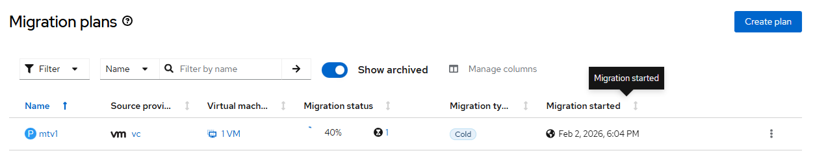

# Migration Toolkit for Virtualization - Run Migration Plan

## Workflow

- run migration plan 
- track migration plan and associated resource state changes
- wait for migration plan finished

## Requirements

- mtv operator must be [created](./create_operator.md)
- forklift controller instance must be [created](./create_instance.md)

## Expected outcome



## Configurable options

```
# iserver set ocp mtv --mode run
  --cluster TEXT                  Cluster Name
  --plan TEXT                     Plan name
  --no-wait                       Wait mode
  --no-confirm                    Confirmation mode
```

## Example

```
# iserver set ocp mtv \
    --mode run \
    --cluster bm1 \
    --plan mtv1 \
    --no-confirm


OpenShift Workflow - Migration Toolkit for Virtualization Operator - Run Migration
==================================================================================

OpenShift Cluster: bm1

Mtv Operator
- subscription: openshift-mtv/mtv-operator
- channel: release-v2.10
- csv: mtv-operator.v2.10.3
- ready

Start Migration
---------------
- namespace: openshift-mtv
- plan: mtv1
- migration: mtv1-2e92c2d9edba

~~~
apiVersion: forklift.konveyor.io/v1beta1
kind: Migration
metadata:
  name: mtv1-2e92c2d9edba
  namespace: openshift-mtv
spec:
  plan:
    name: mtv1
    namespace: openshift-mtv

~~~

Migration created

Wait for migration...
Wait for migration finished...
VM [usmall] Phase [AllocateDisks] Progress [0/8192 MB]
VM [usmall] PVC [default/mtv1-vm-61951-86d5r] Capacity [None] Phase [Pending]
VM [usmall] DV [default/mtv1-vm-61951-86d5r] Progress [N/A] Phase [PendingPopulation]
VM [usmall] Phase [CreateGuestConversionPod]
VM [usmall] Phase [ConvertGuest]
VM [usmall] Pod [default/mtv1-vm-61951-mcqml] Phase [Pending]
VM [usmall] DV [default/mtv1-vm-61951-86d5r] Progress [N/A] Phase [ImportInProgress]
VM [usmall] PVC [default/mtv1-vm-61951-86d5r] Capacity [8Gi] Phase [Bound]
VM [usmall] DV [default/mtv1-vm-61951-86d5r] Progress [100.0%] Phase [Succeeded]
VM [usmall] Pod [default/mtv1-vm-61951-mcqml] Phase [Running]
VM [usmall] Phase [CopyDisksVirtV2V] Progress [0/8192 MB]
VM [usmall] Phase [Completed] Success
VM [usmall] Virtual Machine [default/usmall] State [Stopped]

Completed tasks
- migration completed successfully
```

[[Back]](./README.md)