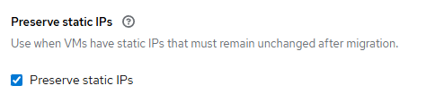
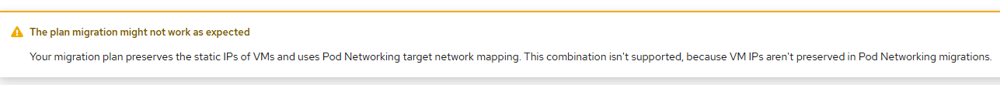

# Preserve static IPs

OpenShift migration plan has "preserve static ips" settings that is by default enabled



It can be also controlled in Plan CR

```
apiVersion: forklift.konveyor.io/v1beta1
kind: Plan
metadata:
  name: mtv1
  namespace: openshift-mtv
spec:
  preserveStaticIPs: true
```

Console UI warns if "preserve static ips" is used with POD networking since by design it is not supposed to work without OS change post-migration.



## Summary

Options
- Source Virtual Machine
    - with static IP configuration
    - with DHCP configuration
- Migration Plan
    - preserve static IPs true/false
    - target network
        - POD default network with masquerade
        - Multus network (Network Attachment Definition)

Tick
- :white_check_mark: means virtual machine after migration will be IP reachable without any OS changes as long as external dependencies are met (if any)
- :x: means that migrated virtual machine is not IP reachable even if external dependencies are met, it must be accessed (via console) for the changes to be applied

Works | Interface IP | Preserve | Network | OS Changes | External Dependencies
--- | --- | --- | --- | --- | ---
:x: | Static | Yes | POD | Change from static to DHCP | ---
:x: | Static | No | POD | Add new interface w/DHCP | ---
:white_check_mark: | Static | Yes | Multus | --- | DCN configuration
:x: | Static | No | Multus | Add new interface w/static | DCN configuration
:white_check_mark: | DHCP | Yes | POD | --- | ---
:x: | DHCP | No | POD | Add new interface w/DHCP | ---
:white_check_mark: | DHCP | Yes | Multus | --- | DCN configuration incl. DHCP server/relay
:x: | DHCP | No | Multus | Add new interface w/DHCP | DCN configuration incl. DHCP server/relay

Note:
- if IP connectivity works out-of-the-box during the first boot of the OS, without the need of making any OS changes, [first boot system preparation scripts](./first-boot.md) should run to completion incl. [qemu-guest-agent automatic installation](./qga-autoinstall.md).

## Source (Ubuntu22.04)

Ubuntu22.04 source virtual machine is configured with static IP address in netplan 

```
$ cat /etc/netplan/00-installer-config.yaml
network:
  ethernets:
    ens33:
      addresses:
      - 10.10.10.205/28
      nameservers:
        addresses:
        - 20.20.20.20
        search:
        - domain.com
      routes:
      - to: default
        via: 10.10.10.206
  version: 2
```

where ens33 is the Ethernet vNIC with vmxnet3 driver

```
$ sudo ethtool -i ens33
driver: vmxnet3
```

## Without static ip preservation (Ubuntu22.04)

Outcome:
- no ens33 interface name for Ethernet vNIC
- enp1s0 interface name for Ethernet vNIC
- file /etc/netplan/00-installer-config.yaml unchanged but configures nothing as interface is gone
- enp1s0 is not configured via netplan and by default is in admin down state
- virtual machine is not IP reachable after migration

```
$ ip a
2: enp1s0: <BROADCAST,MULTICAST> mtu 1500 qdisc noop state DOWN group default qlen 1000
    link/ether 00:50:56:b2:b1:42 brd ff:ff:ff:ff:ff:ff
```

enp1s0 is with virtio_net driver. refer to [driver](./driver.md) for details behind the driver change

```
$ sudo ethtool -i enp1s0
driver: virtio_net
```

## With static ip preservation (Ubuntu22.04)

Outcome:
- ens33 interface name for Ethernet vNIC
- file /etc/netplan/00-installer-config.yaml unchanged and configures ens33 in the same way
- ens33 is admin and operationally up
- IP configuration remains the same
- virtual machine is not IP reachable after migration but this is due to kubevirt networking that expects DHCP on the main interface

```
$ ip a
2: ens33: <BROADCAST,MULTICAST,UP,LOWER_UP> mtu 1500 qdisc mq state UP group default qlen 1000
    link/ether 00:50:56:b2:b1:42 brd ff:ff:ff:ff:ff:ff
    altname enp2s1
    inet 10.10.10.205/28 brd 10.10.10.207 scope global ens33
       valid_lft forever preferred_lft forever
    inet6 fe80::250:56ff:feb2:b142/64 scope link
       valid_lft forever preferred_lft forever
```

## Closer look

The [conversion pod](./conversion-pod.md) runs [v2v](./v2v.md) that performs the heavy lifting of the migration. 

The mac and ip addresses of the vEthernet interface are passed as environment variable

```
apiVersion: v1
kind: Pod
metadata:
  name: mtv1-vm-61951-wgfh2
  namespace: default
spec:
  containers:
  - env:
    - name: V2V_staticIPs
      value: 00:50:56:b2:b1:42:ip:10.10.10.205,10.10.10.206,28_00:50:56:b2:b1:42:ip:fe80::250:56ff:feb2:b142,,64  
```

And then v2v is started inside conversion pod accordingly

```
Building command: virt-v2v [
    -v 
    -x 
    -o kubevirt 
    -os /var/tmp/v2v 
    -i libvirt 
    -ic vpx://username@vc.domain.com/my-dc-name/host/my-cluster-name/my-host-name?no_verify=1 
    -ip /etc/secret/secretKey 
    --hostname usmall 
    --root first 
    --mac 00:50:56:b2:b1:42:ip:10.10.10.205,10.10.10.206,28 
    --mac 00:50:56:b2:b1:42:ip:fe80::250:56ff:feb2:b142,,64 
    -it vddk 
    -io vddk-libdir=/opt/vmware-vix-disklib-distrib 
    -io vddk-thumbprint=AA:BB:CC
    -- usmall
]
```

That results during the v2v workflow execution with

```
New udev rule:
SUBSYSTEM=="net",ACTION=="add",ATTR{address}=="00:50:56:b2:b1:42",NAME="ens33"
```

This will keep the interface name the same post-migration.

## Distribution specifics

The migrated virtual machine is Ubuntu22.04 and v2v throws the following warnings

```
Warning: Directory /etc/sysconfig/network-scripts does not exist.
Warning: Directory /etc/NetworkManager/system-connections does not exist.
Warning: Directory /var/lib/NetworkManager does not exist.
Warning: Directory /var/lib/dhclient does not exist.
```

In case of Centos8, NetworkManager is found however looks that v2v expects DHCP lease and in this setup the IP address is statically configured

```
grep: /var/lib/NetworkManager/*.lease: No such file or directory
Warning: No lease files found containing address 10.10.10.205
```

[[Back]](./README.md)