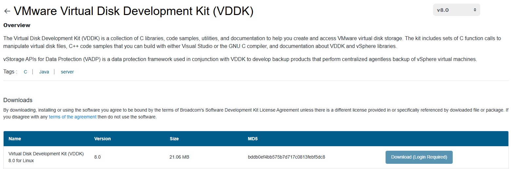

# VMware Virtual Disk Development Kit (VDDK) Image

Quotes from [OpenShift MTV documentation](https://docs.redhat.com/en/documentation/migration_toolkit_for_virtualization/2.9/html/installing_and_using_the_migration_toolkit_for_virtualization/prerequisites-per-provider_mtv#creating-vddk-image_mtv)

- "It is strongly recommended that Migration Toolkit for Virtualization (MTV) should be used with the VMware Virtual Disk Development Kit (VDDK) SDK when transferring virtual disks from VMware vSphere."
- "Creating a VDDK image, although optional, is highly recommended. Using MTV without VDDK is not recommended and could result in significantly lower migration speeds."
- "Storing the VDDK image in a public registry might violate the VMware license terms."

Refer to details below to understand how to
- download vddk packages
- create docker image
- upload docker image to [cluster internal image registry](../image-registry/README.md)
- check it was uploaded correctly
- configure forklift controller and hyperconverged controller

## Download

Download the v8 vddk from [Broadcom](https://developer.broadcom.com/sdks/vmware-virtual-disk-development-kit-vddk/8.0)



```
# ls
VMware-vix-disklib-8.0.0-20521017.x86_64.tar.gz
```

Notes:
- at the time of writing, the latest vddk release is 9.0 and can be downloed without login
- vddk release 8.0 requires an account and login at Broadcom's developer portal
- release 9.0 works fine for cold migration 
- warm migration fails with the log from importer as below; clearly nbdkit expects vddk 8.0 version
- tested with mtv release 2.10

```
I0120 17:17:44.354353       1 vddk-datasource_amd64.go:230] Log line from nbdkit: nbdkit: error: /opt/vmware-vix-disklib-distrib/lib64/libvixDiskLib.so.8: cannot open shared object file: No such file or directory
I0120 17:17:44.354355       1 vddk-datasource_amd64.go:230] Log line from nbdkit:
I0120 17:17:44.354358       1 vddk-datasource_amd64.go:230] Log line from nbdkit: If 'lib64/libvixDiskLib.so.8' is located on a non-standard path you may need to
I0120 17:17:44.354361       1 vddk-datasource_amd64.go:230] Log line from nbdkit: set libdir=/path/to/vmware-vix-disklib-distrib.
I0120 17:17:44.354363       1 vddk-datasource_amd64.go:230] Log line from nbdkit:
I0120 17:17:44.354366       1 vddk-datasource_amd64.go:230] Log line from nbdkit: See nbdkit-vddk-plugin(1) man page section "LIBRARY LOCATION" for details.
I0120 17:17:44.354372       1 vddk-datasource_amd64.go:203] End of nbdkit log.
```

## Unpack

```
# tar xzvf VMware-vix-disklib-8.0.0-20521017.x86_64.tar.gz
# ls
VMware-vix-disklib-8.0.0-20521017.x86_64.tar.gz  vmware-vix-disklib-distrib
```

## Dockerfile

```
# ls
Dockerfile  VMware-vix-disklib-8.0.0-20521017.x86_64.tar.gz  vmware-vix-disklib-distrib

# cat Dockerfile
FROM registry.access.redhat.com/ubi8/ubi-minimal
COPY vmware-vix-disklib-distrib /vmware-vix-disklib-distrib
RUN mkdir -p /opt
ENTRYPOINT ["cp", "-r", "/vmware-vix-disklib-distrib", "/opt"]
```

## Build 

Notes:
- [local image registry](../image-registry/README.md) must be ready to be used
- the name of the docker image is based on the route in target openshift cluster 

Example

```
$ oc get route -n openshift-image-registry
NAME            HOST/PORT                                                       PATH   SERVICES         PORT    TERMINATION   WILDCARD
default-route   default-route-openshift-image-registry.apps.bm1.domain.com             image-registry   <all>   reencrypt     None
```

Docker build

```
# docker build -t default-route-openshift-image-registry.apps.bm1.domain.com/openshift/vddk:v8 .
[+] Building 71.1s (8/8) FINISHED
...
=> => naming to default-route-openshift-image-registry.apps.bm1.domain.com/openshift/vddk:v8                                  0.0s
```

```
# docker image ls | grep vddk
default-route-openshift-image-registry.apps.bm1.domain.com/openshift/vddk       latest        a2c66c0d0450   2 hours ago     172MB
```

## Docker login

- run 'docker login' in order authenticate to local image registry on the target openshift cluster
- check image registry [documentation](../image-registry/manual.md) for details

```
# docker login -u user -p user-token default-route-openshift-image-registry.apps.bm1.domain.com
Login Succeeded
```

## Upload

```
# docker push default-route-openshift-image-registry.apps.bm1.domain.com/openshift/vddk:v8
The push refers to repository [default-route-openshift-image-registry.apps.bm1.domain.com/openshift/vddk]
9cfd0a224702: Pushed
adc752ae552e: Pushed
d3d5294f0e91: Pushed
latest: digest: sha256:65226399587267492044cd357b9d5a348960959bb287b871b529ea83367d02bd size: 947
```

## Verify image upload

```
$ oc get imagestreams.image.openshift.io -n openshift vddk
NAME   IMAGE REPOSITORY                                                                       TAGS     UPDATED
vddk   default-route-openshift-image-registry.apps.bm1.domain.com/openshift/vddk              v8       24 seconds ago
```

## Optional check 

Note: this is just to check internal image repository

```
apiVersion: v1
kind: Pod
metadata:
  name: vddk
spec:
  containers:
  - image: image-registry.openshift-image-registry.svc:5000/openshift/vddk:v8
    name: v2v
```

```
Events:
  Type     Reason          Age                From               Message
  ----     ------          ----               ----               -------
  Normal   Scheduled       16s                default-scheduler  Successfully assigned default/vddk to bm1-1
  Normal   AddedInterface  16s                multus             Add eth0 [10.128.2.75/32] from portmap
  Normal   Pulled          14s                kubelet            Successfully pulled image "image-registry.openshift-image-registry.svc:5000/openshift/vddk:v8" in 2.589s (2.589s including waiting). Image size: 196211426 bytes.
```

## Configure HyperConverged

```
$ oc edit hco -n openshift-cnv kubevirt-hyperconverged
spec:
  vddkInitImage: image-registry.openshift-image-registry.svc:5000/openshift/vddk:v8
```

## Configure Forklift Controller

```
$ oc edit forkliftcontrollers.forklift.konveyor.io -n openshift-mtv forklift-controller
spec:
  vddkInitImage: image-registry.openshift-image-registry.svc:5000/openshift/vddk:v8
```

[[Back]](./README.md)