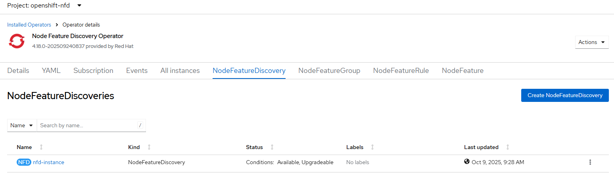

# Node Feature Discovery - Create instance

[[Back]](../README.md) [[Next]](./operator.md) [[iserver-way]](../create_instance.md)

Node Feature Discovery requires single NodeFeatureDiscovery object aka `instance`
- must be created in the same namespace as operator e.g. openshift-nfd

## NodeFeatureDiscovery

~~~
apiVersion: nfd.openshift.io/v1
kind: NodeFeatureDiscovery
metadata:
  name: nfd-instance
  namespace: openshift-nfd
spec:
  customConfig:
    configData: |-
      #    - name: "more.kernel.features"
      #      matchOn:
      #      - loadedKMod: ["example_kmod3"]
      #    - name: "more.features.by.nodename"
      #      value: customValue
      #      matchOn:
      #      - nodename: ["special-.*-node-.*"]
  operand:
    imagePullPolicy: IfNotPresent
    servicePort: 12000
  workerConfig:
    configData: |-
      core:
      #  labelWhiteList:
      #  noPublish: false
        sleepInterval: 60s
      #  sources: [all]
      #  klog:
      #    addDirHeader: false
      #    alsologtostderr: false
      #    logBacktraceAt:
      #    logtostderr: true
      #    skipHeaders: false
      #    stderrthreshold: 2
      #    v: 0
      #    vmodule:
      ##   NOTE: the following options are not dynamically run-time
      ##          configurable and require a nfd-worker restart to take effect
      ##          after being changed
      #    logDir:
      #    logFile:
      #    logFileMaxSize: 1800
      #    skipLogHeaders: false
      sources:
      #  cpu:
      #    cpuid:
      ##     NOTE: whitelist has priority over blacklist
      #      attributeBlacklist:
      #        - "BMI1"
      #        - "BMI2"
      #        - "CLMUL"
      #        - "CMOV"
      #        - "CX16"
      #        - "ERMS"
      #        - "F16C"
      #        - "HTT"
      #        - "LZCNT"
      #        - "MMX"
      #        - "MMXEXT"
      #        - "NX"
      #        - "POPCNT"
      #        - "RDRAND"
      #        - "RDSEED"
      #        - "RDTSCP"
      #        - "SGX"
      #        - "SSE"
      #        - "SSE2"
      #        - "SSE3"
      #        - "SSE4.1"
      #        - "SSE4.2"
      #        - "SSSE3"
      #      attributeWhitelist:
      #  kernel:
      #    kconfigFile: "/path/to/kconfig"
      #    configOpts:
      #      - "NO_HZ"
      #      - "X86"
      #      - "DMI"
        pci:
          deviceClassWhitelist:
            - "0200"
            - "03"
            - "12"
          deviceLabelFields:
      #      - "class"
            - "vendor"
      #      - "device"
      #      - "subsystem_vendor"
      #      - "subsystem_device"
      #  usb:
      #    deviceClassWhitelist:
      #      - "0e"
      #      - "ef"
      #      - "fe"
      #      - "ff"
      #    deviceLabelFields:
      #      - "class"
      #      - "vendor"
      #      - "device"
      #  custom:
      #    - name: "my.kernel.feature"
      #      matchOn:
      #        - loadedKMod: ["example_kmod1", "example_kmod2"]
      #    - name: "my.pci.feature"
      #      matchOn:
      #        - pciId:
      #            class: ["0200"]
      #            vendor: ["15b3"]
      #            device: ["1014", "1017"]
      #        - pciId :
      #            vendor: ["8086"]
      #            device: ["1000", "1100"]
      #    - name: "my.usb.feature"
      #      matchOn:
      #        - usbId:
      #          class: ["ff"]
      #          vendor: ["03e7"]
      #          device: ["2485"]
      #        - usbId:
      #          class: ["fe"]
      #          vendor: ["1a6e"]
      #          device: ["089a"]
      #    - name: "my.combined.feature"
      #      matchOn:
      #        - pciId:
      #            vendor: ["15b3"]
      #            device: ["1014", "1017"]
      #          loadedKMod : ["vendor_kmod1", "vendor_kmod2"]
~~~

## Expected outcome



```
$ oc get all -n openshift-nfd
NAME                                          READY   STATUS    RESTARTS   AGE
pod/nfd-controller-manager-6bb88d9dbf-nf89n   1/1     Running   0          6m18s
pod/nfd-gc-6654d9b6b7-mk9zx                   1/1     Running   0          2m54s
pod/nfd-master-57cb89b9b7-jtcb9               1/1     Running   0          2m54s
pod/nfd-worker-2gxsd                          1/1     Running   0          2m54s
pod/nfd-worker-rkc47                          1/1     Running   0          2m54s
pod/nfd-worker-sx2mx                          1/1     Running   0          2m54s

NAME                                             TYPE        CLUSTER-IP       EXTERNAL-IP   PORT(S)    AGE
service/nfd-controller-manager-metrics-service   ClusterIP   172.244.218.56   <none>        8443/TCP   6m24s

NAME                        DESIRED   CURRENT   READY   UP-TO-DATE   AVAILABLE   NODE SELECTOR   AGE
daemonset.apps/nfd-worker   3         3         3       3            3           <none>          2m54s

NAME                                     READY   UP-TO-DATE   AVAILABLE   AGE
deployment.apps/nfd-controller-manager   1/1     1            1           6m18s
deployment.apps/nfd-gc                   1/1     1            1           2m54s
deployment.apps/nfd-master               1/1     1            1           2m54s

NAME                                                DESIRED   CURRENT   READY   AGE
replicaset.apps/nfd-controller-manager-6bb88d9dbf   1         1         1       6m18s
replicaset.apps/nfd-gc-6654d9b6b7                   1         1         1       2m54s
replicaset.apps/nfd-master-57cb89b9b7               1         1         1       2m54s
```

[[Back]](../README.md) [[Next]](./operator.md) [[iserver-way]](../create_instance.md)