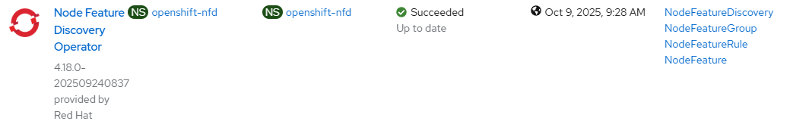

# Node Feature Discovery - Install operator

[[Back]](../README.md) [[Next]](./instance.md) [[iserver-way]](../create_operator.md)

Node Feature Discovery functionalities are implemented via an operator that can be installed using OpenShift Console UI or sequence of objects created via command line (see below)
- Namespace e.g. cisco-intersight
- OperatorGroup in the created namespace
- Subscription in the created namespace

Once operator is installed, [instance](./instance.md) must be created.

## Namespace

~~~
apiVersion: v1
kind: Namespace
metadata:
  name: openshift-nfd
~~~

## Operator Group

~~~
apiVersion: operators.coreos.com/v1
kind: OperatorGroup
metadata:
  name: nfd-operator-group
  namespace: openshift-nfd
spec:
  targetNamespaces:
  - openshift-nfd
  upgradeStrategy: Default
~~~

## Subscription

~~~
apiVersion: operators.coreos.com/v1alpha1
kind: Subscription
metadata:
  name: nfd
  namespace: openshift-nfd
spec:
  channel: stable
  installPlanApproval: Automatic
  name: nfd
  source: redhat-operators
  sourceNamespace: openshift-marketplace
~~~

## Expected outcome



```
$ oc get all -n cisco-intersight
NAME                                             READY   STATUS    RESTARTS   AGE
pod/cisco-intersight-operator-5d7b6b8d55-8tvl5   1/1     Running   0          88s

NAME                                                          TYPE        CLUSTER-IP        EXTERNAL-IP   PORT(S)    AGE
service/cisco-intersight-controller-manager-metrics-service   ClusterIP   172.244.168.126   <none>        8443/TCP   89s

NAME                                        READY   UP-TO-DATE   AVAILABLE   AGE
deployment.apps/cisco-intersight-operator   1/1     1            1           88s

NAME                                                   DESIRED   CURRENT   READY   AGE
replicaset.apps/cisco-intersight-operator-5d7b6b8d55   1         1         1       88s
```

[[Back]](../README.md) [[Next]](./instance.md) [[iserver-way]](../create_operator.md)