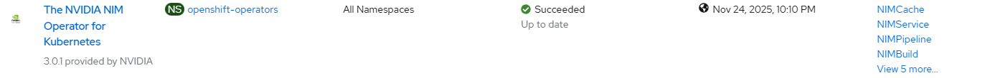

# NVIDIA NIM Operator - Create via Task

## Input

```
[
    {
        "nim": {
            "operator": {
                "channel": "__default__"
            }
        }
    }
]
```

Notes:
- [operator](./create_operator.md) trigger workflow execution with optional input parameters

## Requirements

None

## Expected outcome



## Configurable options

```
# iserver set ocp task 
  --cluster TEXT   Cluster Name
  --filename TEXT  Tasks filename
  --validate       Validate only
  --break          Break on error
  --no-confirm     Confirmation mode
```

## Example

```
# iserver set ocp task --filename C:\tmp\task.json --no-confirm --cluster bm1

OpenShift Workflow - Create Tasks
=================================

Validate Input
--------------
Completed


OpenShift Workflow - NVIDIA NIM Operator - Create Operator
==========================================================

OpenShift Cluster: bm1

Create Namespace
----------------
- name: openshift-operators
- already defined

Create Subscription
-------------------
Subscription: openshift-operators/nim-operator-certified
Source: openshift-marketplace/certified-operators/nim-operator-certified
Install plan approval: Automatic
Getting subscription and packege manifest information...
Channel: stable
- CSV [nim-operator-certified.v3.0.1]
- CSV Display name [The NVIDIA NIM Operator for Kubernetes]
- CVS Version [3.0.1]
- CSV Provider [{'name': 'NVIDIA'}]
- CSV Maturity [stable]

~~~
apiVersion: operators.coreos.com/v1alpha1
kind: Subscription
metadata:
  name: nim-operator-certified
  namespace: openshift-operators
spec:
  channel: stable
  installPlanApproval: Automatic
  name: nim-operator-certified
  source: certified-operators
  sourceNamespace: openshift-marketplace

~~~

Subscription created

Wait for subscription install plan started [timeout:360]...
Install plan: install-7dkcq
Wait for subscription install plan ready [timeout:600]...
Install plan succeeded
Wait for deployments ready (optional: True, allow zero replicas: False)...
- openshift-operators/k8s-nim-operator

Completed tasks
- Namespace created
- Operator Group created
- NVIDIA NIM operator installed
```

[[Back]](./README.md)