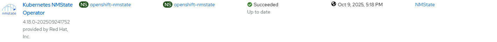
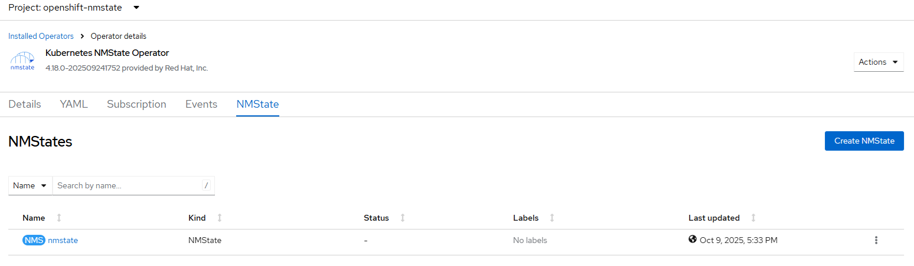
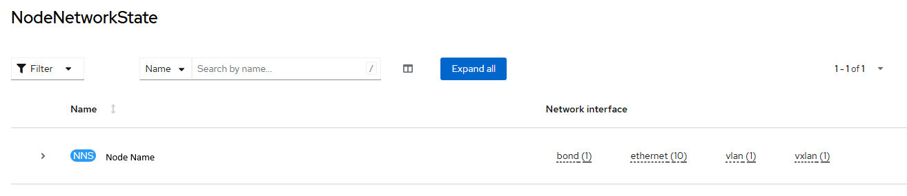

# MMState Operator - Create Operator

## Workflow

- create openshift-nmstate namespace
- create operator group
- create subscription with user controlled channel or defaultChannelName
- create nmstate instance based on default package information or user-provided file with NMState CRD
- wait for nmstate node network states for all cluster nodes

## Requirements

None

## Expected Outcome







## Configurable options

```
# iserver set ocp nmstate --mode operator
  --cluster TEXT              Cluster Name
  --channel TEXT              Operator channel  [default: __default__]
  --filename TEXT             NMState CRD
  --no-confirm                Confirmation mode
```

## Example

```
python.exe .\iserver.py set ocp nmstate --mode operator --cluster bm1 --no-confirm

OpenShift Workflow - NMState Operator - Create Operator
=======================================================

Workflow Parameters
-------------------
{
    "cluster": "bm1",
    "channel": "__default__",
    "instance": null,
    "confirmation": false,
    "check-verbose": true,
    "namespace": "openshift-nmstate",
    "name": "kubernetes-nmstate-operator",
    "operator-group-name": "nmstate-operator-group",
    "delete-namespace": true
}


OpenShift Cluster
-----------------
- cluster: bm1 [domain:local]
- api [C:\Users\user\.itool\ocp-clusters\bm1\kubeconfig]: ok
- dns resolution: ok


Create Namespace
----------------
- name: openshift-nmstate

~~~
apiVersion: v1
kind: Namespace
metadata:
  name: openshift-nmstate

~~~

Namespace created

Wait for namespace [timeout:60]...

Create Operator Group
---------------------
Operator group: openshift-nmstate/nmstate-operator-group

~~~
apiVersion: operators.coreos.com/v1
kind: OperatorGroup
metadata:
  name: nmstate-operator-group
  namespace: openshift-nmstate
spec:
  targetNamespaces:
  - openshift-nmstate
  upgradeStrategy: Default

~~~

Operator group created

Wait for operator group [timeout:60]...

Create Subscription
-------------------
Subscription: openshift-nmstate/kubernetes-nmstate-operator
Source: openshift-marketplace/redhat-operators/kubernetes-nmstate-operator
Install plan approval: Automatic
Getting subscription and packege manifest information...
Resolving channel name...
Channel: stable
- CSV [kubernetes-nmstate-operator.4.18.0-202509241752]
- CSV Display name [Kubernetes NMState Operator]
- CVS Version [4.18.0-202509241752]
- CSV Provider [{'name': 'Red Hat, Inc.'}]
- CSV Maturity [GA]

~~~
apiVersion: operators.coreos.com/v1alpha1
kind: Subscription
metadata:
  name: kubernetes-nmstate-operator
  namespace: openshift-nmstate
spec:
  channel: stable
  installPlanApproval: Automatic
  name: kubernetes-nmstate-operator
  source: redhat-operators
  sourceNamespace: openshift-marketplace

~~~

Subscription created

Wait for subscription install plan started [timeout:360]...
Install plan: install-mhn22
Wait for subscription install plan ready [timeout:600]...
Install plan succeeded
Wait for deployments ready (optional: True, allow zero replicas: False)...
- openshift-nmstate/nmstate-operator

Create NMState Instance
-----------------------

~~~
apiVersion: nmstate.io/v1
kind: NMState
metadata:
  name: nmstate
spec: {}

~~~

NMState instance created

Wait for nmstate instance [timeout:60]...
Wait for nmstate instance resources...
Wait for deployments ready (optional: True, allow zero replicas: False)...
- openshift-nmstate/nmstate-operator
- openshift-nmstate/nmstate-console-plugin
- openshift-nmstate/nmstate-webhook
Wait for nns ready on all cluster nodes
Node [ocp-bm1] nns collected

Completed tasks
- Namespace created
- Operator Group created
- NMState Operator installed and configured
```

[[Back]](./README.md)