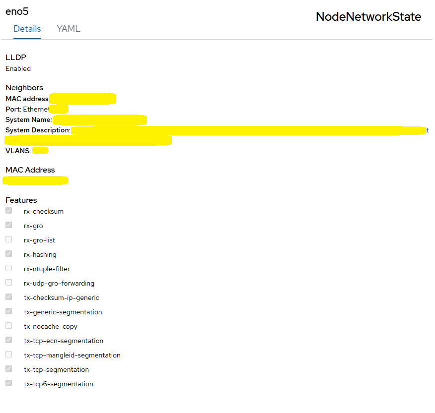

# NMState Operator - Enable LLDP

## Why

NMState operator provides NodeNetworkState that provides per-node per-interface state information. 

LLDP provides whats-on-the-other-end-of-the-cable information and as such is very useful. It needs to be enabled though on nmstate level as by default it is disabled. Moreover, depending on the NIC firmware, LLDP may be enabled on the NIC level by default preventing LLDP message to be seen on NMState level.

## Workflow

On every cluster node
- if --fw flag set, disable lldp on ethernet nic firmware level using ethtool cli
- if --lldp flag set, enable lldp on ethernet nic using nncp crd
- skip interfaces in operational down state if --skip-down flag set as nncp may fail
- wait for nncp crd to complete the configuration task
- delete nncp object unless --keep-ncp flag is used

## Requirements

- NMState operator installed and instance created
- ssh access to cluster nodes

## Expected Outcome



## Configurable options

```
# iserver set ocp nmstate --mode lldp
  --cluster TEXT              Cluster Name
  --fw                        Disable LLDP on NIC fw level
  --keep-nncp                 Keep NNCP
  --skip-down                 Skip interfaces down
  --no-confirm                Confirmation mode
```

## Example

```
python.exe .\iserver.py set ocp nmstate --cluster bm1 --mode lldp --fw --skip-down --no-confirm

OpenShift Workflow - NMState Operator - Enable LLDP
===================================================

Workflow Parameters
-------------------
{
    "cluster": "bm1",
    "settings": {
        "enable": true,
        "nic-fw-disable": true,
        "delete-nncp": true,
        "include-down": false
    },
    "confirmation": true,
    "check-verbose": true,
    "namespace": "openshift-nmstate",
    "name": "kubernetes-nmstate-operator",
    "operator-group-name": "nmstate-operator-group",
    "delete-namespace": true
}


OpenShift Cluster
-----------------
- cluster: bm1 [domain:local]
- api [C:\Users\user\.itool\ocp-clusters\bm1\kubeconfig]: ok
- dns resolution: ok
- cluster node [10.10.10.10] [key:C:\Users\user\.itool\ocp-clusters\bm1\ssh.pub]: ok


Get interface details
---------------------
- node [ocp-bm1]
        interface: bond1
        interface: bond1.702
        interface: cilium_vxlan
        interface: eno1
                ethtool
                lspci
                priv flags
                state
        interface: eno2
                ethtool
                lspci
                priv flags
                state
        interface: eno5
                ethtool
                lspci
                priv flags
                state
        interface: eno6
                ethtool
                lspci
                priv flags
                state
        interface: eno7
                ethtool
                lspci
                priv flags
                state
        interface: eno8
                ethtool
                lspci
                priv flags
                state
        interface: enp216s0f0
                ethtool
                lspci
                priv flags
                state
        interface: enp216s0f1
                ethtool
                lspci
                priv flags
                state
        interface: ens1f0
                ethtool
                lspci
                priv flags
                state
        interface: ens1f1
                ethtool
                lspci
                priv flags
                state
        interface: lo
Disable lldp on ethernet interface fw level [ocp-bm1]
Interface eno1 [0000:3b:00.0] - no change
Interface eno2 [0000:3b:00.1] - no change
Interface eno5 [0000:1d:00.0] - no change
Interface eno6 [0000:1d:00.1] - no change
Interface eno7 [0000:1d:00.2] - no change
Interface eno8 [0000:1d:00.3] - no change
Action: set disable-fw-lldp to on
Interface enp216s0f0 [0000:d8:00.0] - fw lldp disabled
Action: set disable-fw-lldp to on
Interface enp216s0f1 [0000:d8:00.1] - fw lldp disabled
Action: set disable-fw-lldp to on
Interface ens1f0 [0000:5e:00.0] - fw lldp disabled
Action: set disable-fw-lldp to on
Interface ens1f1 [0000:5e:00.1] - fw lldp disabled
Enable lldp on nmstate level [ocp-bm1]
Interface eno1 - skip on interface oper down
Interface eno2 - skip on interface oper down
Interface eno5 - enabling with nncp (enable-lldp-ocp-bm1-eno5)
Interface eno6 - enabling with nncp (enable-lldp-ocp-bm1-eno6)
Interface eno7 - enabling with nncp (enable-lldp-ocp-bm1-eno7)
Interface eno8 - enabling with nncp (enable-lldp-ocp-bm1-eno8)
Interface enp216s0f0 - enabling with nncp (enable-lldp-ocp-bm1-enp216s0f0)
Interface enp216s0f1 - enabling with nncp (enable-lldp-ocp-bm1-enp216s0f1)
Interface ens1f0 - enabling with nncp (enable-lldp-ocp-bm1-ens1f0)
Interface ens1f1 - enabling with nncp (enable-lldp-ocp-bm1-ens1f1)

+--------------------------------+-------------+--------------------------+
| Name                           | Status      | Reason                   |
+--------------------------------+-------------+--------------------------+
| enable-lldp-ocp-bm1-eno5       | Progressing | ConfigurationProgressing |
| enable-lldp-ocp-bm1-eno6       | Unknown     | N/A                      |
| enable-lldp-ocp-bm1-eno7       | Unknown     | N/A                      |
| enable-lldp-ocp-bm1-eno8       | Unknown     | N/A                      |
| enable-lldp-ocp-bm1-enp216s0f0 | Unknown     | N/A                      |
| enable-lldp-ocp-bm1-enp216s0f1 | Unknown     | N/A                      |
| enable-lldp-ocp-bm1-ens1f0     | Unknown     | N/A                      |
| enable-lldp-ocp-bm1-ens1f1     | Unknown     | N/A                      |
+--------------------------------+-------------+--------------------------+
Waiting for [8]: enable-lldp-ocp-bm1-eno5, enable-lldp-ocp-bm1-eno6, enable-lldp-ocp-bm1-eno7, enable-lldp-ocp-bm1-eno8, enable-lldp-ocp-bm1-enp216s0f0, enable-lldp-ocp-bm1-enp216s0f1, enable-lldp-ocp-bm1-ens1f0, enable-lldp-ocp-bm1-ens1f1
Waiting for [7]: enable-lldp-ocp-bm1-eno6, enable-lldp-ocp-bm1-eno7, enable-lldp-ocp-bm1-eno8, enable-lldp-ocp-bm1-enp216s0f0, enable-lldp-ocp-bm1-enp216s0f1, enable-lldp-ocp-bm1-ens1f0, enable-lldp-ocp-bm1-ens1f1
Waiting for [5]: enable-lldp-ocp-bm1-eno8, enable-lldp-ocp-bm1-enp216s0f0, enable-lldp-ocp-bm1-enp216s0f1, enable-lldp-ocp-bm1-ens1f0, enable-lldp-ocp-bm1-ens1f1
Waiting for [2]: enable-lldp-ocp-bm1-ens1f0, enable-lldp-ocp-bm1-ens1f1

+--------------------------------+-----------+------------------------+
| Name                           | Status    | Reason                 |
+--------------------------------+-----------+------------------------+
| enable-lldp-ocp-bm1-eno5       | Available | SuccessfullyConfigured |
| enable-lldp-ocp-bm1-eno6       | Available | SuccessfullyConfigured |
| enable-lldp-ocp-bm1-eno7       | Available | SuccessfullyConfigured |
| enable-lldp-ocp-bm1-eno8       | Available | SuccessfullyConfigured |
| enable-lldp-ocp-bm1-enp216s0f0 | Available | SuccessfullyConfigured |
| enable-lldp-ocp-bm1-enp216s0f1 | Available | SuccessfullyConfigured |
| enable-lldp-ocp-bm1-ens1f0     | Available | SuccessfullyConfigured |
| enable-lldp-ocp-bm1-ens1f1     | Available | SuccessfullyConfigured |
+--------------------------------+-----------+------------------------+
All policies are deleted (except for progressing if any)...
- enable-lldp-ocp-bm1-eno5 [Deleted]
- enable-lldp-ocp-bm1-eno6 [Deleted]
- enable-lldp-ocp-bm1-eno7 [Deleted]
- enable-lldp-ocp-bm1-eno8 [Deleted]
- enable-lldp-ocp-bm1-enp216s0f0 [Deleted]
- enable-lldp-ocp-bm1-enp216s0f1 [Deleted]
- enable-lldp-ocp-bm1-ens1f0 [Deleted]
- enable-lldp-ocp-bm1-ens1f1 [Deleted]

Completed tasks
- LLDP disabled on fw nic level
- LLDP enabled on nmstate level
```

[[Back]](./README.md)