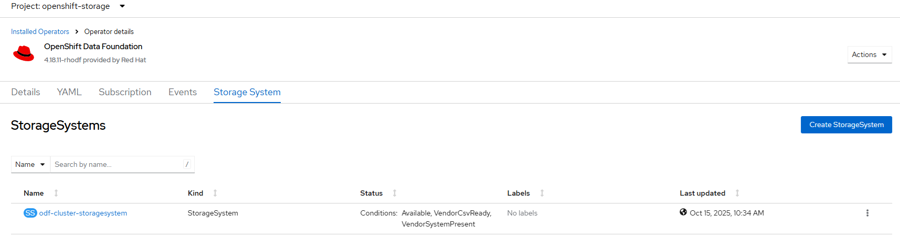

# OpenShift Data Foundation (ODF) Operator - Create Cluster

## Workflow

- create StorageCluster CRD generated from parameters or provided YAML
- wait for cluster initialization to complete

## Requirements

ODP operator must be installed
No storage cluster may exist

## Configurable options

```
# iserver set ocp odf --mode cluster
  --cluster TEXT                 Cluster Name
  --filename TEXT                ODF Cluster
  --sc TEXT                      Storage class name  [default: odf-sc]
  --replica INTEGER              Replica  [default: 0]
  --count INTEGER                Count  [default: 0]
  --default-sc                   Set ODF storage class as default
  --nfs                          Enable nfs
  --flexible                     Flexible scaling
  --tools                        Ceph tools
  --no-confirm                   Confirmation mode
```

## Expected Outcome



## Example

```
# iserver set ocp odf --mode cluster --replica 3 --count 2 --nfs --default-sc --flexible --cluster bm1 --no-confirm

OpenShift Workflow - OpenShift Data Foundation (ODF) Operator - Create Cluster
==============================================================================

Workflow Parameters
-------------------
{
    "cluster": "bm1",
    "sc": "odf-sc",
    "replica": 3,
    "count": 2,
    "default_sc": true,
    "nfs": true,
    "flexible": true,
    "tools": false,
    "confirmation": false,
    "instance": null,
    "check-verbose": true,
    "namespace": "openshift-storage",
    "name": "odf-operator",
    "cluster-name": "odf-cluster",
    "operator-group-name": "openshift-storage-operator-group",
    "delete-namespace": true
}


OpenShift Cluster
-----------------
- cluster: bm1 [domain:local]
- api [C:\Users\user\.itool\ocp-clusters\bm1\kubeconfig]: ok
- dns resolution: ok


Checks
------
- odf subscription found
- local storage class: local-sc
- persistent volumes for local storage: 6
- enough pvs for repliaca [3] and count [2]

Create Storage Cluster
----------------------
- namespace: openshift-storage
- name: odf-cluster
- storage class: odf-sc
- default storage class: True
- default virtualization storage class: True
- nfs: True
- lso storage class: local-sc
- replica: 3
- count: 2
- flexible scaling: True
- ceph tools: False

~~~
apiVersion: ocs.openshift.io/v1
kind: StorageCluster
metadata:
  name: odf-cluster
  namespace: openshift-storage
spec:
  arbiter: {}
  encryption:
    keyRotation:
      schedule: '@weekly'
    kms: {}
  externalStorage: {}
  flexibleScaling: true
  managedResources:
    cephBlockPools:
      defaultStorageClass: true
      defaultVirtualizationStorageClass: true
    cephCluster: {}
    cephConfig: {}
    cephDashboard: {}
    cephFilesystems: {}
    cephNonResilientPools: {}
    cephObjectStoreUsers: {}
    cephObjectStores: {}
    cephRBDMirror: {}
    cephToolbox: {}
  monDataDirHostPath: /var/lib/rook
  nfnodeTopologies: {}
  nfs:
    enable: true
  storageDeviceSets:
  - config: {}
    count: 2
    dataPVCTemplate:
      metadata: {}
      spec:
        accessModes:
        - ReadWriteOnce
        resources:
          requests:
            storage: '1'
        storageClassName: local-sc
        volumeMode: Block
      status: {}
    name: odf-sc
    placement: {}
    preparePlacement: {}
    replica: 3
    resources: {}

~~~

- storage cluster created

- wait for storage cluster crd...
- wait for ceph cluster crd...
- wait for storage cluster resources...
Wait for deployments ready (optional: False, allow zero replicas: True)...
- openshift-storage/csi-rbdplugin-provisioner
- openshift-storage/csi-cephfsplugin-provisioner
- openshift-storage/noobaa-endpoint
- openshift-storage/ocs-metrics-exporter
- openshift-storage/rook-ceph-mon-a
- openshift-storage/rook-ceph-mon-b
- openshift-storage/rook-ceph-mon-c
- openshift-storage/rook-ceph-mgr-a
- openshift-storage/rook-ceph-mgr-b
- openshift-storage/rook-ceph-osd-0
- openshift-storage/rook-ceph-osd-1
- openshift-storage/rook-ceph-osd-2
- openshift-storage/rook-ceph-osd-3
- openshift-storage/rook-ceph-osd-4
- openshift-storage/rook-ceph-osd-5
- openshift-storage/rook-ceph-crashcollector-bm1-1
- openshift-storage/rook-ceph-exporter-bm1-1
- openshift-storage/rook-ceph-crashcollector-bm1-2
- openshift-storage/rook-ceph-exporter-bm1-2
- openshift-storage/rook-ceph-crashcollector-bm1-3
- openshift-storage/rook-ceph-exporter-bm1-3
- wait for storage cluster crd...

Completed tasks
- Cluster created and ready
```

[[Back]](./README.md)