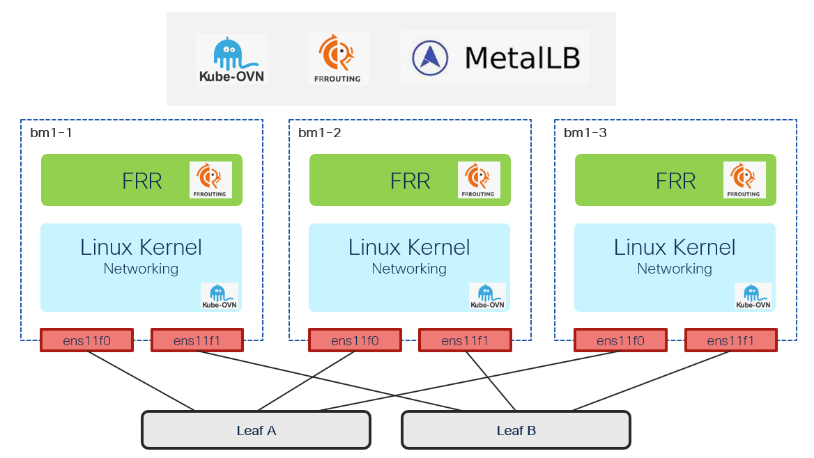

# OVNKubernetes BGP

[[Back]](../Operations.md)

OpenShift Container Platform supports BGP routing through FRRouting (FRR). FRR-K8s is a Kubernetes-based daemon set that exposes a subset of the FRR API in a Kubernetes-compliant manner. Refer to official [documentation](https://docs.redhat.com/en/documentation/openshift_container_platform/4.21/html/advanced_networking/bgp-routing#nw-bgp-about_routing_about-bgp-routing) for more details.

## Features

> [!NOTE]
> all outputs and code developed based on OCP4.21 bundled with FRR v8.5.3

- requirements: bare metal cluster, OCP 4.19+, OVNKubernetes CNI
- must be [enabled](./kb/enable.md) with optional [route advertisement feature](./kb/enable_route_advertisement.md)
- FRR-k8s configuration controlled with [FRRConfiguration CRD](./kb/configuration.md) and [RouteAdvertisements CRD](./kb/route_advertisement.md)
- BGP state exposed with [FRRNodeState CRD](./kb/node_state.md) and [BGPSessionState CRD](./kb/session_state.md)
- can integrate with [MetalLB for service advertisement](../ovn-metallb/README.md)

## Examples

- accessing frr [cli](./kb/frr_cli.md)
- peering with Nexus [NX-OS](./example/nxos/README.md) fabric
- peering with Nexus ACI fabric
- [bfd](./example/bfd/README.md)
- [advertising](./example/advertise/README.md) routes 
- [receiving](./example/receive/README.md) routes 
- [node selector](./example/node_selector/README.md)
- [md5 authentication](./example/password/README.md)
- [timers](./example/timer/README.md)
- local preference
- [community](./example/community/README.md)
- [pod cidr](./example/pod/README.md)
- cluster user defined network
    - topology [l3](./example/cudn-l3/README.md)
    - topology l3 w/VRF-Lite
- egress ip

## Life Cycle Management Commands

Command | Intent | Details
--- | --- | ---
iserver get ocp ovn-bgp -v state | get ovnkubernetes bgp state summary | [Link](./get_state.md)
iserver get ocp ovn-bgp -v cli | get frr cli access command | [Link](./get_cli.md)
iserver get ocp ovn-bgp -v config | get frr configuration objects | [Link](./get_config.md)
iserver get ocp ovn-bgp -v exec | run frr cli | [Link](./get_exec.md)
iserver get ocp ovn-bgp -v frr | get frr configuration | [Link](./get_frr.md)
iserver get ocp ovn-bgp -v ra | get route advertisement objects | [Link](./get_ra.md)
iserver get ocp ovn-bgp -v ra-config | get route advertisement objects with generated configs | [Link](./get_ra_config.md)
iserver get ocp ovn-bgp -v session | get bgp session state | [Link](./get_session.md)
iserver set ocp ovn-bgp --mode feature | enable ovn frr-k8s | [Link](./feature_enable.md)
iserver set ocp ovn-bgp --mode ra | enable ovn route advertisement | [Link](./ra_enable.md)
iserver set ocp ovn-bgp --mode config | add frr configuraton | [Link](./configuration_create.md)
iserver set ocp ovn-bgp --mode ra-config | add route advertisement | [Link](./ra_create.md)
iserver set ocp task | in task way | [Link](./create_task.md)
iserver delete ocp ovn-bgp --mode feature | disable ovn frr-k8s | [Link](./feature_disable.md)
iserver delete ocp ovn-bgp --mode ra | disable ovn route advertisement | [Link](./ra_disable.md)
iserver delete ocp ovn-bgp --mode config | delete frr configuraton | [Link](./configuration_delete.md)
iserver delete ocp ovn-bgp --mode ra-config | delete route advertisement | [Link](./ra_delete.md)
iserver delete ocp ovn-bgp --mode wipe | wipe frr-k8s and ra | [Link](./wipe.md)
iserver delete ocp task | in task way | [Link](./delete_task.md)

[[Back]](../Operations.md)