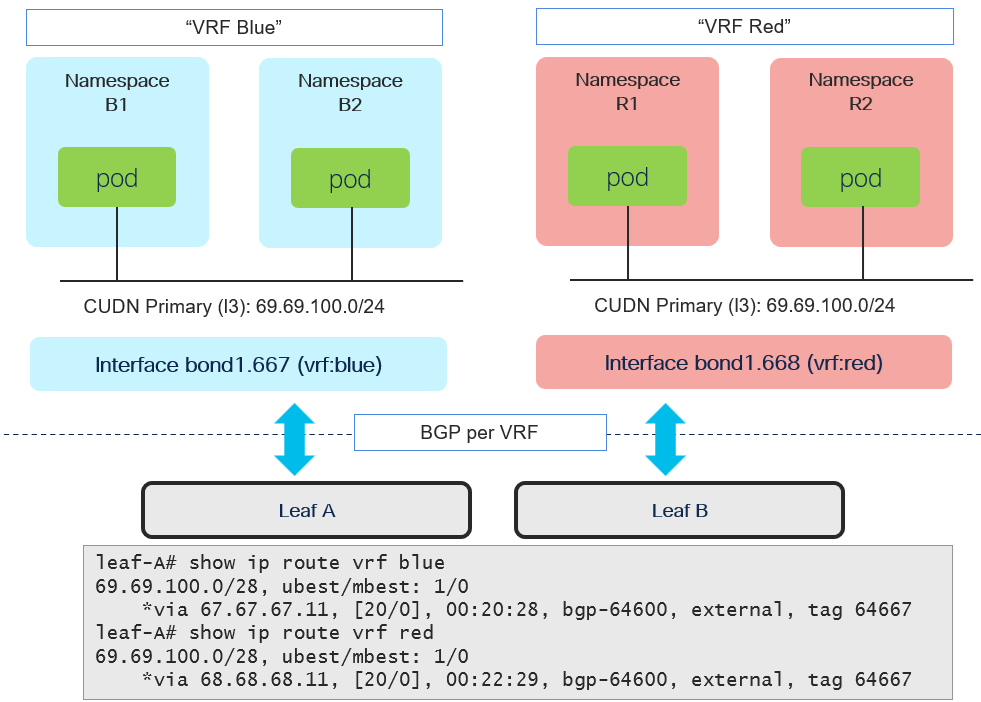

# OVNKubernetes BGP - Cluster User Defined Network (L3) w/VRF-Lite

[[Back]](./README.md) [[CRD]](./cudn-crd.md) [[IP Stack]](./nns-cudn.md)



## CUDN

Requirements
- primary cudn
- L3 topology
- assigned with two namespaces each
- bgp:enabled labeled
- cudn blue: 69.69.100.0/24 with hostSubnet:28
- cudn red: 69.69.100.0/24 with hostSubnet:28
- cudn subnets bgp advertised within vrf as such no problem with overal from bgp perspective

## Task

```
[
    {
        "k8s": {
            "__enabled__": true,
            "description": "namespaces",
            "items": [
                {
                    "__type__": "namespace",
                    "namespace": "island-r1",
                    "ovn-udn": true,
                    "labels": {
                        "tenant": "red"
                    }
                },
                {
                    "__type__": "namespace",
                    "namespace": "island-r2",
                    "ovn-udn": true,
                    "labels": {
                        "tenant": "red"
                    }
                },
                {
                    "__type__": "namespace",
                    "namespace": "island-b1",
                    "ovn-udn": true,
                    "labels": {
                        "tenant": "blue"
                    }
                },
                {
                    "__type__": "namespace",
                    "namespace": "island-b2",
                    "ovn-udn": true,
                    "labels": {
                        "tenant": "blue"
                    }
                }
            ]
        }
    },
    {
        "k8s": {
            "__enabled__": true,
            "description": "cudn",
            "items": [
                {
                    "__type__": "ovn-cudn",
                    "namespace": {
                        "label": [
                            "tenant:blue"
                        ]
                    },
                    "name": "blue",
                    "primary": true,
                    "topology": "l3",
                    "subnets": [
                        {
                            "cidr": "69.69.100.0/24",
                            "host": 28
                        }
                    ],
                    "labels": {
                        "bgp": "enabled"
                    }
                },
                {
                    "__type__": "ovn-cudn",
                    "namespace": {
                        "label": [
                            "tenant:red"
                        ]
                    },
                    "name": "red",
                    "primary": true,
                    "topology": "l3",
                    "subnets": [
                        {
                            "cidr": "69.69.100.0/24",
                            "host": 28
                        }
                    ],
                    "labels": {
                        "bgp": "enabled"
                    }
                }
            ]
        }
    }
]
```

[[Back]](./README.md) [[CRD]](./cudn-crd.md)