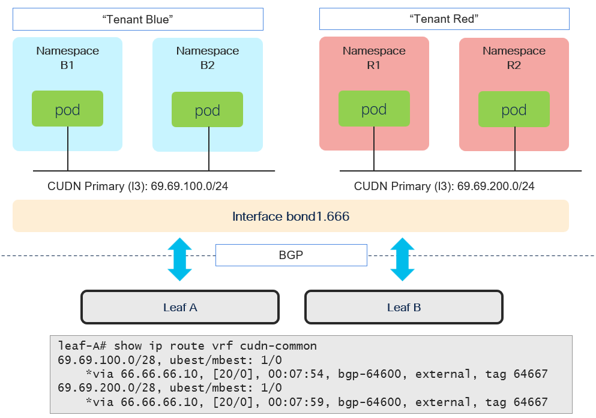

# OVNKubernetes BGP - Cluster User Defined Network (L3)

[[Back]](../../README.md)

## Goal

BGP advertise [cluster user defined networks](../../../ovn-cudn/README.md) using **default VRF in FRR**.

> [!NOTE]
> FRR on every cluster node expected to advertise hostSubnet allocated from CUDN CIDR

## Networking setup

Requirements
- dedicated physical interfaces (ens11f0, ens11f1) to leaf switches
- active/backup bond
- no vlan encapsulation
- route to leaf loopback interface via bond

Details
- [NodeNetworkConfigurationPolicy](./create-nncp.md), [task-way](./create-nncp-task.md)
- [cluster node ip stack](./nns-nncp.md)
- [leaf state](./nxos-nncp.md)

## BGP Peering

Requirements
- local asn 64667, remote asn 64600
- ebgp multihop 
- every cluster node establishes bgp peering with leaf-a and leaf-b
- peering with leaf's loopback interface

Details
- [enable ovn-bgp](../../feature_enable.md)
- [FRRConfiguration](./create-frr.md)
- [frr state](./frr-bgp.md)
- [leaf state](./nxos-bgp.md)

## CUDN

Requirements
- primary cudn
- L3 topology
- assigned with two namespaces each
- bgp:enabled labeled
- tenant-blue: 69.69.100.0/24 with hostSubnet:28
- tenant-red: 69.69.200.0/24 with hostSubnet:28

Details
- [cudn crds](./cudn-crd.md), [task-way](./cudn-crd-task.md)
- [cluster node ip stack](./nns-cudn.md)

## Route Advertisement

Requirements
- frr advertises cudn pod networks

Details
- [enable route advertisements](../../ra_enable.md)
- [RouteAdvertisements](./create-ra.md)
- [frr state](./frr-cudn.md)
- [leaf state](./nxos-cudn.md)

[[Back]](../../README.md)