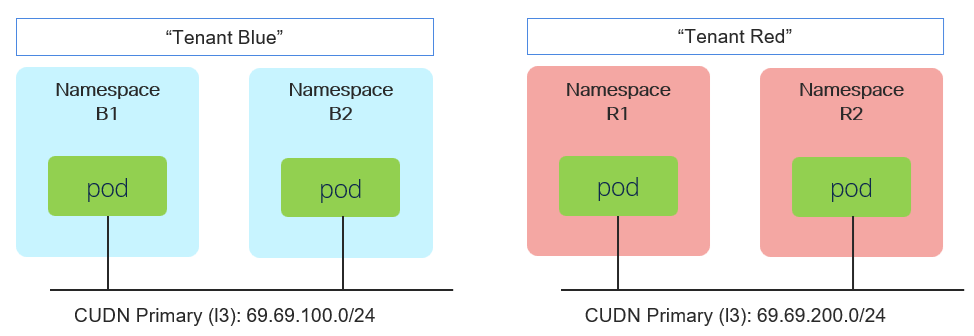

# OVNKubernetes BGP - Cluster User Defined Network

[[Back]](./README.md) [[IP Stack]](./ip-stack.md)



## CRD

> [!NOTE]
> Showing one namespace and one CUDN. Scroll below in task output details for all CRDs generated and applied via task

```
apiVersion: v1
kind: Namespace
metadata:
  annotations:
    k8s.ovn.org/multicast-enabled: 'true'
  labels:
    k8s.ovn.org/primary-user-defined-network: ''
    tenant: blue
  name: island-b1
```

```
apiVersion: k8s.ovn.org/v1
kind: ClusterUserDefinedNetwork
metadata:
  labels:
    bgp: enabled
  name: tenant-blue
spec:
  namespaceSelector:
    matchExpressions:
    - key: kubernetes.io/metadata.name
      operator: In
      values:
      - island-b1
      - island-b2
  network:
    layer3:
      role: Primary
      subnets:
      - cidr: 69.69.100.0/24
        hostSubnet: 28
    topology: Layer3
```

## Task

```
[
    {
        "k8s": {
            "__enabled__": true,
            "description": "namespaces",
            "items": [
                {
                    "__type__": "namespace",
                    "namespace": "island-r1",
                    "ovn-udn": true,
                    "ovn-multicast": true,
                    "labels": {
                        "tenant": "red"
                    }
                },
                {
                    "__type__": "namespace",
                    "namespace": "island-r2",
                    "ovn-udn": true,
                    "ovn-multicast": true,
                    "labels": {
                        "tenant": "red"
                    }
                },
                {
                    "__type__": "namespace",
                    "namespace": "island-b1",
                    "ovn-udn": true,
                    "ovn-multicast": true,
                    "labels": {
                        "tenant": "blue"
                    }
                },
                {
                    "__type__": "namespace",
                    "namespace": "island-b2",
                    "ovn-udn": true,
                    "ovn-multicast": true,
                    "labels": {
                        "tenant": "blue"
                    }
                }
            ]
        }
    },
    {
        "k8s": {
            "__enabled__": true,
            "description": "cudn",
            "items": [
                {
                    "__type__": "ovn-cudn",
                    "namespace": {
                        "label": [
                            "tenant:blue"
                        ]
                    },
                    "name": "tenant-blue",
                    "primary": true,
                    "topology": "l3",
                    "subnets": [
                        {
                            "cidr": "69.69.100.0/24",
                            "host": 28
                        }
                    ],
                    "labels": {
                        "bgp": "enabled"
                    }
                },
                {
                    "__type__": "ovn-cudn",
                    "namespace": {
                        "label": [
                            "tenant:red"
                        ]
                    },
                    "name": "tenant-red",
                    "primary": true,
                    "topology": "l3",
                    "subnets": [
                        {
                            "cidr": "69.69.200.0/24",
                            "host": 28
                        }
                    ],
                    "labels": {
                        "bgp": "enabled"
                    }
                }
            ]
        }
    }
]
```

## Output

```
# iserver set ocp task --cluster bm1 --filename C:\tmp\task.json

Cluster: bm1 (type: ocp)

Kubernetes Workflow - Namespace - Create
========================================

OpenShift Cluster: bm1

Create Namespace
----------------
- name: island-r1

~~~
apiVersion: v1
kind: Namespace
metadata:
  annotations:
    k8s.ovn.org/multicast-enabled: 'true'
  labels:
    k8s.ovn.org/primary-user-defined-network: ''
    tenant: red
  name: island-r1

~~~
Namespace [island-r1] created
Wait for namespace [timeout:60]...

Check labels
- tenant:red found
- k8s.ovn.org/primary-user-defined-network: found

Check annotations
- k8s.ovn.org/multicast-enabled:true found

Completed tasks
- namespace created

Kubernetes Workflow - Namespace - Create
========================================

OpenShift Cluster: bm1

Create Namespace
----------------
- name: island-r2

~~~
apiVersion: v1
kind: Namespace
metadata:
  annotations:
    k8s.ovn.org/multicast-enabled: 'true'
  labels:
    k8s.ovn.org/primary-user-defined-network: ''
    tenant: red
  name: island-r2

~~~
Namespace [island-r2] created
Wait for namespace [timeout:60]...

Check labels
- tenant:red found
- k8s.ovn.org/primary-user-defined-network: found

Check annotations
- k8s.ovn.org/multicast-enabled:true found

Completed tasks
- namespace created

Kubernetes Workflow - Namespace - Create
========================================

OpenShift Cluster: bm1

Create Namespace
----------------
- name: island-b1

~~~
apiVersion: v1
kind: Namespace
metadata:
  annotations:
    k8s.ovn.org/multicast-enabled: 'true'
  labels:
    k8s.ovn.org/primary-user-defined-network: ''
    tenant: blue
  name: island-b1

~~~
Namespace [island-b1] created
Wait for namespace [timeout:60]...

Check labels
- tenant:blue found
- k8s.ovn.org/primary-user-defined-network: found

Check annotations
- k8s.ovn.org/multicast-enabled:true found

Completed tasks
- namespace created

Kubernetes Workflow - Namespace - Create
========================================

OpenShift Cluster: bm1

Create Namespace
----------------
- name: island-b2

~~~
apiVersion: v1
kind: Namespace
metadata:
  annotations:
    k8s.ovn.org/multicast-enabled: 'true'
  labels:
    k8s.ovn.org/primary-user-defined-network: ''
    tenant: blue
  name: island-b2

~~~
Namespace [island-b2] created
Wait for namespace [timeout:60]...

Check labels
- tenant:blue found
- k8s.ovn.org/primary-user-defined-network: found

Check annotations
- k8s.ovn.org/multicast-enabled:true found

Completed tasks
- namespace created

Kubernetes Workflow - OVN Cluster User Defined Network - Create
===============================================================

OpenShift Cluster: bm1

Create ClusterUserDefinedNetwork
--------------------------------
- name: tenant-blue

~~~
apiVersion: k8s.ovn.org/v1
kind: ClusterUserDefinedNetwork
metadata:
  labels:
    bgp: enabled
  name: tenant-blue
spec:
  namespaceSelector:
    matchExpressions:
    - key: kubernetes.io/metadata.name
      operator: In
      values:
      - island-b1
      - island-b2
  network:
    layer3:
      role: Primary
      subnets:
      - cidr: 69.69.100.0/24
        hostSubnet: 28
    topology: Layer3

~~~
ClusterUserDefinedNetwork [tenant-blue] created
- wait for ClusterUserDefinedNetwork tenant-blue [timeout:60s]
- wait for ClusterUserDefinedNetwork tenant-blue [timeout:60s] with {"created_status": "True"}
- wait for NetworkAttachmentDefinition island-b1/tenant-blue [timeout:60s]
- wait for NetworkAttachmentDefinition island-b2/tenant-blue [timeout:60s]

+----+-------------+---+---+-----------+----------+----------------+---------------------------------------------------+----------+
| ID | CUDN        | C | P | Namespace | Topology | Subnet         | Net Attach Def                                    | Workload |
+----+-------------+---+---+-----------+----------+----------------+---------------------------------------------------+----------+
| 1  | tenant-blue | V | V | island-b1 | Layer3   | 69.69.100.0/24 | {                                                 | ---      | 
|    |             |   |   | island-b2 |          | host /28       |   "cniVersion": "1.0.0",                          |          | 
|    |             |   |   |           |          |                |   "joinSubnet": "100.65.0.0/16,fd99::/64",        |          | 
|    |             |   |   |           |          |                |   "name": "cluster_udn_tenant-blue",              |          | 
|    |             |   |   |           |          |                |   "netAttachDefName": "${NAMESPACE}/tenant-blue", |          | 
|    |             |   |   |           |          |                |   "role": "primary",                              |          | 
|    |             |   |   |           |          |                |   "subnets": "69.69.100.0/24/28",                 |          | 
|    |             |   |   |           |          |                |   "topology": "layer3",                           |          | 
|    |             |   |   |           |          |                |   "type": "ovn-k8s-cni-overlay"                   |          | 
|    |             |   |   |           |          |                | }                                                 |          | 
+----+-------------+---+---+-----------+----------+----------------+---------------------------------------------------+----------+

Completed tasks
- ovn cluster user defined network created

Kubernetes Workflow - OVN Cluster User Defined Network - Create
===============================================================

OpenShift Cluster: bm1

Create ClusterUserDefinedNetwork
--------------------------------
- name: tenant-red

~~~
apiVersion: k8s.ovn.org/v1
kind: ClusterUserDefinedNetwork
metadata:
  labels:
    bgp: enabled
  name: tenant-red
spec:
  namespaceSelector:
    matchExpressions:
    - key: kubernetes.io/metadata.name
      operator: In
      values:
      - island-r1
      - island-r2
  network:
    layer3:
      role: Primary
      subnets:
      - cidr: 69.69.200.0/24
        hostSubnet: 28
    topology: Layer3

~~~
ClusterUserDefinedNetwork [tenant-red] created
- wait for ClusterUserDefinedNetwork tenant-red [timeout:60s]
- wait for ClusterUserDefinedNetwork tenant-red [timeout:60s] with {"created_status": "True"}
- wait for NetworkAttachmentDefinition island-r1/tenant-red [timeout:60s]
- wait for NetworkAttachmentDefinition island-r2/tenant-red [timeout:60s]

+----+------------+---+---+-----------+----------+----------------+--------------------------------------------------+----------+
| ID | CUDN       | C | P | Namespace | Topology | Subnet         | Net Attach Def                                   | Workload |
+----+------------+---+---+-----------+----------+----------------+--------------------------------------------------+----------+
| 1  | tenant-red | V | V | island-r1 | Layer3   | 69.69.200.0/24 | {                                                | ---      | 
|    |            |   |   | island-r2 |          | host /28       |   "cniVersion": "1.0.0",                         |          | 
|    |            |   |   |           |          |                |   "joinSubnet": "100.65.0.0/16,fd99::/64",       |          | 
|    |            |   |   |           |          |                |   "name": "cluster_udn_tenant-red",              |          | 
|    |            |   |   |           |          |                |   "netAttachDefName": "${NAMESPACE}/tenant-red", |          | 
|    |            |   |   |           |          |                |   "role": "primary",                             |          | 
|    |            |   |   |           |          |                |   "subnets": "69.69.200.0/24/28",                |          | 
|    |            |   |   |           |          |                |   "topology": "layer3",                          |          | 
|    |            |   |   |           |          |                |   "type": "ovn-k8s-cni-overlay"                  |          | 
|    |            |   |   |           |          |                | }                                                |          | 
+----+------------+---+---+-----------+----------+----------------+--------------------------------------------------+----------+

Completed tasks
- ovn cluster user defined network created
```

[[Back]](./README.md)