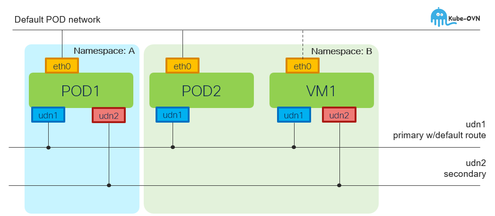

# OVNKubernetes - Cluster User Defined Network (CUDN)

[[Back]](../Operations.md) [[User Defined Network]](../ovn-udn/README.md)

The ClusterUserDefinedNetwork (CUDN) custom resource (CR) provides cluster-scoped network segmentation in OpenShift Container Platform and isolation for administrators only. Defining this resource ensures that network traffic is securely partitioned across the entire cluster as explained in the official [documentation](https://docs.redhat.com/en/documentation/openshift_container_platform/4.21/pdf/multiple_networks/OpenShift_Container_Platform-4.21-Multiple_networks-en-US.pdf).

## Features

- cluster scope with [namespace selection](./namespace.md)
- single [primary](./primary.md) and mutliple [secondary](./secondary.md) networks per namespace
- IPv4 and IPv6 subnets may be associated with cudn with built-in [vrf isolation](./vrf.md)
- topology
    - [L2](./l2/overview.md) - flat L2 subnet across the nodes (bridging)
    - [L3](./l3/overview.md) - similar to POD CIDR with per node subnets (routing)
    - [localnet](./localnet/overview.md) - connects secondary network to physical underlay

## Networking

Topology | Role | EW | NS | Service | NetworkPolicy | MultinetworkPolicy
--- | --- | --- | --- | --- | --- | ---
L2 | Primary | :white_check_mark: w/overlay | :white_check_mark: w/masq | :white_check_mark: | :white_check_mark: | :x:
L3 | Primary | :white_check_mark: w/overlay | :white_check_mark: w/masq | :white_check_mark: | :white_check_mark: | :x:
L2 | Secondary | :white_check_mark: w/overlay | :x: | :x: | :x: | :white_check_mark:
L3 | Secondary | :white_check_mark: w/overlay | :x: | :x: | :x: | :white_check_mark:
Localnet | Secondary | :white_check_mark: no-overlay | :white_check_mark: no-masq | :x: | :x: | :white_check_mark:

## Limitations

- Virtual machine primary interface does not work with L3 topology ([Link](./l3/vm.md))
- L2 topology: link local multicast (224.0.0.x) works within namespace only, not across namespaces e.g. OSPF

## Life Cycle Management Commands

Command | Intent | Details
--- | --- | ---
iserver get k8s cudn | get cudn | [Link](./get.md)
iserver set ocp task | in task way | [L2](./l2/task.md), [L3](./l3/task.md), [Localnet](./localnet/task.md)
iserver delete ocp task | in task way | [Link](./delete_task.md)

[[Back]](../Operations.md) [[User Defined Network]](../ovn-udn/README.md)