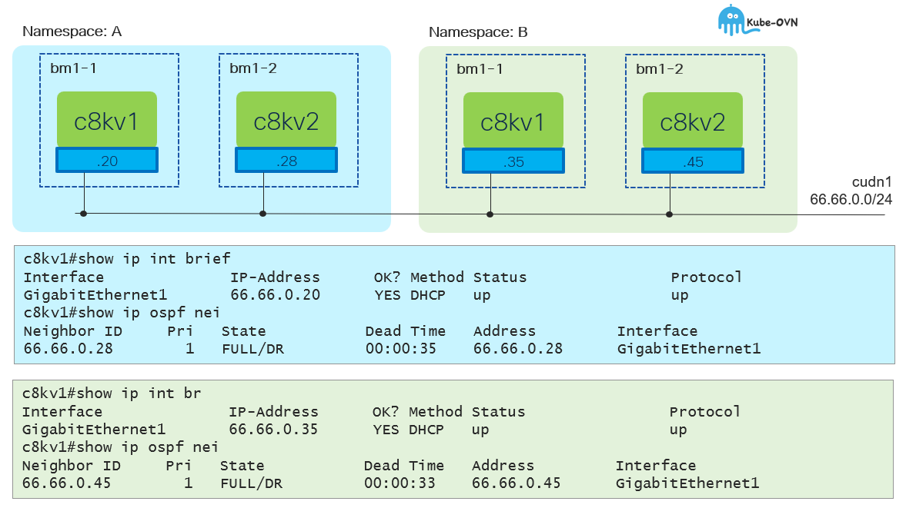

# CUDN w/L2 Topology - Multicast

[[Back]](./overview.md)



## Setup

- two namespaces: island-a1 and island-a2
- namespace primary udn and multicast enabled
- single cudn primary network with l2 topology across two namespaces
- 2x c8kv vms per namespace, each in different node

> [!CAUTION]
> Multicast works within namespace (not sure if by design or due to bug)

## CUDN

```
apiVersion: k8s.ovn.org/v1
kind: ClusterUserDefinedNetwork
metadata:
  name: tenant-a
spec:
  namespaceSelector:
    matchExpressions:
    - key: kubernetes.io/metadata.name
      operator: In
      values:
      - island-a1
      - island-a2
  network:
    layer2:
      role: Primary
      subnets:
      - 66.66.0.0/24
    topology: Layer2
```

```
# iserver get k8s cudn --cluster bm1

+----+----------+---+---+-----------+----------+--------------+------------------------------------------------+--------------------------------+
| ID | CUDN     | C | P | Namespace | Topology | Subnet       | Net Attach Def                                 | Workload                       |
+----+----------+---+---+-----------+----------+--------------+------------------------------------------------+--------------------------------+
| 1  | tenant-a | V | V | island-a1 | Layer2   | 66.66.0.0/24 | {                                              | [VM] island-a1/c8kv1 (default) | 
|    |          |   |   | island-a2 |          |              |   "cniVersion": "1.0.0",                       | [VM] island-a1/c8kv2 (default) |
|    |          |   |   |           |          |              |   "joinSubnet": "100.65.0.0/16,fd99::/64",     | [VM] island-a2/c8kv1 (default) |
|    |          |   |   |           |          |              |   "name": "cluster_udn_tenant-a",              | [VM] island-a2/c8kv2 (default) |
|    |          |   |   |           |          |              |   "netAttachDefName": "${NAMESPACE}/tenant-a", |                                |
|    |          |   |   |           |          |              |   "role": "primary",                           |                                |
|    |          |   |   |           |          |              |   "subnets": "66.66.0.0/24",                   |                                |
|    |          |   |   |           |          |              |   "topology": "layer2",                        |                                |
|    |          |   |   |           |          |              |   "transitSubnet": "100.88.0.0/16",            |                                |
|    |          |   |   |           |          |              |   "type": "ovn-k8s-cni-overlay"                |                                |
|    |          |   |   |           |          |              | }                                              |                                |
+----+----------+---+---+-----------+----------+--------------+------------------------------------------------+--------------------------------+
```

## Virtual Machines

```
# iserver get k8s vmi --cluster bm1
Cluster: bm1 (type: ocp)

+----+-------------+-------+-----+-----+---------------------+-------+-------------------------------------+-----+---------+-------+
| ID | VM Instance | Node  | CPU | Mem | Disk                | PVC   | Interface                           | Svc | State   | Age   |
+----+-------------+-------+-----+-----+---------------------+-------+-------------------------------------+-----+---------+-------+
| 1  | island-a1   | bm1-1 | 1   | 4Gi | rootdisk/vda - 10Gi | c8kv1 | [default] 66.66.0.20 (pod:l2bridge) | 1   | Running | 4h1m  |
|    | c8kv1       |       |     |     | day0                | ---   |                                     |     |         |       |
+----+-------------+-------+-----+-----+---------------------+-------+-------------------------------------+-----+---------+-------+
| 2  | island-a1   | bm1-2 | 1   | 4Gi | rootdisk/vda - 10Gi | c8kv2 | [default] 66.66.0.28 (pod:l2bridge) | 1   | Running | 4h0m  |
|    | c8kv2       |       |     |     | day0                | ---   |                                     |     |         |       |
+----+-------------+-------+-----+-----+---------------------+-------+-------------------------------------+-----+---------+-------+
| 3  | island-a2   | bm1-1 | 1   | 4Gi | rootdisk/vda - 10Gi | c8kv1 | [default] 66.66.0.35 (pod:l2bridge) | 1   | Running | 4h0m  | 
|    | c8kv1       |       |     |     | day0                | ---   |                                     |     |         |       |
+----+-------------+-------+-----+-----+---------------------+-------+-------------------------------------+-----+---------+-------+
| 4  | island-a2   | bm1-2 | 1   | 4Gi | rootdisk/vda - 10Gi | c8kv2 | [default] 66.66.0.45 (pod:l2bridge) | 1   | Running | 3h59m |
|    | c8kv2       |       |     |     | day0                | ---   |                                     |     |         |       |
+----+-------------+-------+-----+-----+---------------------+-------+-------------------------------------+-----+---------+-------+
```

```
# iserver get k8s vmi --cluster bm1 -v net
Cluster: bm1 (type: ocp)

+----+-------------+-----------+-------------------+------------+--------------+
| ID | VM Instance | Interface | MAC               | IP         | Network      |
+----+-------------+-----------+-------------------+------------+--------------+
| 1  | island-a1   | ovn-udn1  | 0a:58:42:42:00:14 | 66.66.0.20 | pod:l2bridge |
|    | c8kv1       |           |                   |            |              |
+----+-------------+-----------+-------------------+------------+--------------+
| 2  | island-a1   | ovn-udn1  | 0a:58:42:42:00:1c | 66.66.0.28 | pod:l2bridge |
|    | c8kv2       |           |                   |            |              | 
+----+-------------+-----------+-------------------+------------+--------------+
| 3  | island-a2   | ovn-udn1  | 0a:58:42:42:00:23 | 66.66.0.35 | pod:l2bridge |
|    | c8kv1       |           |                   |            |              |
+----+-------------+-----------+-------------------+------------+--------------+
| 4  | island-a2   | ovn-udn1  | 0a:58:42:42:00:2d | 66.66.0.45 | pod:l2bridge |
|    | c8kv2       |           |                   |            |              |
+----+-------------+-----------+-------------------+------------+--------------+
```

### c8kv1 in namespace island-a1

```
c8kv1#show int   
GigabitEthernet1 is up, line protocol is up 
  Hardware is vNIC, address is 0a58.4242.0014 (bia 0a58.4242.0014)
  Internet address is 66.66.0.20/24
```

```
c8kv1#show ip route  
S*    0.0.0.0/0 [254/0] via 66.66.0.1
      66.0.0.0/8 is variably subnetted, 2 subnets, 2 masks
C        66.66.0.0/24 is directly connected, GigabitEthernet1
L        66.66.0.20/32 is directly connected, GigabitEthernet1
      169.254.0.0/32 is subnetted, 1 subnets
S        169.254.1.1 [254/0] via 66.66.0.1, GigabitEthernet1
```

> [!NOTE]
> All vms are l2-connected

```
c8kv1#show arp       
Protocol  Address          Age (min)  Hardware Addr   Type   Interface
Internet  66.66.0.1             178   0a58.4242.0001  ARPA   GigabitEthernet1
Internet  66.66.0.20              -   0a58.4242.0014  ARPA   GigabitEthernet1
Internet  66.66.0.28            169   0a58.4242.001c  ARPA   GigabitEthernet1
Internet  66.66.0.35              0   0a58.4242.0023  ARPA   GigabitEthernet1
Internet  66.66.0.45            125   0a58.4242.002d  ARPA   GigabitEthernet1
```

> [!NOTE]
> OSPF formed only within same namespace

```
c8kv1#show ip ospf nei

Neighbor ID     Pri   State           Dead Time   Address         Interface
66.66.0.28        1   FULL/DR         00:00:34    66.66.0.28      GigabitEthernet1
```

## On-the-wire

```
10.10.10.210.4063 > 10.10.10.211.6081: 
    Geneve, Flags [C], vni 0xff0027, proto TEB (0x6558), options [8 bytes]: 
    0a:58:42:42:00:14 > 01:00:5e:00:00:05, 
    ethertype IPv4 (0x0800), length 114: 
    66.66.0.20 > 224.0.0.5: 
    OSPFv2, Hello, length 80

10.10.10.210.14263 > 10.10.10.211.6081: 
    Geneve, Flags [C], vni 0xff0027, proto TEB (0x6558), options [8 bytes]: 
    0a:58:42:42:00:23 > 01:00:5e:00:00:05, 
    ethertype IPv4 (0x0800), length 114: 
    66.66.0.35 > 224.0.0.5: OSPFv2, Hello, length 80
```

[[Back]](./overview.md)