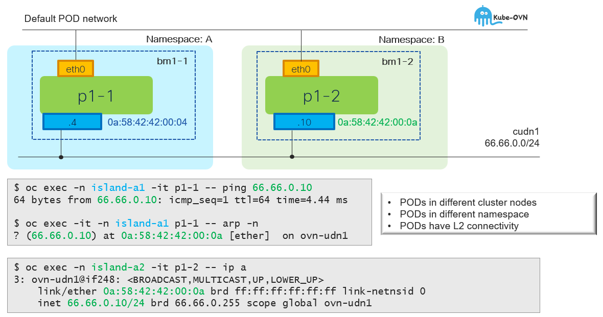

# CUDN w/L2 Topology - Unicast

[[Back]](./overview.md)



## Setup

- two namespaces: island-a1 and island-a2
- namespace primary udn enabled
- single cudn primary network with l2 topology across two namespaces
- netshoot pod per namespace

## CUDN

```
apiVersion: k8s.ovn.org/v1
kind: ClusterUserDefinedNetwork
metadata:
  name: tenant-a
spec:
  namespaceSelector:
    matchExpressions:
    - key: kubernetes.io/metadata.name
      operator: In
      values:
      - island-a1
      - island-a2
  network:
    layer2:
      role: Primary
      subnets:
      - 66.66.0.0/24
    topology: Layer2
```

```
# iserver get k8s cudn --cluster bm1

+----+----------+---+---+-----------+----------+--------------+------------------------------------------------+---------------------------------+
| ID | CUDN     | C | P | Namespace | Topology | Subnet       | Net Attach Def                                 | Workload                        |
+----+----------+---+---+-----------+----------+--------------+------------------------------------------------+---------------------------------+
| 1  | tenant-a | V | V | island-a1 | Layer2   | 66.66.0.0/24 | {                                              | [POD] island-a1/p1-1 (ovn-udn1) | 
|    |          |   |   | island-a2 |          |              |   "cniVersion": "1.0.0",                       | [POD] island-a2/p1-2 (ovn-udn1) |
|    |          |   |   |           |          |              |   "joinSubnet": "100.65.0.0/16,fd99::/64",     |                                 |
|    |          |   |   |           |          |              |   "name": "cluster_udn_tenant-a",              |                                 |
|    |          |   |   |           |          |              |   "netAttachDefName": "${NAMESPACE}/tenant-a", |                                 |
|    |          |   |   |           |          |              |   "role": "primary",                           |                                 |
|    |          |   |   |           |          |              |   "subnets": "66.66.0.0/24",                   |                                 |
|    |          |   |   |           |          |              |   "topology": "layer2",                        |                                 |
|    |          |   |   |           |          |              |   "transitSubnet": "100.88.0.0/16",            |                                 |
|    |          |   |   |           |          |              |   "type": "ovn-k8s-cni-overlay"                |                                 |
|    |          |   |   |           |          |              | }                                              |                                 |
+----+----------+---+---+-----------+----------+--------------+------------------------------------------------+---------------------------------+
```

## Pod in island-a1

```
$ oc exec -it -n island-a1 p1-1 -- ip a
1: lo: <LOOPBACK,UP,LOWER_UP> mtu 65536 qdisc noqueue state UNKNOWN group default qlen 1000
    inet 127.0.0.1/8 scope host lo
2: eth0@if314: <BROADCAST,MULTICAST,UP,LOWER_UP> mtu 1400 qdisc noqueue state UP group default
    link/ether 0a:58:0a:80:00:ca brd ff:ff:ff:ff:ff:ff link-netnsid 0
    inet 10.128.0.202/23 brd 10.128.1.255 scope global eth0
3: ovn-udn1@if315: <BROADCAST,MULTICAST,UP,LOWER_UP> mtu 1400 qdisc noqueue state UP group default
    link/ether 0a:58:42:42:00:04 brd ff:ff:ff:ff:ff:ff link-netnsid 0
    inet 66.66.0.4/24 brd 66.66.0.255 scope global ovn-udn1
```

```
$ oc exec -it -n island-a1 p1-1 -- ip r
default via 66.66.0.1 dev ovn-udn1 
10.128.0.0/23 dev eth0 proto kernel scope link src 10.128.0.202
10.128.0.0/14 via 10.128.0.1 dev eth0
66.66.0.0/24 dev ovn-udn1 proto kernel scope link src 66.66.0.4
100.64.0.0/16 via 10.128.0.1 dev eth0
100.65.0.0/16 via 66.66.0.1 dev ovn-udn1
172.30.0.0/16 via 66.66.0.1 dev ovn-udn1
```

## Pod in island-a2

```
$ oc exec -it -n island-a2 p1-2 -- ip a
1: lo: <LOOPBACK,UP,LOWER_UP> mtu 65536 qdisc noqueue state UNKNOWN group default qlen 1000
    link/loopback 00:00:00:00:00:00 brd 00:00:00:00:00:00
    inet 127.0.0.1/8 scope host lo
2: eth0@if247: <BROADCAST,MULTICAST,UP,LOWER_UP> mtu 1400 qdisc noqueue state UP group default
    link/ether 0a:58:0a:81:00:a4 brd ff:ff:ff:ff:ff:ff link-netnsid 0
    inet 10.129.0.164/23 brd 10.129.1.255 scope global eth0
3: ovn-udn1@if248: <BROADCAST,MULTICAST,UP,LOWER_UP> mtu 1400 qdisc noqueue state UP group default 
    link/ether 0a:58:42:42:00:0a brd ff:ff:ff:ff:ff:ff link-netnsid 0
    inet 66.66.0.10/24 brd 66.66.0.255 scope global ovn-udn1
```

```
$ oc exec -it -n island-a2 p1-2 -- ip r
default via 66.66.0.1 dev ovn-udn1 
10.128.0.0/14 via 10.129.0.1 dev eth0
10.129.0.0/23 dev eth0 proto kernel scope link src 10.129.0.164
66.66.0.0/24 dev ovn-udn1 proto kernel scope link src 66.66.0.10
100.64.0.0/16 via 10.129.0.1 dev eth0
100.65.0.0/16 via 66.66.0.1 dev ovn-udn1
172.30.0.0/16 via 66.66.0.1 dev ovn-udn1
```

## Connectivity

```
$ oc exec -it -n island-a1 p1-1 -- ping 66.66.0.10
PING 66.66.0.10 (66.66.0.10) 56(84) bytes of data.
64 bytes from 66.66.0.10: icmp_seq=1 ttl=64 time=4.44 ms
```

```
$ oc exec -it -n island-a1 p1-1 -- arp -n
? (66.66.0.10) at 0a:58:42:42:00:0a [ether]  on ovn-udn1
```

## On-the-wire

```
10.10.10.210.13163 > 10.10.10.211.6081: 
    Geneve, Flags [C], vni 0xff0027, proto TEB (0x6558), options [8 bytes]: 
    0a:58:42:42:00:04 > 0a:58:42:42:00:0a, 
    ethertype IPv4 (0x0800), length 98: 
    66.66.0.4 > 66.66.0.10: 
    ICMP echo request, id 20, seq 1, length 64
```

[[Back]](./overview.md)