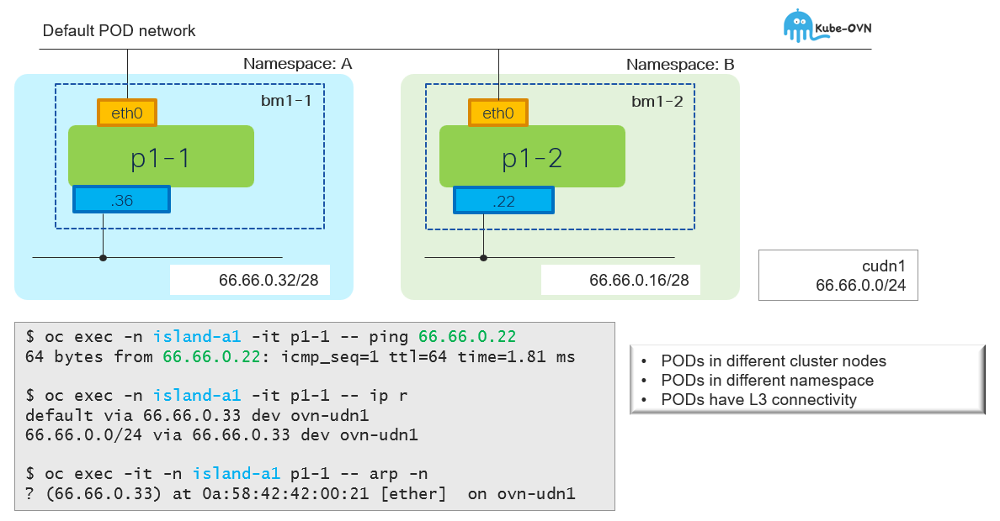

# CUDN w/L3 Topology - Unicast

[[Back]](./overview.md)



## CUDN

```
apiVersion: k8s.ovn.org/v1
kind: ClusterUserDefinedNetwork
metadata:
  name: tenant-b-p1
spec:
  namespaceSelector:
    matchExpressions:
    - key: kubernetes.io/metadata.name
      operator: In
      values:
      - island-b1
      - island-b2
  network:
    layer3:
      role: Primary
      subnets:
      - cidr: 66.66.0.0/24
        hostSubnet: 28
    topology: Layer3
```

```
# iserver get k8s cudn --cluster bm1

+----+-------------+---+---+-----------+----------+--------------+---------------------------------------------------+---------------------------------+
| ID | CUDN        | C | P | Namespace | Topology | Subnet       | Net Attach Def                                    | Workload                        |
+----+-------------+---+---+-----------+----------+--------------+---------------------------------------------------+---------------------------------+
| 1  | tenant-b-p1 | V | V | island-b1 | Layer3   | 66.66.0.0/24 | {                                                 | [POD] island-b1/p1-1 (ovn-udn1) |
|    |             |   |   | island-b2 |          | host /28     |   "cniVersion": "1.0.0",                          | [POD] island-b1/p1-2 (ovn-udn1) | 
|    |             |   |   |           |          |              |   "joinSubnet": "100.65.0.0/16,fd99::/64",        | [POD] island-b2/p1-1 (ovn-udn1) |
|    |             |   |   |           |          |              |   "name": "cluster_udn_tenant-b-p1",              | [POD] island-b2/p1-2 (ovn-udn1) |
|    |             |   |   |           |          |              |   "netAttachDefName": "${NAMESPACE}/tenant-b-p1", |                                 |
|    |             |   |   |           |          |              |   "role": "primary",                              |                                 |
|    |             |   |   |           |          |              |   "subnets": "66.66.0.0/24/28",                   |                                 |
|    |             |   |   |           |          |              |   "topology": "layer3",                           |                                 |
|    |             |   |   |           |          |              |   "type": "ovn-k8s-cni-overlay"                   |                                 |
|    |             |   |   |           |          |              | }                                                 |                                 |
+----+-------------+---+---+-----------+----------+--------------+---------------------------------------------------+---------------------------------+
```

## Pod in namespace A

```
$ oc exec -it -n island-b1 p1-1 -- ip a
1: lo: <LOOPBACK,UP,LOWER_UP> mtu 65536 qdisc noqueue state UNKNOWN group default qlen 1000
    inet 127.0.0.1/8 scope host lo
2: eth0@if11814: <BROADCAST,MULTICAST,UP,LOWER_UP> mtu 1400 qdisc noqueue state UP group default
    link/ether 0a:58:0a:80:00:e6 brd ff:ff:ff:ff:ff:ff link-netnsid 0
    inet 10.128.0.230/23 brd 10.128.1.255 scope global eth0
3: ovn-udn1@if11815: <BROADCAST,MULTICAST,UP,LOWER_UP> mtu 1400 qdisc noqueue state UP group default
    link/ether 0a:58:42:42:00:24 brd ff:ff:ff:ff:ff:ff link-netnsid 0
    inet 66.66.0.36/28 brd 66.66.0.47 scope global ovn-udn1
```

```
$ oc exec -it -n island-b1 p1-1 -- ip r
default via 66.66.0.33 dev ovn-udn1 
10.128.0.0/23 dev eth0 proto kernel scope link src 10.128.0.230
10.128.0.0/14 via 10.128.0.1 dev eth0
66.66.0.0/24 via 66.66.0.33 dev ovn-udn1
66.66.0.32/28 dev ovn-udn1 proto kernel scope link src 66.66.0.36
100.64.0.0/16 via 10.128.0.1 dev eth0
100.65.0.0/16 via 66.66.0.33 dev ovn-udn1
172.30.0.0/16 via 66.66.0.33 dev ovn-udn1
```

## Pod in namespace B

```
$ oc exec -it -n island-b2 p1-2 -- ip a
1: lo: <LOOPBACK,UP,LOWER_UP> mtu 65536 qdisc noqueue state UNKNOWN group default qlen 1000
    link/loopback 00:00:00:00:00:00 brd 00:00:00:00:00:00
    inet 127.0.0.1/8 scope host lo
2: eth0@if285: <BROADCAST,MULTICAST,UP,LOWER_UP> mtu 1400 qdisc noqueue state UP group default
    link/ether 0a:58:0a:81:00:ac brd ff:ff:ff:ff:ff:ff link-netnsid 0
    inet 10.129.0.172/23 brd 10.129.1.255 scope global eth0
3: ovn-udn1@if286: <BROADCAST,MULTICAST,UP,LOWER_UP> mtu 1400 qdisc noqueue state UP group default
    link/ether 0a:58:42:42:00:16 brd ff:ff:ff:ff:ff:ff link-netnsid 0
    inet 66.66.0.22/28 brd 66.66.0.31 scope global ovn-udn1
```

```
$ oc exec -it -n island-b2 p1-2 -- ip r
default via 66.66.0.17 dev ovn-udn1 
10.128.0.0/14 via 10.129.0.1 dev eth0
10.129.0.0/23 dev eth0 proto kernel scope link src 10.129.0.172
66.66.0.0/24 via 66.66.0.17 dev ovn-udn1
66.66.0.16/28 dev ovn-udn1 proto kernel scope link src 66.66.0.22
100.64.0.0/16 via 10.129.0.1 dev eth0
100.65.0.0/16 via 66.66.0.17 dev ovn-udn1
172.30.0.0/16 via 66.66.0.17 dev ovn-udn1
```

## Connectivity Test

```
$ oc exec -it -n island-b1 p1-1 -- ping 66.66.0.22
PING 66.66.0.22 (66.66.0.22) 56(84) bytes of data.
64 bytes from 66.66.0.22: icmp_seq=1 ttl=62 time=3.83 ms
```

```
$ oc exec -it -n island-b1 p1-1 -- arp -n
? (66.66.0.33) at 0a:58:42:42:00:21 [ether]  on ovn-udn1
```

## On-the-wire

```
10.10.10.210.11835 > 10.10.10.211.6081: 
    Geneve, Flags [C], vni 0xff0036, proto TEB (0x6558), options [8 bytes]: 
    0a:58:64:58:00:02 > 0a:58:64:58:00:03, 
    ethertype IPv4 (0x0800), length 98: 
    66.66.0.36 > 66.66.0.22: 
    ICMP echo request, id 23, seq 1, length 64
```

[[Back]](./overview.md)