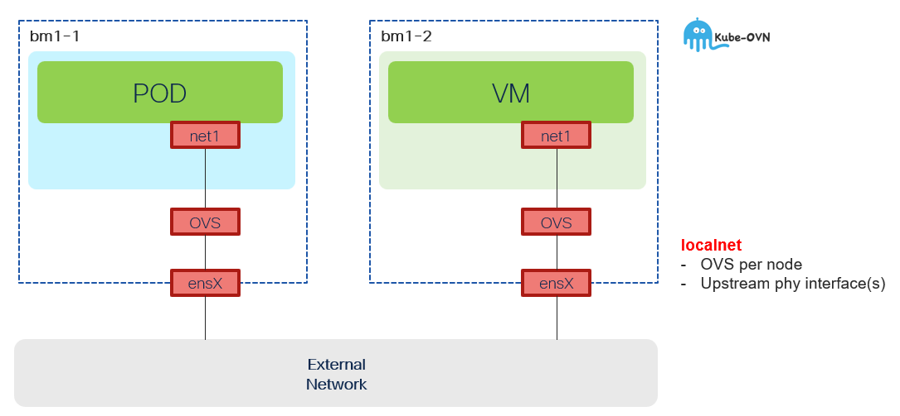

# CUDN w/Localnet Topology - Phy Interface Upstream



## NNCP

Dedicated OVS for localnet **must** be created as the first step. The upstream interface is controlled with `port` property set to single physical interface `ens11f0`. You can fur
```
apiVersion: nmstate.io/v1
kind: NodeNetworkConfigurationPolicy
metadata:
  name: ovs-localnet-y
spec:
  desiredState:
    interfaces:
    - name: ovs-localnet-y
      type: ovs-bridge
      state: up
      bridge:
        allow-extra-patch-ports: true
        options:
          stp: false
          mcast-snooping-enable: true
        port:
        - name: ens11f0
    ovn:
      bridge-mappings:
      - localnet: localnet-y
        bridge: ovs-localnet-y
        state: present
```