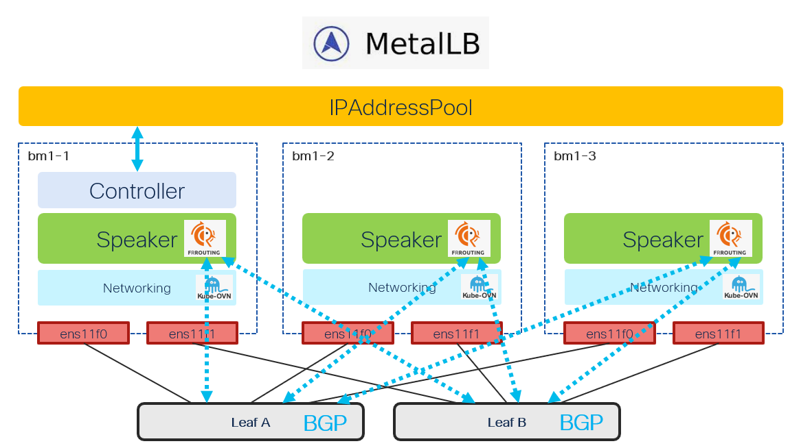

# MetalLB

[[Back]](../Operations.md)

In OpenShift Container Platform clusters running on bare metal or without a cloud load balancer, you can use the MetalLB Operator to **assign and advertise external IP addresses to LoadBalancer services**. These services receive external IPs on the host network. Refer to official [documentation](https://docs.redhat.com/en/documentation/openshift_container_platform/4.21/html/networking_operators/metallb-operator#about-metallb) for more details.

## Features

> [!NOTE]
> all outputs and code developed based on OCP4.21 with OVNKubernetes CNI and metallb instance instantiated with `bgpBackend: frr`

- requirements: bare metal cluster
- instantiated with [operator](./kb/operator.md) and cluster-wide [instance](./kb/instance.md)
- [IPAddressPool CRD](./kb/pool.md) defines the pool of IP addresses to be allocated to `LoadBalancer` service
- [L2 mode](./kb/l2_mode.md)
    - L2Advertisement CRD controls service IP advertisement in L2 protocol
- [L3 mode](./kb/l3_mode.md)
    - [BGPPeer CRD](./kb/bgp_peer.md) defines bgp peering with external fabric
    - [BFDProfile CRD](./kb/bfd_profile.md) for BFD configuration 
    - [BGPAdvertisement CRD](./kb/adv.md) to control pool advertisement
    - [Community CRD](./kb/community.md) to control community on service advertisement

## Examples

- accessing frr [cli](./kb/frr_cli.md)
- peering with Nexus [NX-OS](./example/nxos/README.md) fabric
- [community](./example/community/README.md)

## Life Cycle Management Commands

Command | Intent | Details
--- | --- | ---
iserver get ocp metallb | get state summary | [Link](./get_state.md)
iserver get ocp metallb -v cli | get frr cli access command | [Link](./get_cli.md)
iserver get ocp metallb -v crd | get metallb crds | [Link](./get_crd.md)
iserver get ocp metallb -v exec | run frr cli | [Link](./get_exec.md)
iserver get ocp metallb -v frr | get frr configuration | [Link](./get_frr.md)
iserver set ocp metallb --mode operator | install metallb operator | [Link](./create_operator.md)
iserver set ocp metallb --mode instance | create metallb system-wide instance | [Link](./create_instance.md)
iserver set ocp metallb --mode pool | create ip address pool | [Link](./create_pool.md)
iserver set ocp metallb --mode peer | create bgp peer | [Link](./create_peer.md)
iserver set ocp metallb --mode bfd | create bfd profile | [Link](./create_bfd.md)
iserver set ocp metallb --mode community | create community | [Link](./create_community.md)
iserver set ocp metallb --mode adv | create bgp advertisement | [Link](./create_adv.md)
iserver delete ocp metallb --mode operator | uninstall metallb operator | [Link](./delete_operator.md)
iserver delete ocp metallb --mode instance | delete metallb instance | [Link](./delete_instance.md)
iserver delete ocp metallb --mode pool | delete ip address pool | [Link](./delete_pool.md)
iserver delete ocp metallb --mode peer | delete bgp peer | [Link](./delete_peer.md)
iserver delete ocp metallb --mode bfd | delete bfd profile | [Link](./delete_bfd.md)
iserver delete ocp metallb --mode community | delete community | [Link](./delete_community.md)
iserver delete ocp metallb --mode adv | delete bgp advertisement | [Link](./delete_adv.md)
iserver delete ocp metallb --mode wipe | wipe all crds | [Link](./delete_wipe.md)

[[Back]](../Operations.md)