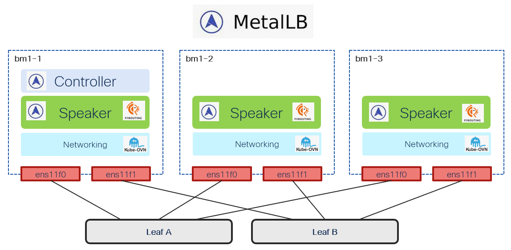

# MetalLB - Create instance

[[Back]](./README.md) [[Delete]](./delete_instance.md)

## Workflow

- create `MetalLB` instance in `metallb-system` namespace
- bgp mode one of '', 'native', 'frr', 'frr-k8s'; refer to bgp mode details [here](./kb/instance.md)
- wait for controller and speaker resources to come up

## Expected outcome



## Example

```
# iserver set ocp metallb --cluster bm1 --mode instance --bgp frr

OpenShift Workflow - MetalLB Operator - Create instance
=======================================================

OpenShift Cluster: bm1

Operator
--------
- subscription          : metallb-system/metallb-operator
- package               : openshift-marketplace/redhat-operators/metallb-operator
- channel               : stable
- install plan          : metallb-system/install-bnn2x
- install plan approved : ✓
- installed csv         : metallb-operator.v4.21.0-202603300221
- latest_csv            : ✓


Operator resources
------------------
- deployment metallb-system/metallb-operator-controller-manager: ready
- deployment metallb-system/metallb-operator-webhook-server: ready
Subscription metallb ready

No metallb instance currently defined


Create MetalLB
--------------
- namespace: metallb-system
- name: metallb

~~~
apiVersion: metallb.io/v1beta1
kind: MetalLB
metadata:
  name: metallb
  namespace: metallb-system
spec:
  bgpBackend: frr

~~~
MetalLB [metallb-system/metallb] created
- wait for MetalLB metallb-system/metallb [timeout:60s]
Wait for deployment metallb-system/controller ready (optional: False, allow zero replicas: False, timeout: 600s)...
Wait for daemonset metallb-system/speaker ready (optional: False, timeout: 600s)...
Subscription metallb ready

Completed tasks
- MetalLB instance created
```

[[Back]](./README.md) [[Delete]](./delete_instance.md)