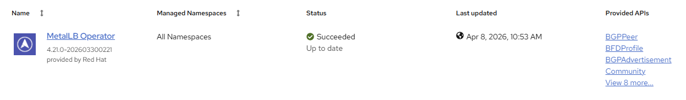

# MetalLB - Create operator

[[Back]](./README.md) [[Delete]](./delete_operator.md)

## Workflow

- create `metallb-system` namespace
- create operator group
- create subscription with user controlled channel or defaultChannelName
- wait for resources

## Expected outcome



## Example

```
# iserver set ocp metallb --cluster bm1 --mode operator

OpenShift Workflow - MetalLB Operator - Create Operator
=======================================================

OpenShift Cluster: bm1
Operator not found: metallb-operator

Create Namespace
----------------
- name: metallb-system

~~~
apiVersion: v1
kind: Namespace
metadata:
  name: metallb-system

~~~
Namespace [metallb-system] created
Wait for namespace [timeout:60]...

Create OperatorGroup
--------------------
- namespace: metallb-system
- name: metallb-system

~~~
apiVersion: operators.coreos.com/v1
kind: OperatorGroup
metadata:
  name: metallb-system
  namespace: metallb-system
spec:
  upgradeStrategy: Default

~~~
OperatorGroup [metallb-system/metallb-system] created
- wait for OperatorGroup metallb-system/metallb-system [timeout:60s]

Create Subscription
-------------------
Subscription: metallb-system/metallb-operator
Source: openshift-marketplace/redhat-operators/metallb-operator
Install plan approval: Automatic
Getting subscription and packege manifest information...
Resolving channel name...
Channel: stable
- CSV [metallb-operator.v4.21.0-202603300221]
- CSV Display name [MetalLB Operator]
- CVS Version [4.21.0-202603300221]
- CSV Provider [{'name': 'Red Hat'}]
- CSV Maturity [alpha]

~~~
apiVersion: operators.coreos.com/v1alpha1
kind: Subscription
metadata:
  name: metallb-operator
  namespace: metallb-system
spec:
  channel: stable
  installPlanApproval: Automatic
  name: metallb-operator
  source: redhat-operators
  sourceNamespace: openshift-marketplace

~~~

Subscription created

Wait for subscription install plan started [timeout:360]...
Install plan: install-hfq5s
Wait for subscription install plan ready [timeout:600]...
Install plan succeeded
Wait for deployment metallb-system/metallb-operator-controller-manager ready (optional: False, allow zero replicas: False, timout: 600s)...
Wait for deployment metallb-system/metallb-operator-webhook-server ready (optional: False, allow zero replicas: False, timout: 600s)...
Subscription metallb ready


Operator
--------
- subscription          : metallb-system/metallb-operator
- package               : openshift-marketplace/redhat-operators/metallb-operator
- channel               : stable
- install plan          : metallb-system/install-hfq5s
- install plan approved : ✓
- installed csv         : metallb-operator.v4.21.0-202603300221
- latest_csv            : ✓


Completed tasks
- Namespace created
- Operator Group created
- MetalLB installed and configured
```

[[Back]](./README.md) [[Delete]](./delete_operator.md)