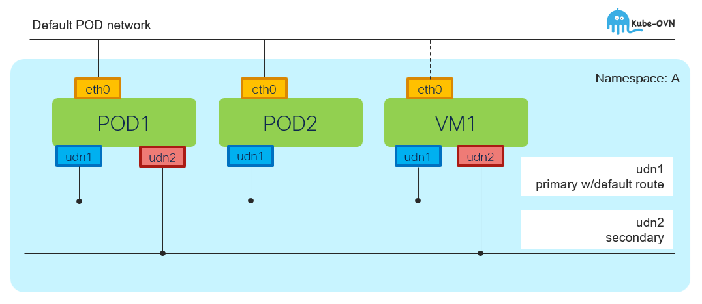

# User Defined Network (UDN)

[[Back]](../Operations.md) [[Cluster User Defined Network]](../ovn-cudn/README.md)

User defined networks (UDNs) extend OVN-Kubernetes to enable custom layer 2 and layer 3 network segments with default isolation, providing enhanced network flexibility, security, and segmentation capabilities for multi-tenant deployments and custom network architectures as explained in the official [documentation](https://docs.redhat.com/en/documentation/openshift_container_platform/4.21/pdf/multiple_networks/OpenShift_Container_Platform-4.21-Multiple_networks-en-US.pdf)

## Features

- [namespace scope](./namespace.md)
- single primary and mutliple secondary networks per namespace
- topology
    - [L2](./l2/overview.md) - flat L2 subnet across the nodes (bridging)
    - [L3](./l3/overview.md) - similar to POD CIDR with per node subnets (routing)
- packet forwarding
    - [overlay-on-the-wire](./overlay.md)
    - [multicast friendly](./multicast.md)
    - masquerade with cluster node ip on [egress](./egress.md)
- address management
    - mandatory IPAM (DHCP) unless no subnet defined in L2 topology
    - v4 and v6 aware
- isolation
    - intra-udn traffic [allowed](./policy/intra_udn_allowed.md) unless [network policy](./policy/intra_udn_network_policy.md) applied
    - cross-udn traffic [not allowed](./policy/inter_udn_not_allowed.md)
    - udn cannot communicate with default network unless [open ports](./policy/open_ports.md) defined

## Networking

Topology | Role | EW | NS | Service | NetworkPolicy | MultinetworkPolicy
---| --- | --- | --- | --- | --- | ---
L2 | Primary | :white_check_mark: w/overlay | :white_check_mark: w/masq | :white_check_mark: | :white_check_mark: | :x:
L3 | Primary | :white_check_mark: w/overlay | :white_check_mark: w/masq | :white_check_mark: | :white_check_mark: | :x:
L2 | Secondary | :white_check_mark: w/overlay | :x: | :x: | :x: | :white_check_mark:
L3 | Secondary | :white_check_mark: w/overlay | :x: | :x: | :x: | :white_check_mark:

## Life Cycle Management Commands

Command | Intent | Details
--- | --- | ---
iserver get k8s udn | get udn | [Link](./get.md)
iserver set ocp task | in task way | [L2](./l2/task.md), [L3](./l3/task.md)
iserver delete ocp task | in task way | [Link](./delete_task.md)

[[Back]](../Operations.md) [[Cluster User Defined Network]](../ovn-cudn/README.md)