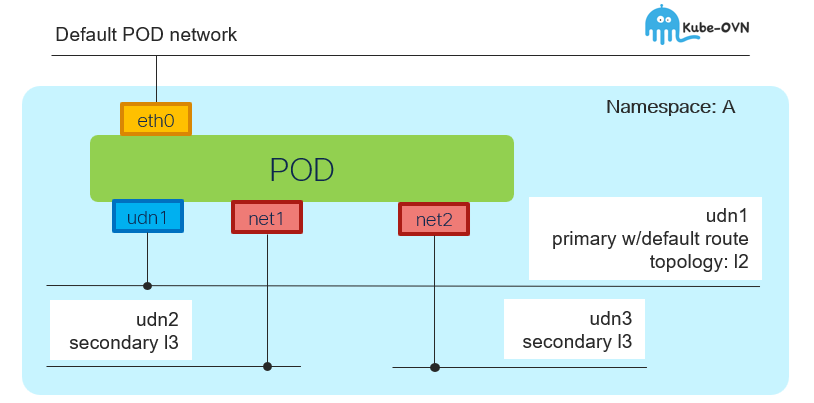

# UDN topology mix-and-match

[[Back]](../README.md)



## User defined network

```
# iserver get k8s udn --namespace island-c

+----+----------+---+---+---+----------+--------------+--------------------------------------------+-----------------------+
| ID | UDN      | C | A | P | Topology | Subnet       | Net Attach Def                             | Workload              |
+----+----------+---+---+---+----------+--------------+--------------------------------------------+-----------------------+
| 1  | island-c | V | V | V | Layer2   | 66.66.0.0/24 | {                                          | [POD] p1-3 (ovn-udn1) | 
|    | p1-l2    |   |   |   |          |              |   "cniVersion": "1.0.0",                   |                       | 
|    |          |   |   |   |          |              |   "joinSubnet": "100.65.0.0/16,fd99::/64", |                       | 
|    |          |   |   |   |          |              |   "name": "island-c_p1-l2",                |                       | 
|    |          |   |   |   |          |              |   "netAttachDefName": "island-c/p1-l2",    |                       | 
|    |          |   |   |   |          |              |   "role": "primary",                       |                       | 
|    |          |   |   |   |          |              |   "subnets": "66.66.0.0/24",               |                       | 
|    |          |   |   |   |          |              |   "topology": "layer2",                    |                       | 
|    |          |   |   |   |          |              |   "transitSubnet": "100.88.0.0/16",        |                       | 
|    |          |   |   |   |          |              |   "type": "ovn-k8s-cni-overlay"            |                       |
|    |          |   |   |   |          |              | }                                          |                       |
+----+----------+---+---+---+----------+--------------+--------------------------------------------+-----------------------+
| 2  | island-c | V | V |   | Layer3   | 66.66.1.0/24 | {                                          | [POD] p1-3 (net1)     |
|    | s1-l3    |   |   |   |          | host /28     |   "cniVersion": "1.0.0",                   |                       |
|    |          |   |   |   |          |              |   "name": "island-c_s1-l3",                |                       |
|    |          |   |   |   |          |              |   "netAttachDefName": "island-c/s1-l3",    |                       |
|    |          |   |   |   |          |              |   "role": "secondary",                     |                       |
|    |          |   |   |   |          |              |   "subnets": "66.66.1.0/24/28",            |                       |
|    |          |   |   |   |          |              |   "topology": "layer3",                    |                       |
|    |          |   |   |   |          |              |   "type": "ovn-k8s-cni-overlay"            |                       |
|    |          |   |   |   |          |              | }                                          |                       |
+----+----------+---+---+---+----------+--------------+--------------------------------------------+-----------------------+
| 3  | island-c | V | V |   | Layer3   | 66.66.2.0/24 | {                                          | [POD] p1-3 (net2)     |
|    | s2-l3    |   |   |   |          | host /28     |   "cniVersion": "1.0.0",                   |                       |
|    |          |   |   |   |          |              |   "name": "island-c_s2-l3",                |                       |
|    |          |   |   |   |          |              |   "netAttachDefName": "island-c/s2-l3",    |                       |
|    |          |   |   |   |          |              |   "role": "secondary",                     |                       | 
|    |          |   |   |   |          |              |   "subnets": "66.66.2.0/24/28",            |                       |
|    |          |   |   |   |          |              |   "topology": "layer3",                    |                       |
|    |          |   |   |   |          |              |   "type": "ovn-k8s-cni-overlay"            |                       |
|    |          |   |   |   |          |              | }                                          |                       |
+----+----------+---+---+---+----------+--------------+--------------------------------------------+-----------------------+
```

## POD

```
$ oc exec -n island-c p1-3 -- ip a
1: lo: <LOOPBACK,UP,LOWER_UP> mtu 65536 qdisc noqueue state UNKNOWN group default qlen 1000
    link/loopback 00:00:00:00:00:00 brd 00:00:00:00:00:00
    inet 127.0.0.1/8 scope host lo
2: eth0@if188: <BROADCAST,MULTICAST,UP,LOWER_UP> mtu 1400 qdisc noqueue state UP group default 
    link/ether 0a:58:0a:81:00:71 brd ff:ff:ff:ff:ff:ff link-netnsid 0
    inet 10.129.0.113/23 brd 10.129.1.255 scope global eth0
3: ovn-udn1@if189: <BROADCAST,MULTICAST,UP,LOWER_UP> mtu 1400 qdisc noqueue state UP group default 
    link/ether 0a:58:42:42:00:08 brd ff:ff:ff:ff:ff:ff link-netnsid 0
    inet 66.66.0.8/24 brd 66.66.0.255 scope global ovn-udn1
4: net1@if190: <BROADCAST,MULTICAST,UP,LOWER_UP> mtu 1400 qdisc noqueue state UP group default
    link/ether 0a:58:42:42:01:28 brd ff:ff:ff:ff:ff:ff link-netnsid 0
    inet 66.66.1.40/28 brd 66.66.1.47 scope global net1
5: net2@if191: <BROADCAST,MULTICAST,UP,LOWER_UP> mtu 1400 qdisc noqueue state UP group default
    link/ether 0a:58:42:42:02:16 brd ff:ff:ff:ff:ff:ff link-netnsid 0
    inet 66.66.2.22/28 brd 66.66.2.31 scope global net2
```

```
$ oc exec -n island-c p1-3 -- ip r
default via 66.66.0.1 dev ovn-udn1 
10.128.0.0/14 via 10.129.0.1 dev eth0
10.129.0.0/23 dev eth0 proto kernel scope link src 10.129.0.113
66.66.0.0/24 dev ovn-udn1 proto kernel scope link src 66.66.0.8
66.66.1.0/24 via 66.66.1.33 dev net1
66.66.1.32/28 dev net1 proto kernel scope link src 66.66.1.40
66.66.2.0/24 via 66.66.2.17 dev net2
66.66.2.16/28 dev net2 proto kernel scope link src 66.66.2.22
100.64.0.0/16 via 10.129.0.1 dev eth0
100.65.0.0/16 via 66.66.0.1 dev ovn-udn1
172.30.0.0/16 via 66.66.0.1 dev ovn-udn1
```

```
$ oc get pod -n island-c p1-3 -o yaml
apiVersion: v1
kind: Pod
metadata:
  annotations:
    k8s.v1.cni.cncf.io/network-status: |-
      [{
          "name": "ovn-kubernetes",
          "interface": "eth0",
          "ips": [
              "10.129.0.113"
          ],
          "mac": "0a:58:0a:81:00:71",
          "dns": {}
      },{
          "name": "ovn-kubernetes",
          "interface": "ovn-udn1",
          "ips": [
              "66.66.0.8"
          ],
          "mac": "0a:58:42:42:00:08",
          "default": true,
          "dns": {}
      },{
          "name": "island-c/s1-l3",
          "interface": "net1",
          "ips": [
              "66.66.1.40"
          ],
          "mac": "0a:58:42:42:01:28",
          "dns": {}
      },{
          "name": "island-c/s2-l3",
          "interface": "net2",
          "ips": [
              "66.66.2.22"
          ],
          "mac": "0a:58:42:42:02:16",
          "dns": {}
      }]
    k8s.v1.cni.cncf.io/networks: s1-l3,s2-l3
```

[[Back]](../README.md)