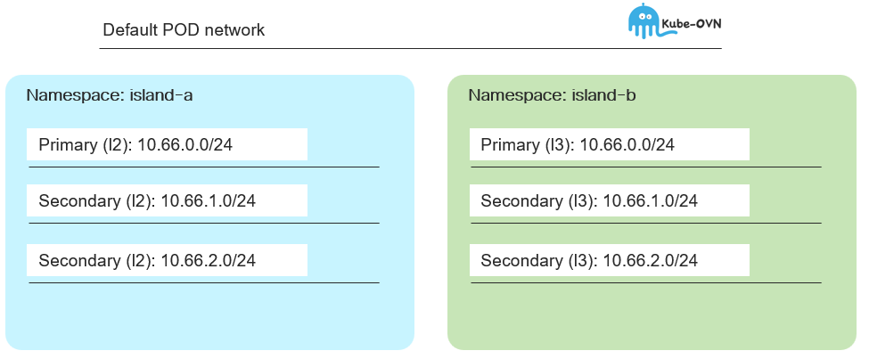

# UDN topology and cidr isolation betweeen namespaces

[[Back]](../README.md)



```
# iserver get k8s udn

+----+----------+---+---+---+----------+--------------+--------------------------------------------+-----------------------+
| ID | UDN      | C | A | P | Topology | Subnet       | Net Attach Def                             | Workload              |
+----+----------+---+---+---+----------+--------------+--------------------------------------------+-----------------------+
| 1  | island-a | V | V | V | Layer2   | 66.66.0.0/24 | {                                          | [POD] p1-1 (ovn-udn1) |
|    | p1-l2    |   |   |   |          |              |   "cniVersion": "1.0.0",                   | [POD] p1-2 (ovn-udn1) |
|    |          |   |   |   |          |              |   "joinSubnet": "100.65.0.0/16,fd99::/64", | [POD] p1-3 (ovn-udn1) |
|    |          |   |   |   |          |              |   "name": "island-a_p1-l2",                | [VM] c8kv2 (default)  |
|    |          |   |   |   |          |              |   "netAttachDefName": "island-a/p1-l2",    | [VM] c8kv3 (default)  |
|    |          |   |   |   |          |              |   "role": "primary",                       |                       |
|    |          |   |   |   |          |              |   "subnets": "66.66.0.0/24",               |                       |
|    |          |   |   |   |          |              |   "topology": "layer2",                    |                       |
|    |          |   |   |   |          |              |   "transitSubnet": "100.88.0.0/16",        |                       |
|    |          |   |   |   |          |              |   "type": "ovn-k8s-cni-overlay"            |                       |
|    |          |   |   |   |          |              | }                                          |                       |
+----+----------+---+---+---+----------+--------------+--------------------------------------------+-----------------------+
| 2  | island-a | V | V |   | Layer2   | 66.66.1.0/24 | {                                          | [POD] p1-2 (net1)     |
|    | s1-l2    |   |   |   |          |              |   "cniVersion": "1.0.0",                   | [POD] p1-3 (net1)     |
|    |          |   |   |   |          |              |   "name": "island-a_s1-l2",                | [VM] c8kv3 (net1)     |
|    |          |   |   |   |          |              |   "netAttachDefName": "island-a/s1-l2",    | [VM] c8kv4 (net1)     |
|    |          |   |   |   |          |              |   "role": "secondary",                     |                       |
|    |          |   |   |   |          |              |   "subnets": "66.66.1.0/24",               |                       |
|    |          |   |   |   |          |              |   "topology": "layer2",                    |                       |
|    |          |   |   |   |          |              |   "type": "ovn-k8s-cni-overlay"            |                       |
|    |          |   |   |   |          |              | }                                          |                       |
+----+----------+---+---+---+----------+--------------+--------------------------------------------+-----------------------+
| 3  | island-a | V | V |   | Layer2   | 66.66.2.0/24 | {                                          | [POD] p1-3 (net2)     |
|    | s2-l2    |   |   |   |          |              |   "cniVersion": "1.0.0",                   |                       |
|    |          |   |   |   |          |              |   "name": "island-a_s2-l2",                |                       |
|    |          |   |   |   |          |              |   "netAttachDefName": "island-a/s2-l2",    |                       |
|    |          |   |   |   |          |              |   "role": "secondary",                     |                       |
|    |          |   |   |   |          |              |   "subnets": "66.66.2.0/24",               |                       |
|    |          |   |   |   |          |              |   "topology": "layer2",                    |                       |
|    |          |   |   |   |          |              |   "type": "ovn-k8s-cni-overlay"            |                       |
|    |          |   |   |   |          |              | }                                          |                       |
+----+----------+---+---+---+----------+--------------+--------------------------------------------+-----------------------+
| 4  | island-b | V | V | V | Layer3   | 66.66.0.0/24 | {                                          | [POD] p1-1 (ovn-udn1) |
|    | p1-l3    |   |   |   |          | host /28     |   "cniVersion": "1.0.0",                   | [POD] p1-2 (ovn-udn1) |
|    |          |   |   |   |          |              |   "joinSubnet": "100.65.0.0/16,fd99::/64", | [POD] p1-3 (ovn-udn1) |
|    |          |   |   |   |          |              |   "name": "island-b_p1-l3",                | [VM] c8kv2 (default)  |
|    |          |   |   |   |          |              |   "netAttachDefName": "island-b/p1-l3",    | [VM] c8kv3 (default)  |
|    |          |   |   |   |          |              |   "role": "primary",                       |                       |
|    |          |   |   |   |          |              |   "subnets": "66.66.0.0/24/28",            |                       |
|    |          |   |   |   |          |              |   "topology": "layer3",                    |                       |
|    |          |   |   |   |          |              |   "type": "ovn-k8s-cni-overlay"            |                       |
|    |          |   |   |   |          |              | }                                          |                       | 
+----+----------+---+---+---+----------+--------------+--------------------------------------------+-----------------------+
| 5  | island-b | V | V |   | Layer3   | 66.66.1.0/24 | {                                          | [POD] p1-2 (net1)     |
|    | s1-l3    |   |   |   |          | host /28     |   "cniVersion": "1.0.0",                   | [POD] p1-3 (net1)     |
|    |          |   |   |   |          |              |   "name": "island-b_s1-l3",                | [VM] c8kv3 (net1)     |
|    |          |   |   |   |          |              |   "netAttachDefName": "island-b/s1-l3",    | [VM] c8kv4 (net1)     |
|    |          |   |   |   |          |              |   "role": "secondary",                     |                       |
|    |          |   |   |   |          |              |   "subnets": "66.66.1.0/24/28",            |                       |
|    |          |   |   |   |          |              |   "topology": "layer3",                    |                       |
|    |          |   |   |   |          |              |   "type": "ovn-k8s-cni-overlay"            |                       |
|    |          |   |   |   |          |              | }                                          |                       |
+----+----------+---+---+---+----------+--------------+--------------------------------------------+-----------------------+
| 6  | island-b | V | V |   | Layer3   | 66.66.2.0/24 | {                                          | [POD] p1-3 (net2)     |
|    | s2-l3    |   |   |   |          | host /28     |   "cniVersion": "1.0.0",                   |                       |
|    |          |   |   |   |          |              |   "name": "island-b_s2-l3",                |                       |
|    |          |   |   |   |          |              |   "netAttachDefName": "island-b/s2-l3",    |                       |
|    |          |   |   |   |          |              |   "role": "secondary",                     |                       |
|    |          |   |   |   |          |              |   "subnets": "66.66.2.0/24/28",            |                       |
|    |          |   |   |   |          |              |   "topology": "layer3",                    |                       |
|    |          |   |   |   |          |              |   "type": "ovn-k8s-cni-overlay"            |                       |
|    |          |   |   |   |          |              | }                                          |                       |
+----+----------+---+---+---+----------+--------------+--------------------------------------------+-----------------------+
```
[[Back]](../README.md)