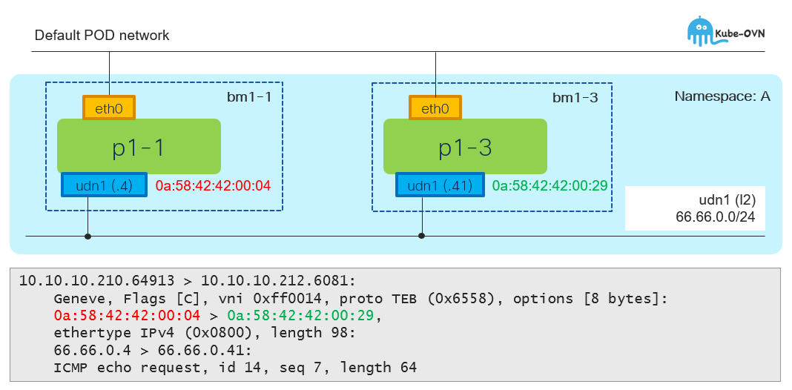
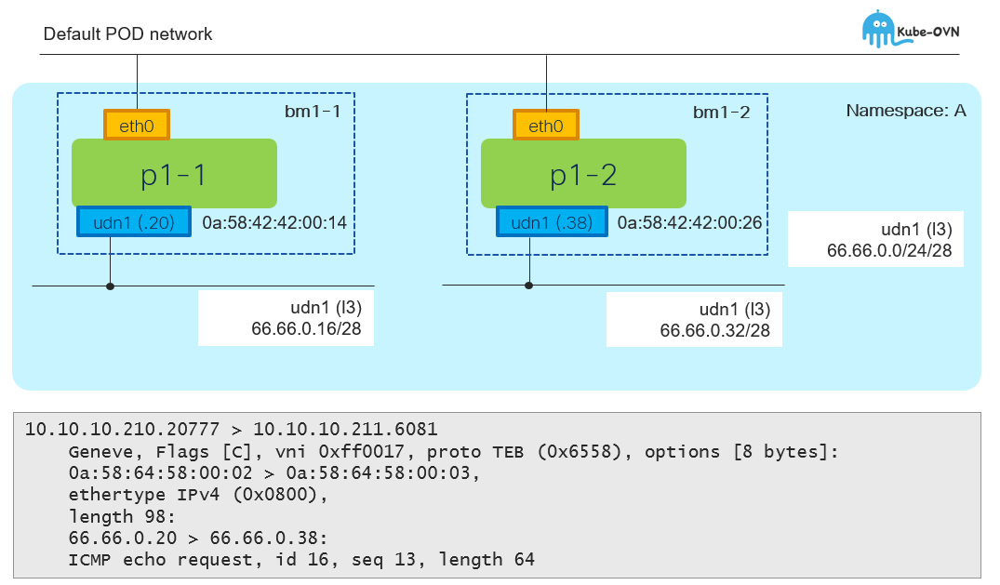

# UDN and inter-node packet forwarding

[[Back]](../README.md)

## L2 Topology



```
$ oc get pod -n island-a -o wide
NAME    READY   STATUS    RESTARTS   AGE   IP             NODE    
p1-1    1/1     Running   0          25h   10.128.0.126   bm1-1   
p1-3    1/1     Running   0          19h   10.130.0.123   bm1-3   
```

```
$ oc exec -it -n island-a p1-1 -- ip a
3: ovn-udn1@if196: <BROADCAST,MULTICAST,UP,LOWER_UP> mtu 1400 qdisc noqueue state UP group default
    link/ether 0a:58:42:42:00:04 brd ff:ff:ff:ff:ff:ff link-netnsid 0
    inet 66.66.0.4/24 brd 66.66.0.255 scope global ovn-udn1
```

```
$ oc exec -it -n island-a p1-3 -- ip a
3: ovn-udn1@if197: <BROADCAST,MULTICAST,UP,LOWER_UP> mtu 1400 qdisc noqueue state UP group default
    link/ether 0a:58:42:42:00:29 brd ff:ff:ff:ff:ff:ff link-netnsid 0
    inet 66.66.0.41/24 brd 66.66.0.255 scope global ovn-udn1
```

```
$ oc get node -o wide
NAME    STATUS   ROLES                         AGE     VERSION   INTERNAL-IP    
bm1-1   Ready    control-plane,master,worker   7d13h   v1.34.4   10.10.10.210   
bm1-3   Ready    control-plane,master,worker   7d13h   v1.34.4   10.10.10.212   
```

Ethernet frame from source pod (p1-1) is sent between the cluster nodes on top of Geneve overlay

```
10.10.10.210.64913 > 10.10.10.212.6081: 
    Geneve, Flags [C], vni 0xff0014, proto TEB (0x6558), options [8 bytes]: 
    0a:58:42:42:00:04 > 0a:58:42:42:00:29, 
    ethertype IPv4 (0x0800), length 98: 
    66.66.0.4 > 66.66.0.41: 
    ICMP echo request, id 14, seq 7, length 64
```

## L3 Topology



```
$ oc get pod -n island-b -o wide
NAME      READY   STATUS    RESTARTS   AGE   IP             NODE
p1-1      1/1     Running   0          24h   10.128.0.133   bm1-1
p1-3      1/1     Running   0          24h   10.129.0.108   bm1-2
```

```
$ oc exec -it -n island-a p1-1 -- ip a
3: ovn-udn1@if213: <BROADCAST,MULTICAST,UP,LOWER_UP> mtu 1400 qdisc noqueue state UP group default
    link/ether 0a:58:42:42:00:14 brd ff:ff:ff:ff:ff:ff link-netnsid 0
    inet 66.66.0.20/28 brd 66.66.0.31 scope global ovn-udn1
```

```
$ oc exec -it -n island-a p1-3 -- ip a
3: ovn-udn1@if174: <BROADCAST,MULTICAST,UP,LOWER_UP> mtu 1400 qdisc noqueue state UP group default
    link/ether 0a:58:42:42:00:26 brd ff:ff:ff:ff:ff:ff link-netnsid 0
    inet 66.66.0.38/28 brd 66.66.0.47 scope global ovn-udn1
```

```
$ oc get node -o wide
NAME    STATUS   ROLES                         AGE     VERSION   INTERNAL-IP    
bm1-1   Ready    control-plane,master,worker   7d13h   v1.34.4   10.10.10.210   
bm1-2   Ready    control-plane,master,worker   7d13h   v1.34.4   10.10.10.211   
```

The packet routed over Geneve overlay across the nodes 

```
10.10.10.210.20777 > 10.10.10.211.6081
    Geneve, Flags [C], vni 0xff0017, proto TEB (0x6558), options [8 bytes]: 
    0a:58:64:58:00:02 > 0a:58:64:58:00:03, 
    ethertype IPv4 (0x0800), 
    length 98: 
    66.66.0.20 > 66.66.0.38: 
    ICMP echo request, id 16, seq 13, length 64
```

[[Back]](../README.md)