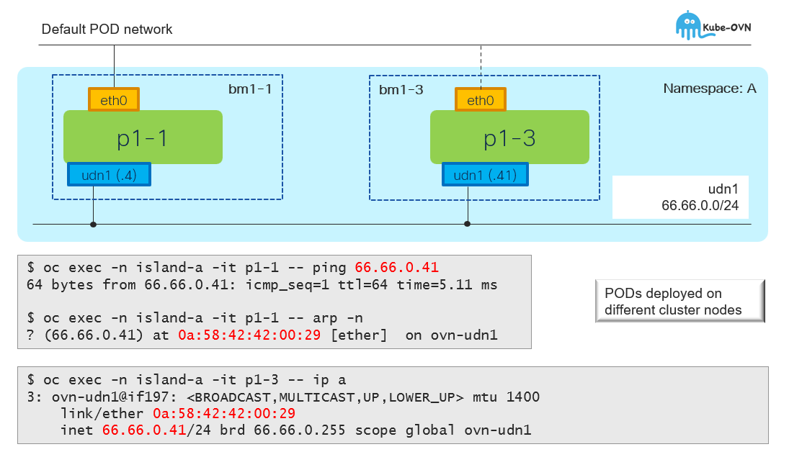
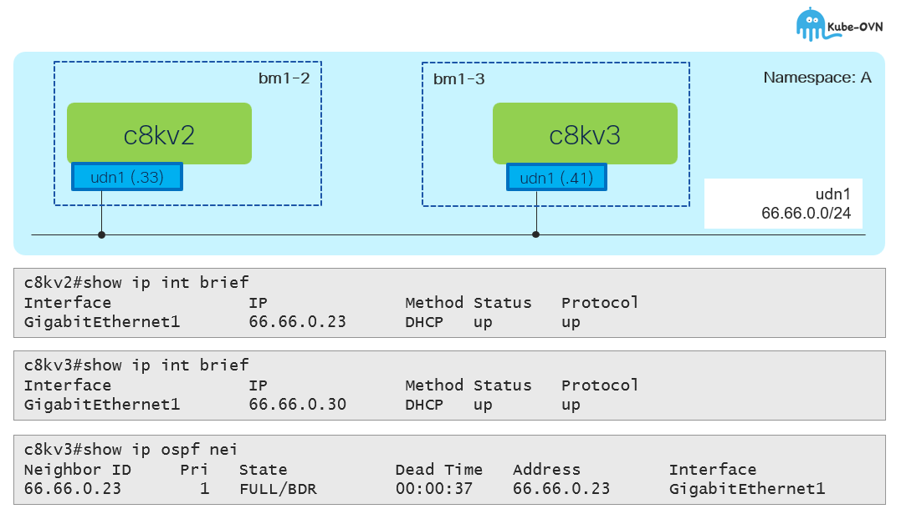

# UDN w/L2 Topology - Overview

[[Back]](../README.md) [[Prev]](../get/l2.md) [[Next]](../create/l2_crd.md)

User defined network with layer 2 topology provides flat east-west network across the nodes. All connected applications (pod/vm) are in single broadcast domain.

## L2 connectivity

## Multicast

> [!NOTE]
> Multicast must be enabled in namespace with `k8s.ovn.org/multicast-enabled: "true"` annotation

Cat8000v virtual machines connected to primary udn only.

[[Back]](../README.md) [[Prev]](../get/l2.md) [[Next]](../create/l2_crd.md)