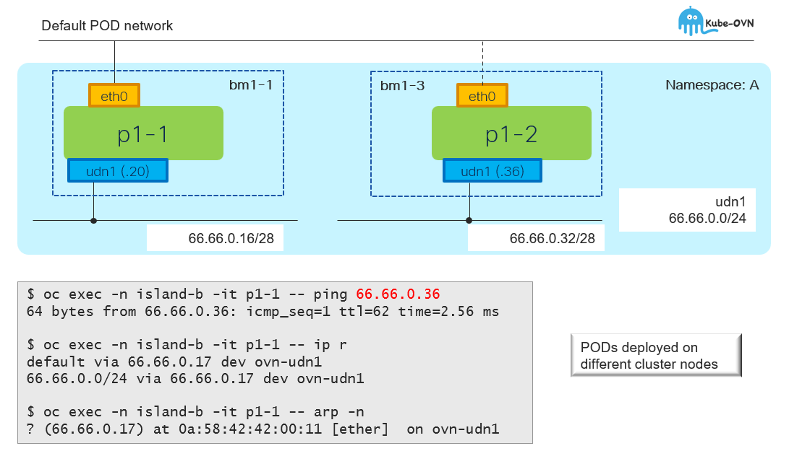

# UDN w/L3 Topology - Overview

[[Back]](../README.md) [[Prev]](../get/l3.md) [[Next]](../create/l3_crd.md)

A layer 3 topology creates a unique layer 2 segment for each node in a cluster. The layer 3 routing mechanism interconnects these segments so that virtual machines and pods that are hosted on different nodes can communicate with each other. 

## L3 connectivity

[[Back]](../README.md) [[Prev]](../get/l3.md) [[Next]](../create/l3_crd.md)