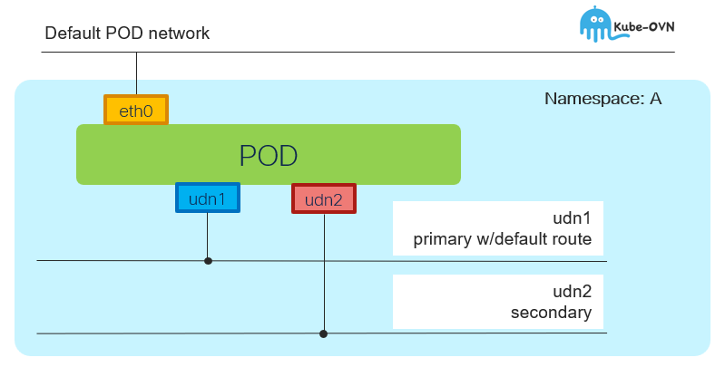

# UDN and POD - Overview

[[Back]](../README.md) [[Prev]](../get/pod.md) [[Next]](../create/pod_crd.md)



## Default pod network

- pod always connects to default pod network

## Primary UDN

Pod deployed in namespace that is 
- udn-enabled
- associated with primary udn

Pod connected to user-defined primary network configured as default.

Example

```
$ oc exec -n island-a p1-1 -- ip a
1: lo: <LOOPBACK,UP,LOWER_UP> mtu 65536 qdisc noqueue state UNKNOWN group default qlen 1000
    inet 127.0.0.1/8 scope host lo
2: eth0@if195: <BROADCAST,MULTICAST,UP,LOWER_UP> mtu 1400 qdisc noqueue state UP group default
    link/ether 0a:58:0a:80:00:7e brd ff:ff:ff:ff:ff:ff link-netnsid 0
    inet 10.128.0.126/23 brd 10.128.1.255 scope global eth0
3: ovn-udn1@if196: <BROADCAST,MULTICAST,UP,LOWER_UP> mtu 1400 qdisc noqueue state UP group default
    link/ether 0a:58:42:42:00:04 brd ff:ff:ff:ff:ff:ff link-netnsid 0
    inet 66.66.0.4/24 brd 66.66.0.255 scope global ovn-udn1
```

```
$ oc exec -n island-a p1-1 -- ip r
default via 66.66.0.1 dev ovn-udn1 
```

## Secondary UDN

Connection to secondary user-defined networks pre-configured in the same namespace as POD must be annotated in "multus-way" e.g.

```
metadata:
  annotations:
    k8s.v1.cni.cncf.io/networks: s1-l2,s2-l2
```

```
$ oc exec -n island p1-3 -- ip a
1: lo: <LOOPBACK,UP,LOWER_UP> mtu 65536 qdisc noqueue state UNKNOWN group default qlen 1000
    inet 127.0.0.1/8 scope host lo
2: eth0@if211: <BROADCAST,MULTICAST,UP,LOWER_UP> mtu 1400 qdisc noqueue state UP group default
    link/ether 0a:58:0a:82:00:7f brd ff:ff:ff:ff:ff:ff link-netnsid 0
    inet 10.130.0.127/23 brd 10.130.1.255 scope global eth0
3: ovn-udn1@if212: <BROADCAST,MULTICAST,UP,LOWER_UP> mtu 1400 qdisc noqueue state UP group default
    link/ether 0a:58:42:42:00:06 brd ff:ff:ff:ff:ff:ff link-netnsid 0
    inet 66.66.0.6/24 brd 66.66.0.255 scope global ovn-udn1
4: net1@if213: <BROADCAST,MULTICAST,UP,LOWER_UP> mtu 1400 qdisc noqueue state UP group default
    link/ether 0a:58:42:42:01:03 brd ff:ff:ff:ff:ff:ff link-netnsid 0
    inet 66.66.1.3/24 brd 66.66.1.255 scope global net1
5: net2@if214: <BROADCAST,MULTICAST,UP,LOWER_UP> mtu 1400 qdisc noqueue state UP group default
    link/ether 0a:58:42:42:02:02 brd ff:ff:ff:ff:ff:ff link-netnsid 0
    inet 66.66.2.2/24 brd 66.66.2.255 scope global net2
```

```
$ oc exec -n island p1-3 -- ip r
default via 66.66.0.1 dev ovn-udn1 
66.66.1.0/24 dev net1 proto kernel scope link src 66.66.1.3
66.66.2.0/24 dev net2 proto kernel scope link src 66.66.2.2
```

[[Back]](../README.md) [[Prev]](../get/pod.md) [[Next]](../create/pod_crd.md)